# 计算机网络

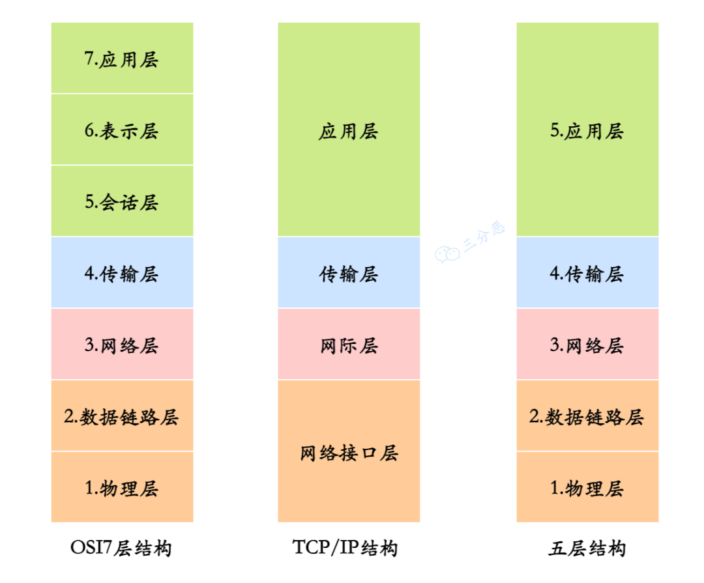

OSI 是理论上的网络通信模型，TCP/IP 是实际应用层面上的网络通信模型，五层结构是为了方便理解和记忆。

## 说说 OSI 七层模型？

OSI（Open System Interconnection）七层参考模型是一个网络架构模型，由国际标准化组织（ISO）提出，用于描述和标准化各种计算机网络的功能和过程。这七层从低到高分别是：

- 应用层：最靠近用户的层，负责处理特定的应用程序细节。这一层提供了网络服务与用户应用软件之间的接口。例如，Web 浏览器、FTP 客户端和服务器、电子邮件客户端等。
- 表示层：确保从一个系统发送的信息可以被另一个系统的应用层读取。它负责数据的转换、压缩和加密。例如，确保数据从一种编码格式转换为另一种，如 ASCII 到 EBCDIC。
- 会话层：管理用户的会话，控制网络上两节点间的对话和数据交换的管理。它负责建立、维护和终止会话。例如，建立一个会话令牌，以便在网络上的两个节点之间传递。
- 传输层：提供端到端的通信服务，保证数据的完整性和正确顺序。这一层包括 TCP 和 UDP 等。
- 网络层：负责在多个网络之间进行数据传输，确保数据能够在复杂的网络结构中找到从源到目的地的最佳路径。这层使用的是 IP（Internet Protocol）协议。
- 数据链路层：在物理连接中提供可靠的传输，负责建立和维护两个相邻节点间的链路。包括帧同步、MAC（媒体访问控制）。
- 物理层：负责在物理媒介上实现原始的数据传输，比如电缆、光纤和无线信号传输。涉及的内容包括电压、接口、针脚、电缆的规格和传输速率等。

## 说说 TCP/IP 四层模型？

TCP/IP 合并了 OSI 的部分层次，专注于高效的网络通信实践，更具实用性。

- 应用层：对应于 OSI 模型的会话层、表示层和应用层。包括所有与网络有关的高级协议，如 HTTP、FTP、SMTP 等。
- 传输层: 对应于 OSI 模型的传输层。负责提供端到端的数据传输服务，包括数据分割、流量控制、错误恢复等。主要的协议有 TCP 和 UDP 。
- 网际层：对应于 OSI 模型的网络层。主要协议是 IP，负责数据包的寻址和路由。这一层还包括 ICMP 协议。
- 网络接口层：对应于 OSI 模型的物理层和数据链路层。负责数据帧的物理传输，包括硬件地址寻址（MAC 地址），数据封装和解封装，错误检测和纠正等。

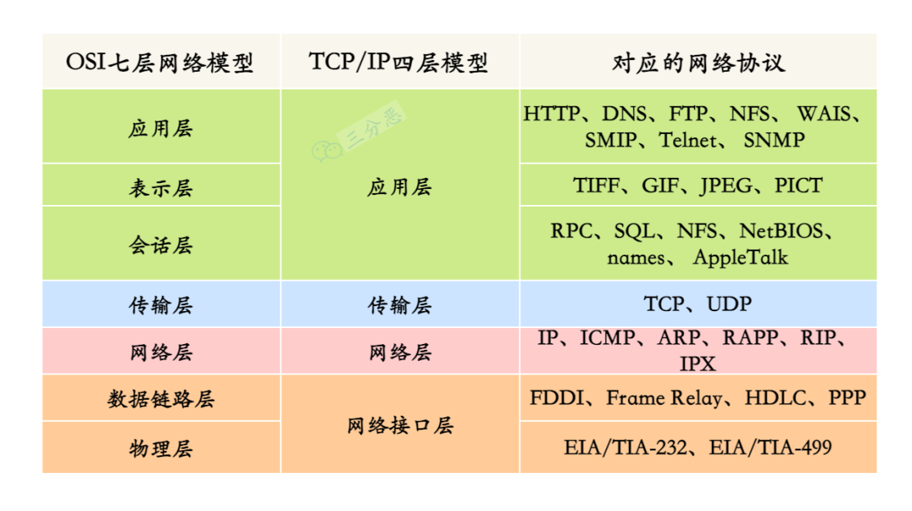

## 从浏览器地址栏输入 url 到显示主页的过程？

1. DNS 解析：浏览器发起一个 DNS 请求到 DNS 服务器，将域名解析为服务器的 IP 地址。
2. TCP 连接：浏览器通过解析得到的 IP 地址与服务器建立 TCP 连接（通常是通过 443 端口进行 SSL 加密的 HTTPS 连接）。这一步涉及到 TCP 的三次握手过程，确保双方都准备好进行数据传输。
3. 发送 HTTP 请求：浏览器构建 HTTP 请求消息，包括请求行（如 GET / HTTP/1.1）、请求头（包含用户代理、接受的内容类型等信息）和请求体（如果有）；将请求发送到服务器。
4. 服务器处理请求：服务器接收到 HTTP 请求后，根据请求的资源路径，经过后端处理（可能包括数据库查询等），生成 HTTP 响应消息；响应消息包括状态行（如 HTTP/1.1 200 OK）、响应头（内容类型、缓存控制等信息）和响应体（请求的资源内容）。
5. 浏览器接收 HTTP 响应：浏览器接收到服务器返回的 HTTP 响应数据，开始解析响应体中的 HTML 内容；然后构建 DOM 树、解析 CSS 和 JavaScript 文件等，最终渲染页面。
6. 断开连接：TCP 四次挥手，连接结束

我们以输入 [www.baidu.comopen in new window](http://www.baidu.com/) 为例：

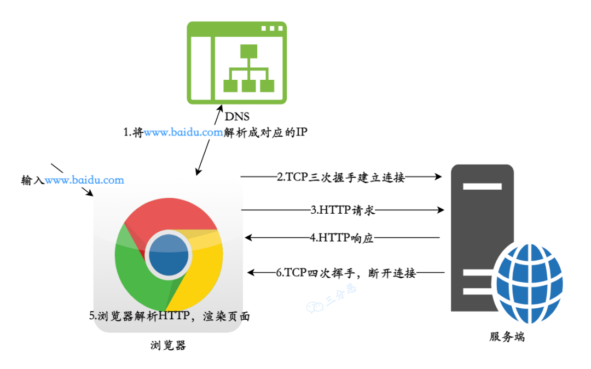

URL 到显示主页

各个过程都使用了哪些协议？

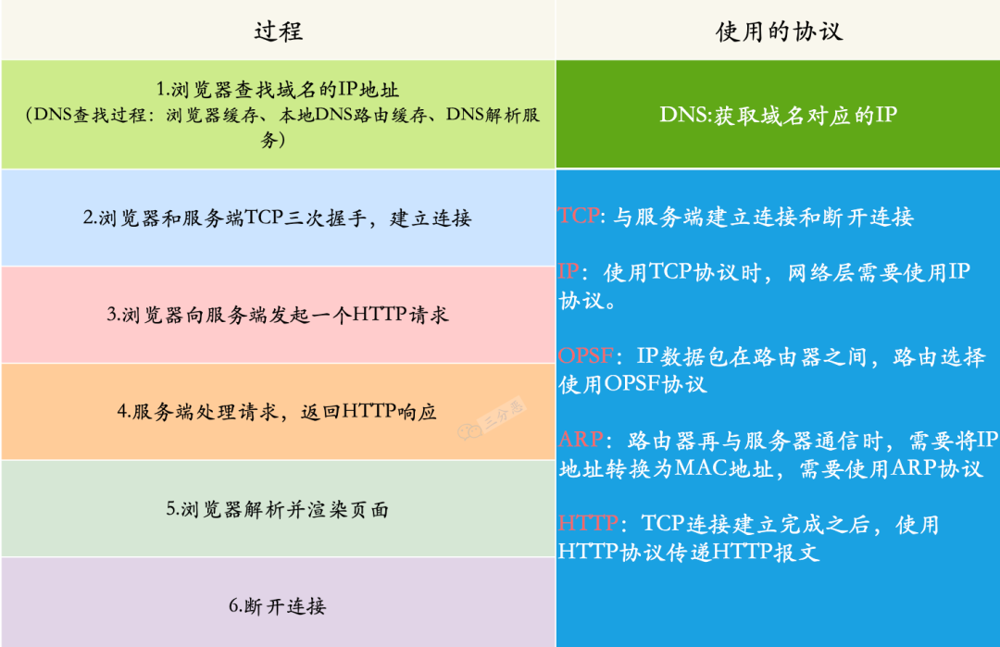

## 说说 DNS 的解析过程？

DNS，英文全称是 domain name system，域名解析系统，它的作用也很明确，就是域名和 IP 相互映射。

DNS 的解析过程如下图：

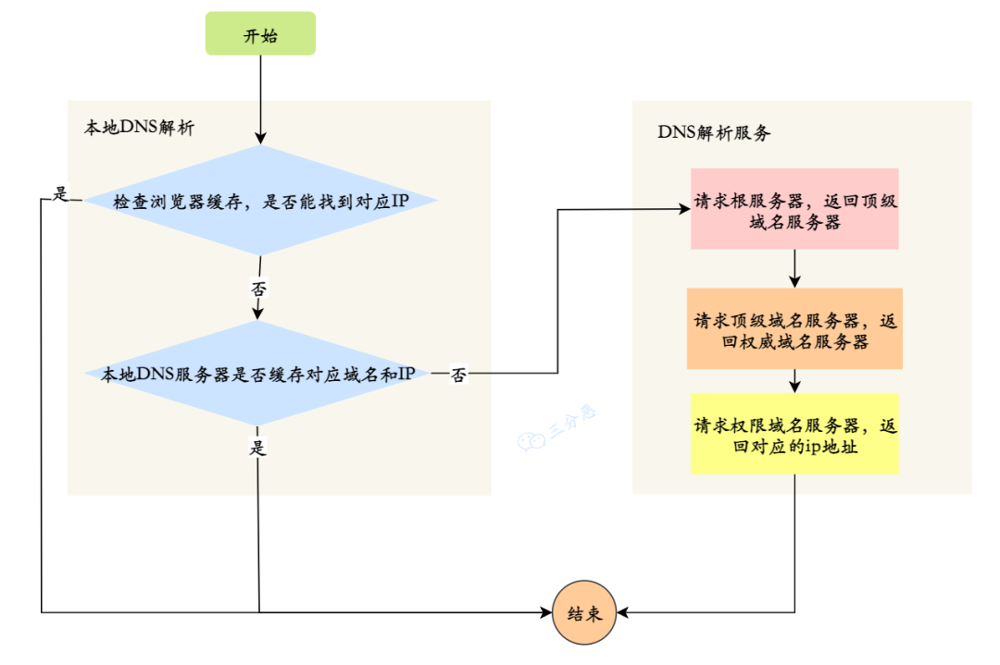

## 说一下你了解的端口及对应的服务？

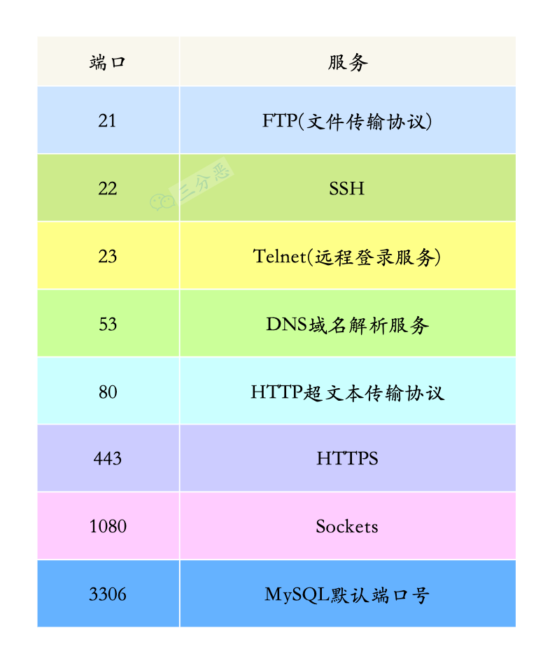

## 说说 HTTP 常用的状态码及其含义？

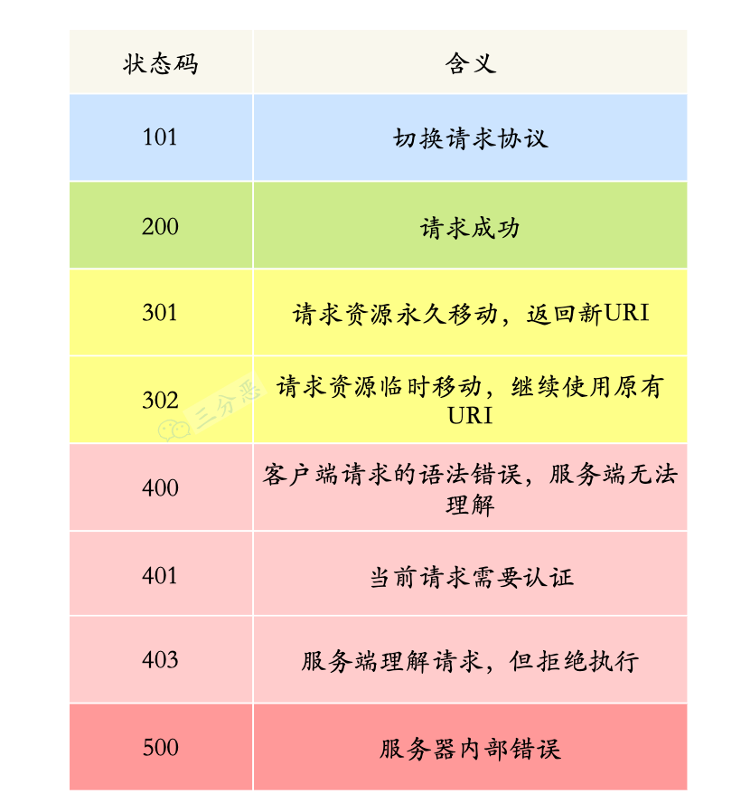

## HTTP 有哪些请求方式？

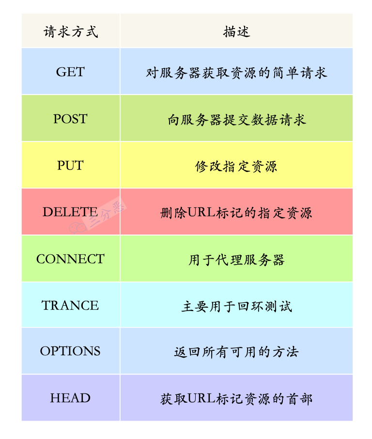

其中，POST、DELETE、PUT、GET 的含义分别对应我们最熟悉的增、删、改、查。

## 说说 HTTP 与 HTTPS 有哪些区别？

1. HTTP 是超⽂本传输协议，信息是明⽂传输，存在安全⻛险的问题。HTTPS 则解决 HTTP 不安全的缺陷，在 TCP 和 HTTP ⽹络层之间加⼊了 SSL/TLS 安全协议，使得报⽂能够加密传输。
2. HTTP 连接建⽴相对简单， TCP 三次握⼿之后便可进⾏ HTTP 的报⽂传输。⽽ HTTPS 在 TCP 三次握⼿之后，还需进⾏ SSL/TLS 的握⼿过程，才可进⼊加密报⽂传输。
3. HTTP 的端⼝号是 80，HTTPS 的端⼝号是 443。
4. HTTPS 协议需要向 CA（证书权威机构）申请数字证书，来保证服务器的身份是可信的。

## HTTPS 工作流程是怎样的？

HTTPS 的工作流程主要涉及到 SSL/TLS 协议，它确保了客户端和服务器之间的通信是加密的。

①、客户端发起请求

客户端（如 Web 浏览器）向服务器发起 HTTPS 请求，请求的 URL 以 `https://` 开头。

②、服务器返回证书

服务器接收到请求后，会向客户端发送一个 SSL 证书，证书中包含了服务器的公钥、证书的颁发机构（CA）、证书的有效期等信息。

③、客户端验证证书

客户端收到服务器的证书后，会验证证书的合法性，包括证书是否过期、颁发机构是否可信等。

④、客户端生成密钥

客户端验证通过后，会生成一个随机的对称密钥，然后用服务器的公钥加密这个对称密钥，发送给服务器。

⑤、服务器解密密钥

服务器收到客户端发来的密钥后，会用自己的私钥解密，得到对称密钥。至此，客户端和服务器都拥有了相同的会话密钥，可以用这个密钥加密通信内容。

⑥、加密通信

服务器用会话密钥加密通信内容，发送给客户端，客户端用会话密钥解密，得到响应内容。

如果在这个过程中，有人截获了通信内容，但由于没有会话密钥，所以无法解密。

当通信结束后，连接会被关闭，会话密钥也会被销毁，下次通信会重新生成一个会话密钥。

## HTTPS 主要解决了以下几个问题：

- 窃听风险：第三方可以截获传输的数据包，获取敏感信息。
- 篡改风险：第三方可以在传输过程中篡改数据包，修改数据。
- 冒充风险：第三方可以冒充服务器，与客户端通信。

## 说说 Session 和 Cookie 有什么联系和区别?

先来看看什么是 Session 和 Cookie ：

- Cookie 是保存在客户端的一小块文本串的数据。客户端向服务器发起请求时，服务端会向客户端发送一个 Cookie，客户端就把 Cookie 保存起来。在客户端下次向同一服务器再发起请求时，Cookie 被携带发送到服务器。服务端可以根据这个 Cookie 判断用户的身份和状态。
- Session 指的就是服务器和客户端一次会话的过程。它是另一种记录客户状态的机制。客户端浏览器访问服务器的时候，服务器把客户端信息记录在服务器上，这就是 session。客户端浏览器再次访问时只需要从该 session 中查找用户的状态。

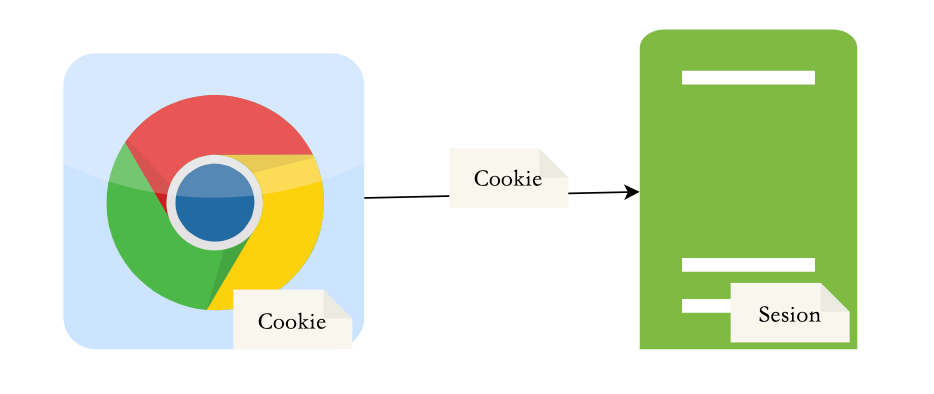

Cookie 和 Session

> Session 和 Cookie 到底有什么不同呢？

- 存储位置不一样，Cookie 保存在客户端，Session 保存在服务器端。
- 存储数据类型不一样，Cookie 只能保存 ASCII，Session 可以存任意数据类型，一般情况下我们可以在 Session 中保持一些常用变量信息，比如说 UserId 等。
- 有效期不同，Cookie 可设置为长时间保持，比如我们经常使用的默认登录功能，Session 一般有效时间较短，客户端关闭或者 Session 超时都会失效。
- 隐私策略不同，Cookie 存储在客户端，比较容易遭到不法获取；Session 存储在服务端，安全性相对 Cookie 要好一些。

## 详细说一下 TCP 的三次握手机制

TCP 提供面向连接的服务，在传送数据前必须建立连接，TCP 连接是通过三次握手建立的。

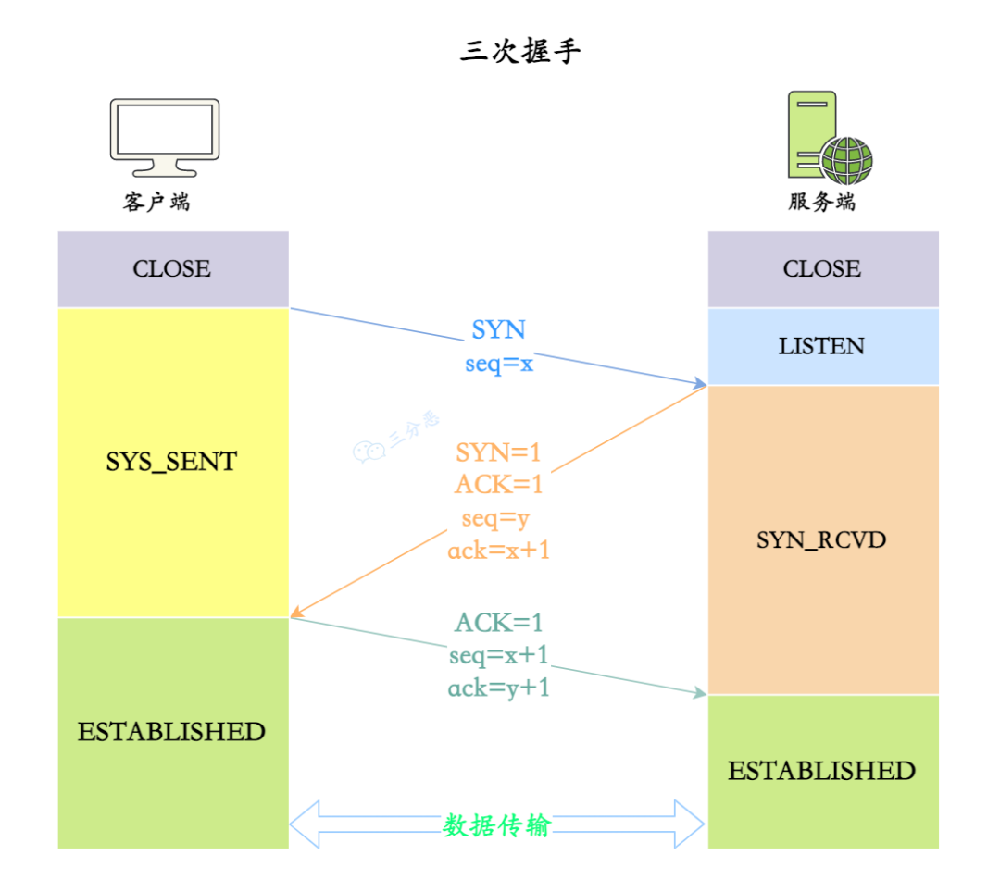

TCP 三次握手示意图

三次握手的过程：

- 最开始，客户端和服务端都处于 CLOSE 状态，服务端监听客户端的请求，进入 LISTEN 状态
- 客户端发送连接请求，第一次握手，发送完毕后，客户端就进入 SYN_SENT 状态
- 服务端确认连接，第二次握手 ， 发送完毕后，服务器端就进入 SYN_RCVD 状态。
- 客户端收到服务端的确认之后，再次向服务端确认，**第三次握手** ，发送完毕后，客户端进入 ESTABLISHED 状态，当服务器端接收到这个包时，也进入 ESTABLISHED 状态。

## TCP 握手为什么是三次，为什么不能是两次？不能是四次？

> 为什么不能是两次？

- 为了防止服务器端开启一些无用的连接增加服务器开销
- 服务器会一直地开着端口在等着客户端发消息

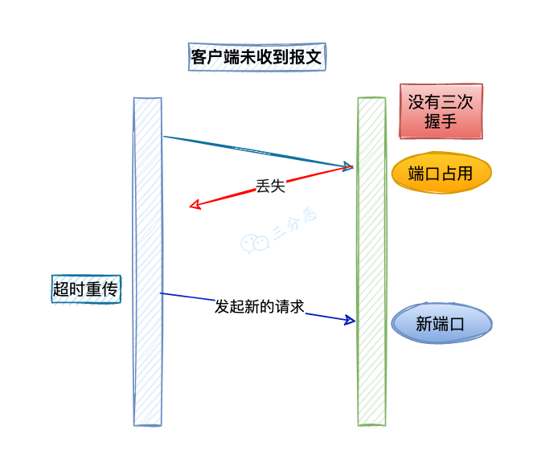

- 防止已失效的连接请求报文段突然又传送到了服务端，因而产生错误。

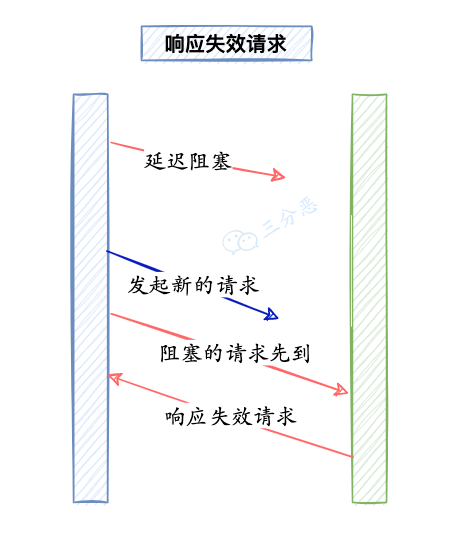

> 为什么不是四次？

简单说，就是三次挥手已经足够创建可靠的连接，没有必要再多一次握手导致花费更多的时间建立连接。

## 说说 TCP 四次挥手的过程？

TCP 四次挥手

TCP 四次挥手过程：

- 数据传输结束之后，通信双方都可以主动发起断开连接请求，这里假定客户端发起
- 客户端发送释放连接报文，第一次挥手 ，发送完毕后，客户端进入 FIN_WAIT_1 状态。
- 服务端发送确认报文，第二次挥手 ，发送完毕后，服务器端进入 CLOSE_WAIT 状态，客户端接收到这个确认包之后，进入 FIN_WAIT_2 状态。
- 服务端发送释放连接报文，第三次挥手，发送完毕后，服务器端进入 LAST_ACK 状态，等待来自客户端的最后一个 ACK。
- 客户端发送确认报文，第四次挥手 ，并进入 TIME_WAIT 状态，服务器端接收到这个确认包之后，关闭连接，进入 CLOSED 状态
- 客户端等待了某个固定时间（两个最大段生命周期）之后，没有收到服务器端的 ACK ，认为服务器端已经正常关闭连接，于是自己也关闭连接，进入 CLOSED 状态。

## 流量控制的目的及如何实现

如果发送者发送数据过快，接收者来不及接收，那么就会有分组丢失。

为了避免分组丢失，控制发送者的发送速度，使得接收者来得及接收，这就是流量控制。

流量控制根本目的是防止分组丢失，它是构成 TCP 可靠性的一方面。

如何实现流量控制

由滑动窗口协议（连续 ARQ 协议）实现。滑动窗口协议既保证了分组无差错、有序接收，也实现了流量控制。

主要的方式就是接收方返回的 ACK 中会包含自己的接收窗口的大小，并且利用大小来控制发送方的数据发送。

## 为什么要进行拥塞控制

假设网络已经出现拥塞，如果不处理拥塞，那么延时增加，出现更多丢包，触发发送方重传数据，加剧拥塞情况，继续恶性循环直至网络瘫痪。

主要使用 4 种算法完成拥塞控制：

1. 慢启动
2. 拥塞避免
3. 快重传算法
4. 快速恢复算法

算法 1、2 适用于拥塞发生前，算法 3 适用于拥塞发生时，算法 4 适用于拥塞解决后（相当于拥塞发生前）。

## 说说 TCP 和 UDP 的区别？

TCP 和 UDP 最根本的区别：TCP 是面向连接的，而 UDP 是无连接的。

可以这么形容：TCP 是打电话，UDP 是大喇叭（😂）。

在数据传输开始之前，TCP 需要先建立连接，数据传输完成后，再断开连接。这个过程通常被称为“三次握手”。

UDP 是无连接的，发送数据之前不需要建立连接，发送完毕也无需断开连接，数据以数据报形式发送。

TCP 是可靠的，它通过确认机制、重发机制等来保证数据的可靠传输。而 UDP 是不可靠的，数据包可能会丢失、重复、乱序。

说说 TCP 和 UDP 的应用场景？

- TCP： 适用于那些对数据准确性要求高于数据传输速度的场合。例如：网页浏览、电子邮件、文件传输（FTP）、远程控制、数据库链接。
- UDP： 适用于对速度要求高、可以容忍一定数据丢失的场合。例如：QQ 聊天、在线视频、网络语音电话、广播通信。容忍一定的数据丢失。

# 数据结构

## 堆排序（Heap Sort）

堆是一个近似完全二叉树的结构，并同时满足堆的性质：即子结点的键值或索引总是小于（或者大于）它的父节点。

1. 基本思想

利用大顶堆(小顶堆)堆顶记录的是最大关键字(最小关键字)这一特性，使得每次从无序中选择最大记录(最小记录)变得简单。

> ① 将待排序的序列构造成一个最大堆，此时序列的最大值为根节点
> ② 依次将根节点与待排序序列的最后一个元素交换
> ③ 再维护从根节点到该元素的前一个节点为最大堆，如此往复，最终得到一个递增序列

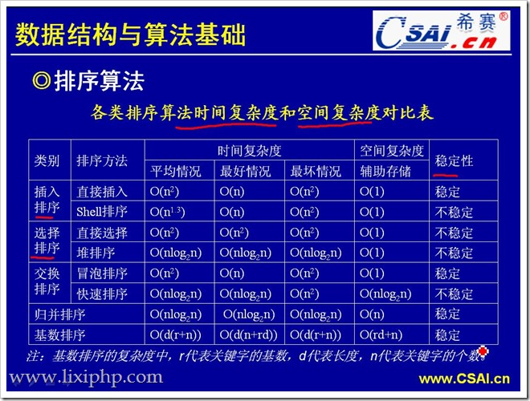
