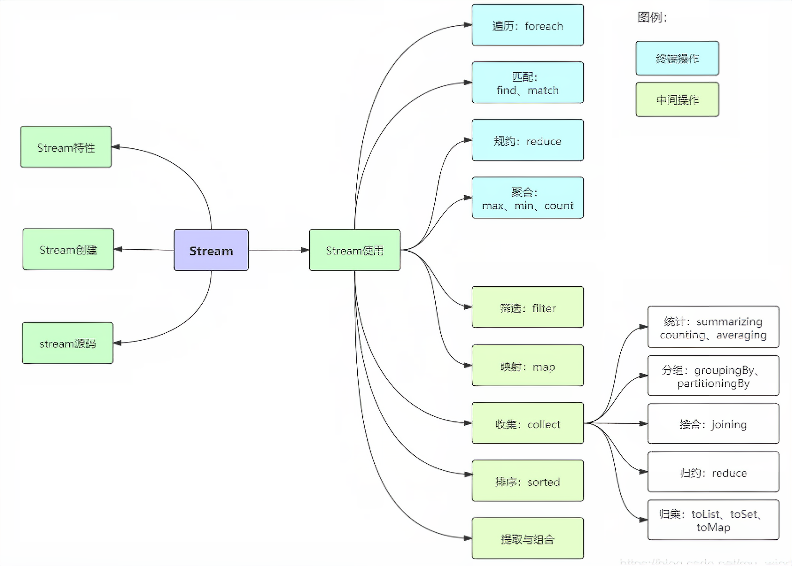

# Stream流式处理



在开发过程中，经常需要对`数组`、`集合`进行操作的时候，通常会通过`循环`的方式进行逐个处理，或者使用`Stream`的方式进行处理。

Java 8 API添加了一个新的抽象称为流Stream，可以让你以一种声明的方式处理数据。

## Stream的特点

* Stream 不会在创建时立即执行，而是等到需要使用时才执行。
* Stream 不会改变数据源，通常情况下会产生一个新的集合或一个值。
* Stream 不存储数据，而是按照特定的规则对数据进行计算，一般会输出结果。
* Stream 的实现方式代码更加简洁、一气呵成，函数式编程使代码简洁且意图明确，让你从此告别for循环。

## Stream流操作

可以将Stream流操作分为以下3个步骤：

1. 创建Stream
2. Stream中间处理
3. 终止Steam

每个步骤都包含若干API方法，先列举下各个API方法的功能介绍。

### 创建

基于现有的数组、List、Set、Map等集合类型对象创建出新的Stream流。

<table>
 <thead>
  <tr>
   <th>API</th>
   <th>说明</th>
  </tr>
 </thead>
 <tbody>
  <tr>
   <td>stream()</td>
   <td>创建出一个新的stream串行流对象</td>
  </tr>
  <tr>
   <td>parallelStream()</td>
   <td>创建出一个可并行执行的stream流对象</td>
  </tr>
  <tr>
   <td>Stream.of()</td>
   <td>通过给定的一系列元素创建一个新的Stream串行流对象</td>
  </tr>
 </tbody>
</table>

### 处理

对Stream进行处理操作，并返回一个新的Stream对象，中间管道操作可以进行叠加。

<table>
 <thead>
  <tr>
   <th>API</th>
   <th>说明</th>
  </tr>
 </thead>
 <tbody>
  <tr>
   <td>filter()</td>
   <td>按照条件过滤符合要求的元素，返回新的stream流</td>
  </tr>
  <tr>
   <td>distinct()</td>
   <td>对Stream中所有元素进行去重，返回新的stream流</td>
  </tr>
  <tr>
   <td>sorted()</td>
   <td>对stream中所有的元素按照指定规则进行排序，返回新的stream流</td>
  </tr>
  <tr>
   <td>map()</td>
   <td>将已有元素转换为另一个对象类型，一对一逻辑，返回新的stream流</td>
  </tr>
  <tr>
   <td>flatMap()</td>
   <td>将已有元素转换为另一个对象类型，一对多逻辑，即原来一个元素对象可能会转换为1个或者多个新类型的元素，返回新的stream流</td>
  </tr>
  <tr>
   <td>skip()</td>
   <td>跳过集合前面指定个数的元素，返回新的stream流</td>
  </tr>
  <tr>
   <td>limit()</td>
   <td>仅保留集合前面指定个数的元素，返回新的stream流</td>
  </tr>
  <tr>
   <td>concat()</td>
   <td>将两个流的数据合并起来为1个新的流，返回新的stream流</td>
  </tr>
  <tr>
   <td>peek()</td>
   <td>对stream流中的每个元素进行逐个遍历处理，返回处理后的stream流</td>
  </tr>
 </tbody>
</table>

### 终止

Stream流将会结束，最后可能会执行某些逻辑处理，或者是按照要求返回某些执行后的结果数据。

<table>
 <thead>
  <tr>
   <th>API</th>
   <th>说明</th>
  </tr>
 </thead>
 <tbody>
  <tr>
   <td>count()</td>
   <td>返回stream处理后最终的元素个数</td>
  </tr>
  <tr>
   <td>max()</td>
   <td>返回stream处理后的元素最大值</td>
  </tr>
  <tr>
   <td>min()</td>
   <td>返回stream处理后的元素最小值</td>
  </tr>
  <tr>
   <td>findFirst()</td>
   <td>找到第一个符合条件的元素时则终止流处理</td>
  </tr>
  <tr>
   <td>findAny()</td>
   <td>找到任何一个符合条件的元素时则退出流处理，这个对于串行流时与findFirst相同，对于并行流时比较高效，任何分片中找到都会终止后续计算逻辑</td>
  </tr>
  <tr>
   <td>noneMatch()</td>
   <td>返回一个boolean值， 用于判断是否所有元素都不符合条件</td>
  </tr>
  <tr>
   <td>allMatch()</td>
   <td>返回一个boolean值，用于判断是否所有元素都符合条件</td>
  </tr>
  <tr>
   <td>anyMatch()</td>
   <td>返回一个boolean值，类似于isContains(),用于判断是否有符合条件的元素</td>
  </tr>
  <tr>
   <td>collect()</td>
   <td>将流转换为指定的类型，通过Collectors进行指定</td>
  </tr>
  <tr>
   <td>toArray()</td>
   <td>将流转换为数组</td>
  </tr>
  <tr>
   <td>iterator()</td>
   <td>将流转换为Iterator对象</td>
  </tr>
  <tr>
   <td>foreach()</td>
   <td>无返回值，对元素进行逐个遍历，然后执行给定的处理逻辑</td>
  </tr>
 </tbody>
</table>

## Stream 方法使用

下面的Stream junit测试方法通用数据初始化：

```java
import com.example.demo.model.User;
import org.junit.Before;
import org.junit.Test;

import java.text.ParseException;
import java.text.SimpleDateFormat;
import java.util.*;
import java.util.stream.Collectors;
import java.util.stream.IntStream;
import java.util.stream.Stream;

/**
 * Java8 Stream junit测试
 * @author xy
 * @date 2024-06-18
 */
public class StreamTest {

    /**
     * 数字数组
     */
    private int[] intArr;

    /**
     * 用户数组
     */
    private User[] userArr;

    /**
     * 用户集合
     */
    private List<User> userList;

    /**
     * 初始化数据
     */
    @Before
    public void setUp() throws ParseException {
        intArr = new int[]{9, 23, 66, 4, 66, 9, 20};

        SimpleDateFormat formatter = new SimpleDateFormat("yyyy-MM-dd HH:mm:ss");
        User u1 = new User(1, "张三", 18, formatter.parse("2024-06-17 10:30:00"));
        User u2 = new User(2, "李四", 22, formatter.parse("2024-06-17 09:30:00"));
        User u3 = new User(3, "王五", 33, formatter.parse("2024-06-17 08:30:00"));
        User u4 = new User(4, "赵六", 22, formatter.parse("2024-06-17 08:00:00"));

        userArr = new User[]{u1, u2, u3, u4};

        userList = new ArrayList<>();
        userList.add(u1);
        userList.add(u2);
        userList.add(u3);
        userList.add(u4);
    }
}
```

## Stream 实例化方式

### 通过数组

```java
@Test
public void testByArr() {
    IntStream intStream = Arrays.stream(intArr);
    Stream<User> stream = Arrays.stream(userArr);
}
```

### 通过集合

```java
@Test
public void testByList() {
    // 返回一个顺序流 （按照集合顺序获取）
    Stream<User> stream = userList.stream();
    // 返回一个并行流 （类似于线程去获取数据，无序）
    Stream<User> parallelStream = userList.parallelStream();
}
```

### 通过Stream.of()方法

```java
@Test
public void testByStreamOf() {
    Stream<Integer> integerStream = Stream.of(1, 2, 3, 4, 5, 6);
    Stream<User> stream = Arrays.stream(userArr);
}
```

### 通过无限流

```java
@Test
public void testByInfiniteStream() {
    // 从3开始，每次+2，5个数
    Stream.iterate(3, t->t+2).limit(5).forEach(System.out::println);
    // 10个一定范围的整数
    Stream.generate(() -> (int) (Math.random() * 100)).limit(10).forEach(System.out::println);
}
```

## Stream 的API方法

### filter

```java
@Test
public void testFilter() {
    // 筛选出年龄大于20岁的用户
    List<User> filterList = userList.stream()
            .filter(x-> x.getAge() > 20)
            .collect(Collectors.toList());
    filterList.forEach(item->{
        System.out.println("年龄大于20岁的用户：" + item);
    });
}
```

控制台输出如下：

```java
年龄大于20岁的用户：User(id=2, name=李四, age=22, createTime=2024-06-17 09:30:00)
年龄大于20岁的用户：User(id=3, name=王五, age=33, createTime=2024-06-17 08:30:00)
年龄大于20岁的用户：User(id=4, name=赵六, age=22, createTime=2024-06-17 08:00:00)
```

### limit

```java
@Test
public void testLimit() {
    // 输出用户集合的前3个
    userList.stream()
            .limit(3)
            .forEach( t-> System.out.println("前3个："+t) );
}
```

控制台输出如下：

```java
前3个：User(id=1, name=张三, age=18, createTime=2024-06-17 10:30:00)
前3个：User(id=2, name=李四, age=22, createTime=2024-06-17 09:30:00)
前3个：User(id=3, name=王五, age=33, createTime=2024-06-17 08:30:00)
```

### skip

```java
@Test
public void testSkip() {
    // 跳过用户集合的前面2个
    userList.stream()
            .skip(2)
            .forEach( t-> System.out.println("跳过前面2个："+t) );
}
```

控制台输出如下：

```java
跳过前面2个：User(id=3, name=王五, age=33, createTime=2024-06-17 08:30:00)
跳过前面2个：User(id=4, name=赵六, age=22, createTime=2024-06-17 08:00:00)
```

### distinct

```java
@Test
public void testDistinct() {
    // 去重
    int[] arrDistinct = Arrays.stream(intArr).distinct().toArray();
    System.out.println("去重前："+ Arrays.toString(intArr));
    System.out.println("去重后："+ Arrays.toString(arrDistinct));
}
```

控制台输出如下：

```java
去重前：[9, 23, 66, 4, 66, 9, 20]
去重后：[9, 23, 66, 4, 20]
```

### sorted

```java
@Test
public void testSort() {
    // 排序:先按照年龄从小到大排序，当年龄相同的时候，按照创建时间倒序
    userList.stream().sorted((e1,e2)->{
        int age = Integer.compare(e1.getAge(), e2.getAge());
        if (age != 0){
            return age;
        } else {
            return e2.getCreateTime().compareTo(e1.getCreateTime());
        }
    }).forEach(System.out::println);
}
```

控制台输出如下：

```java
User(id=1, name=张三, age=18, createTime=2024-06-17 10:30:00)
User(id=2, name=李四, age=22, createTime=2024-06-17 09:30:00)
User(id=4, name=赵六, age=22, createTime=2024-06-17 08:00:00)
User(id=3, name=王五, age=33, createTime=2024-06-17 08:30:00)
```

### 匹配

```java
@Test
public void testMatch() {
    // 1.allMatch：检查是否匹配所有元素
    boolean allMatch = userList.stream().allMatch(x -> x.getAge() >= 18);
    System.out.println("1.用户年龄是否都大于等于18岁：" + allMatch);

    // 2.anyMatch：检查是否至少匹配一个元素
    SimpleDateFormat formatter = new SimpleDateFormat("yyyy-MM-dd HH");
    boolean anyMatch = userList.stream().anyMatch(x -> formatter.format(x.getCreateTime()).equals("2024-06-17 11"));
    System.out.println("2.是否存在2024-06-17 11点创建的用户：" + anyMatch);

    // 3.noneMatch：检查是否没有匹配的元素
    boolean noneMatch = userList.stream().noneMatch(x -> x.getName().startsWith("李"));
    System.out.println("3.查询是否 没有 姓李的员工：" + noneMatch);
}
```

控制台输出如下：

```java
1.用户年龄是否都大于等于18岁：true
2.是否存在2024-06-17 11点创建的用户：false
3.查询是否 没有 姓李的员工：false
```

### count

```java
@Test
public void testCount() {
    // count：返回流中元素的总个数
    long count = userList.stream()
            .filter(x->x.getAge() > 30)
            .count();
    System.out.println("年龄大于30岁的用户数量：" + count);
}
```

控制台输出如下：

```java
年龄大于30岁的用户数量：1
```

### 最大最小

```java
@Test
public void testMaxMin() {
    // 1.max：返回流中的最大值
    OptionalInt max = Arrays.stream(intArr).max();
    System.out.println("intArr数组中最大值：" + max);

    // 2.min：返回流中的最小值
    Optional<User> min = userList.stream().min(Comparator.comparingDouble(User::getAge));
    System.out.println("用户年龄最小的是：" + min);
}
```

控制台输出如下：

```java
intArr数组中最大值：OptionalInt[66]
用户年龄最小的是：Optional[User(id=1, name=张三, age=18, createTime=2024-06-17 10:30:00)]
```

### 查找

```java
@Test
public void testFind() {
    // 1.findFirst：返回第一个元素
    Optional<User> first = userList.stream().findFirst();
    System.out.println("1.第一个用户：" + first);

    // 2.findAny：返回当前流中的任意元素
    Optional<User> any = userList.stream().findAny();
    System.out.println("2.任意一个用户：" + any);
}
```

控制台输出如下：

```java
1.第一个用户：Optional[User(id=1, name=张三, age=18, createTime=2024-06-17 10:30:00)]
2.任意一个用户：Optional[User(id=1, name=张三, age=18, createTime=2024-06-17 10:30:00)]
```

### 归约

```java
@Test
public void testReduce() {
    // reduce：可以将流中的元素反复结合起来，得到一个值; identity代表初始值
    Integer reduce = Arrays.stream(intArr).reduce(0, Integer::sum);
    System.out.println("1.intArr数组的总和：" + reduce);

    // 先映射取出年龄
    Optional<Integer> ageReduce = userList.stream()
            .map(User::getAge)
            .reduce(Integer::sum);
    System.out.println("2.所有用户年龄之和：" + ageReduce);
}
```

控制台输出如下：

```java
1.intArr数组的总和：197
2.所有用户年龄之和：Optional[95]
```

### 分组

```java
enum AgeGroup {
    YOUTH, TWENTIES, THIRTIES_UP
}
@Test
public void testGroupingBy() {
    // 根据年龄段对用户进行分组：青年，20岁，30岁以上
    Map<AgeGroup, List<User>> groupedByAge = userList.stream()
            .collect(Collectors.groupingBy(user -> {
                if (user.getAge() <= 20) {
                    return AgeGroup.YOUTH;
                } else if (user.getAge() <= 30) {
                    return AgeGroup.TWENTIES;
                } else {
                    return AgeGroup.THIRTIES_UP;
                }
            }));

    groupedByAge.forEach((ageGroup, usersInGroup) -> {
        System.out.println("年龄段" + ageGroup + ":");
        usersInGroup.forEach(user -> System.out.println(user));
    });
}
```

控制台输出如下：

```java
年龄段YOUTH:
User(id=1, name=张三, age=18, createTime=2024-06-17 10:30:00)
年龄段THIRTIES_UP:
User(id=3, name=王五, age=33, createTime=2024-06-17 08:30:00)
年龄段TWENTIES:
User(id=2, name=李四, age=22, createTime=2024-06-17 09:30:00)
User(id=4, name=赵六, age=22, createTime=2024-06-17 08:00:00)
```

### 组合使用及其他

```java
@Test
public void testCommon() {
    // 常用例子：
    List<User> filterList = userList.stream()
            // 1.使用filter过滤掉不符合条件的数据
            .filter(x -> null!=x.getName() && x.getAge() > 20)
            // 2.通过distinct对存量元素进行去重操作
            .distinct()
            // 3.借助sorted指定按照数字大小正序排列
            .sorted(Comparator.comparing(User::getAge))
            // 4.使用limit截取排在前2位的元素
            .limit(2)
            // 5.使用collect终止操作将最终处理后的数据收集到list中
            .collect(Collectors.toList());
    System.out.println("组合使用：" + filterList);

    OptionalDouble avg = userList.stream()
            .mapToDouble(User::getAge)
            .average();
    System.out.println("集合中字段的平均值：" + avg);

    Set<String> set = userList.stream()
            .map(User::getName)
            .collect(Collectors.toCollection(HashSet::new));
    System.out.println("获取集合中某个字段的Set集合：" + set);
}
```

控制台输出如下：

```java
组合使用：[User(id=2, name=李四, age=22, createTime=2024-06-17 09:30:00), User(id=4, name=赵六, age=22, createTime=2024-06-17 08:00:00)]
集合中字段的平均值：OptionalDouble[23.75]
获取集合中某个字段的Set集合：[李四, 张三, 王五, 赵六]
```
