# 线程并发

## 进程和线程

### 进程有哪些状态？

当一个进程开始运行时，它可能会经历下面这几种状态：

上图中各个状态的意义：

- 运⾏状态（_Runing_）：该时刻进程占⽤ CPU；
- 就绪状态（_Ready_）：可运⾏，由于其他进程处于运⾏状态⽽暂时停⽌运⾏；
- 阻塞状态（_Blocked_）：该进程正在等待某⼀事件发⽣（如等待输⼊/输出操作的完成）⽽暂时停⽌运⾏，这时，即使给它 CPU 控制权，它也⽆法运⾏；

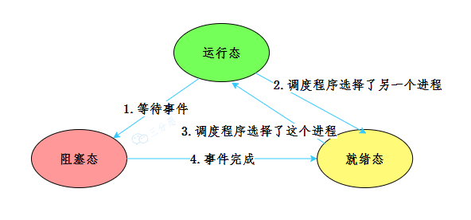

进程 3 种状态

当然，进程还有另外两个基本状态：

- 创建状态（_new_）：进程正在被创建时的状态；
- 结束状态（_Exit_）：进程正在从系统中消失时的状态；

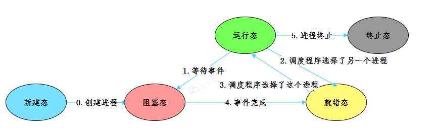

进程 5 种状态

### 进程间通信有哪些方式？

管道、信号、消息队列、共享内存、信号量和套接字。

### 说说进程和线程

进程就比如我们在电脑上启动的一个个应用，比如我们启动一个浏览器，就会启动了一个浏览器进程。进程是操作系统资源分配的最小单位，它包括了程序、数据和进程控制块等。

线程就比如我们在 Java 程序中启动的一个 main 线程，一个进程至少会有一个线程。我们也可以启动多个线程。线程是 CPU 分配资源的基本单位。

一个进程中可以有多个线程，多个线程共用进程的堆和方法区（Java 虚拟机规范中的一个定义，JDK 8 以后的实现为元空间）资源，但是每个线程都会有自己的程序计数器和栈。

### 进程和线程的联系和区别？

**线程和进程的联系**：

线程是进程当中的⼀条执⾏流程。

同⼀个进程内多个线程之间可以共享代码段、数据段、打开的⽂件等资源，但每个线程各⾃都有⼀套独⽴的程序计数器和栈，这样可以确保线程的控制流是相对独⽴的。

**线程与进程的⽐较如下**：

- 调度：进程是资源（包括内存、打开的⽂件等）分配的单位，线程是 CPU 调度的单位；
- 资源：进程拥有⼀个完整的资源平台，⽽线程只独享必不可少的资源，如寄存器和栈；
- 拥有资源：线程同样具有就绪、阻塞、执⾏三种基本状态，同样具有状态之间的转换关系；
- 系统开销：创建或撤销进程时的开销 所付出的开销显著大于在创建或撤销线程时的开销，进程切换的开销也远大于线程切换的开销,创建或撤销进程时，系统都要为之分配或回收系统资源，如内存空间，I/O 设备等。

### 线程有几种创建方式？

- 继承 Thread 类，重写 run()方法，调用 start()方法启动线程
- 实现 Runnable 接口，重写 run()方法，再 new Thread(task).start();
- 实现 Callable 接口，重写 call()方法，这种方式可以通过 FutureTask 获取任务执行的返回值，再 new Thread(task).start();

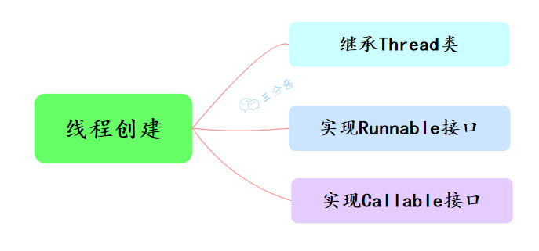

开发中优先选择实现 Runnable 接口的方式

原因：

（1）实现的方式没有类的单继承性的局限性

（2）实现的方式更适合来处理多个线程有共享数据的情况

相同点：两种方式都需要重写 run(),将线程要执行的逻辑声明在 run()中

### 不直接调用 run()方法

JVM 执行 start 方法，会先创建一条线程，由创建出来的新线程去执行 thread 的 run 方法，这才起到多线程的效果。如果直接调用 Thread 的 run()方法，那么 run 方法还是运行在主线程中，相当于顺序执行，就起不到多线程的效果。

### 线程有哪些常用的调度方法？

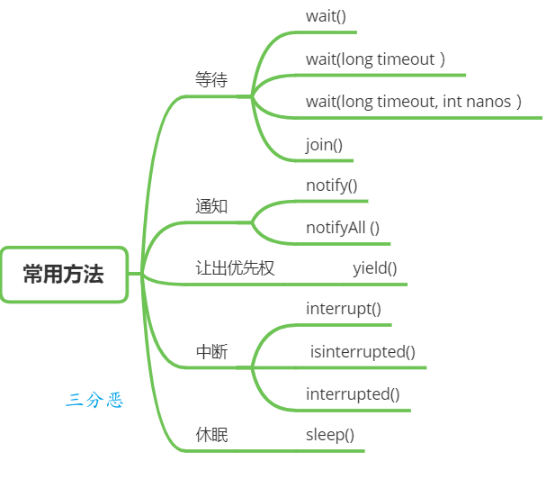

### 请说说 sleep 和 wait 的区别

①、所属类不同

sleep 是让当前线程休眠，不涉及对象类，也不需要获取对象的锁，属于 Thread 类的方法；

wait 是让获得对象锁的线程实现等待，前提要获得对象的锁，属于 Object 类的方法。

②、锁行为不同

当线程执行 sleep 方法时，它不会释放任何锁。

当线程执行 wait 方法时，它会释放它持有的那个对象的锁，这使得其他线程可以有机会获取该对象的锁。

③、使用条件不同

sleep() 方法可以在任何地方被调用。

调用 wait() 方法的前提是当前线程必须持有对象的锁。否则会抛出 IllegalMonitorStateException 异常。、

④、唤醒方式不同

sleep() 方法在指定的时间过后，线程会自动唤醒继续执行。

wait() 方法需要依靠 notify()、notifyAll() 方法或者 wait() 方法中指定的等待时间到期来唤醒线程。

### Java 线程状态

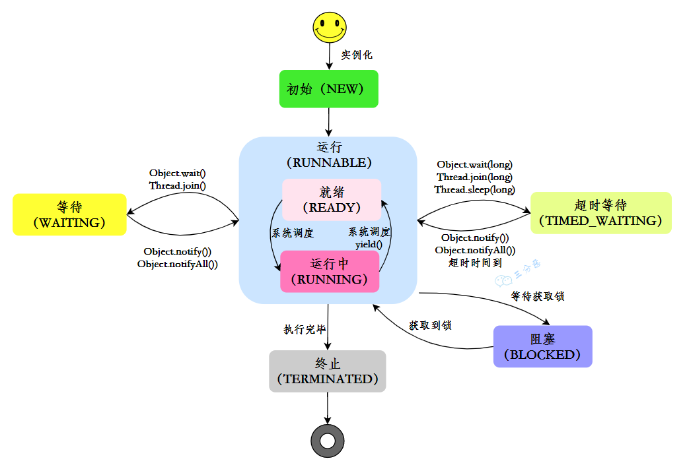

### 线程上下文切换

CPU 给每个线程分配一个时间片，线程在时间片内占用 CPU 执行任务。当线程使用完时间片后，就会处于就绪状态并让出 CPU 让其他线程占用，这就是上下文切换

### 线程间有哪些通信方式

Java 中线程之间的通信主要是为了解决线程之间如何协作运行的问题。

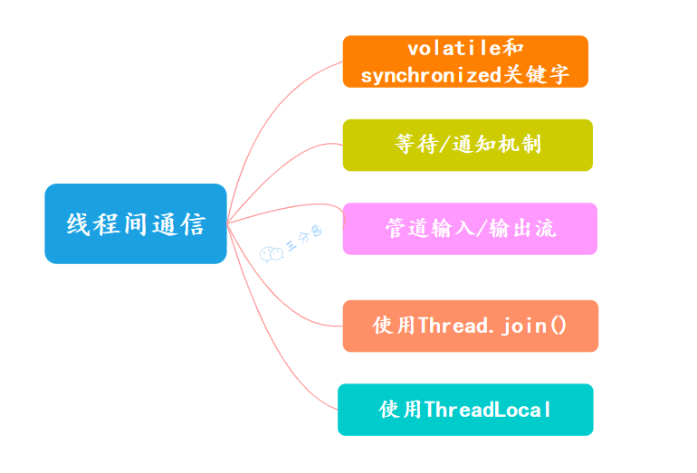

①、volatile 和 synchronized 关键字

volatile 用来修饰成员变量，告知程序任何对该变量的访问均需要从共享内存中获取，而对它的改变必须同步刷新回共享内存，保证所有线程对变量访问的可见性。

synchronized 可以修饰方法，或者以同步代码块的形式来使用，确保多个线程在同一个时刻，只能有一个线程在执行某个方法或某个代码块。

②、等待/通知机制

一个线程调用共享对象的 `wait()` 方法时，它会进入该对象的等待池，并释放已经持有的该对象的锁，进入等待状态，直到其他线程调用相同对象的 `notify()` 或 `notifyAll()` 方法。

一个线程调用共享对象的 `notify()` 方法时，它会唤醒在该对象等待池中等待的一个线程，使其进入锁池，等待获取锁。

## ThreadLocal 是什么？

ThreadLocal 是 Java 中提供的一种用于**实现线程局部变量**的工具类。就是每个线程都可以拥有自己的独立副本，从而实现线程隔离，用于解决多线程中共享对象的线程安全问题

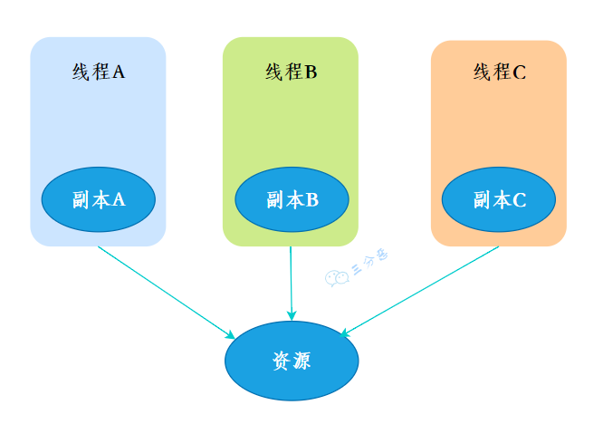

### 你在工作中用到过 ThreadLocal 吗？

有用到过的，用来存储用户信息。

登录后的用户每次访问接口，都会在请求头中携带一个 token，在控制层拦截请求，根据这个 token 判断用户是否存在，然后解析出用户的基本信息，然后把用户信息存入 ThreadLocal。这样在任何一个地方，都可以取出 ThreadLocal 中存的用户信息。

### ThreadLocal 原理？

- 每个线程都有一个属于自己的 ThreadLocalMap。
- ThreadLocalMap 内部，key 是 ThreadLocal 的弱引用，value 是 ThreadLocal 的泛型值。
- 每个线程在往 ThreadLocal 里设置值的时候，都是往自己的 ThreadLocalMap 里存，读也是以某个 ThreadLocal 作为引用，在自己的 map 里找对应的 key，从而实现了线程隔离。
- ThreadLocal 本身不存储值，它只是作为一个 key 来让线程往 ThreadLocalMap 里存取值

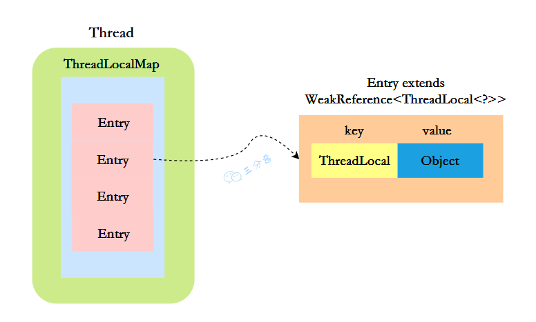

## CAS 自旋锁？实现乐观锁

CAS 叫做 CompareAndSwap，⽐较并交换，主要是通过处理器的指令来保证操作的原⼦性的。

CAS 指令包含 3 个参数：共享变量的内存地址 A、预期的值 B 和共享变量的新值 C。

只有当内存中地址 A 处的值等于 B 时，才能将内存中地址 A 处的值更新为新值 C。作为一条 CPU 指令，CAS 指令本身是能够保证原子性的 。

i++ 需要基本的三个步骤：

1、读取 i 的当前值；

2、对 i 值进行加 1 操作；

3、将 i 值写回内存；

### CAS 的开销为什么比互斥锁轻量级

自旋锁在等待锁释放时不会使线程进入睡眠状态，而是让线程在一个循环中忙等待，直到获取到锁为止。这种方式避免了线程上下文切换的开销。

互斥锁在无法获取锁时会将线程置于睡眠状态，当锁被释放时，操作系统会选择一个等待该锁的线程唤醒，这个过程涉及到线程上下文的切换，因此开销较大。

### CAS 有什么问题？如何解决？

CAS 的经典三大问题：

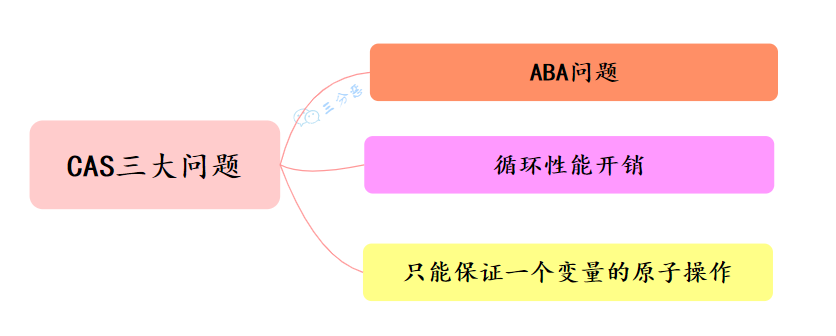

CAS 三大问题

### ABA 问题

并发环境下，假设初始条件是 A，去修改数据时，发现是 A 就会执行修改。但是看到的虽然是 A，中间可能发生了 A 变 B，B 又变回 A 的情况。此时 A 已经非彼 A，数据即使成功修改，也可能有问题。

> 怎么解决 ABA 问题？

- 加版本号

每次修改变量，都在这个变量的版本号上加 1，这样，刚刚 A->B->A，虽然 A 的值没变，但是它的版本号已经变了，再判断版本号就会发现此时的 A 已经被改过了。参考乐观锁的版本号，这种做法可以给数据带上了一种实效性的检验。

### 循环性能开销

自旋 CAS，如果一直循环执行，一直不成功，会给 CPU 带来非常大的执行开销。

> 怎么解决循环性能开销问题？

在 Java 中，很多使用自旋 CAS 的地方，会有一个自旋次数的限制，超过一定次数，就停止自旋。

### 只能保证一个变量的原子操作

CAS 保证的是对一个变量执行操作的原子性，如果对多个变量操作时，CAS 目前无法直接保证操作的原子性的。

> 怎么解决只能保证一个变量的原子操作问题？

- 可以考虑改用锁来保证操作的原子性
- 可以考虑合并多个变量，将多个变量封装成一个对象

## 读写锁

[https://javabetter.cn/thread/ReentrantReadWriteLock.html](https://javabetter.cn/thread/ReentrantReadWriteLock.html)

在并发场景中，为了解决线程安全问题，我们通常会使用关键字 synchronized 。但它们都是独占式获取锁，也就是在同一时刻只有一个线程能够获取锁。

而在一些业务场景中，大部分只是读数据，写数据很少，如果仅仅是读数据的话并不会影响数据正确性，而如果在这种业务场景下，依然使用独占锁的话，很显然会出现性能瓶颈。

针对这种读多写少的情况，Java 提供了另外一个实现 Lock 接口的 ReentrantReadWriteLock——读写锁。

读写锁允许同一时刻被多个读线程访问，但是在写线程访问时，所有的读线程和其他的写线程都会被阻塞。

### 为什么读加锁

读锁是防止读到写的中间值。（如果程序没有原子性问题，那只用 volatile 来避免可见性和有序性问题就可以了，效率更高），读锁在释放前，别的用户得不到相同资源的写锁。如果允许同时读和写，那读到的数很可能是就是写操作的中间状态。

## 线程死锁了解吗？该如何避免？

死锁发生在多个线程相互等待对方释放锁资源，导致所有线程都无法继续执行。


三分恶面渣逆袭：死锁示意图

### 为什么会产生死锁呢？

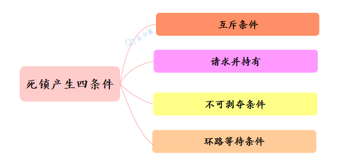

三分恶面渣逆袭：死锁产生必备四条件

- 互斥条件：资源不能被多个线程共享，一次只能由一个线程使用。如果一个线程已经占用了一个资源，其他请求该资源的线程必须等待，直到资源被释放。
- 持有并等待条件：一个线程至少已经持有至少一个资源，且正在等待获取额外的资源，这些额外的资源被其他线程占有。
- 不可剥夺条件：资源不能被强制从一个线程中抢占过来，只能由持有资源的线程主动释放。
- 循环等待条件：存在一种线程资源的循环链，每个线程至少持有一个其他线程所需要的资源，然后又等待下一个线程所占有的资源。这形成了一个循环等待的环路。

### 该如何避免死锁呢？

理解产生死锁的这四个必要条件后，就可以采取相应的措施来避免死锁，换句话说，就是至少破坏死锁发生的一个条件。

- 破坏互斥条件：这通常不可行，因为加锁就是为了互斥。
- 破坏持有并等待条件：一种方法是要求线程在开始执行前一次性地申请所有需要的资源。
- 破坏非抢占条件：占用部分资源的线程进一步申请其他资源时，如果申请不到，可以主动释放它占有的资源。
- 破坏循环等待条件：对所有资源类型进行排序，强制每个线程按顺序申请资源，这样可以避免循环等待的发生。

### 那死锁问题怎么排查呢？

首先从系统级别上排查，比如说在 Linux 生产环境中，可以先使用 top ps 等命令查看进程状态，看看是否有进程占用了过多的资源。

接着，使用 JDK 自带的一些性能监控工具进行排查，比如说，使用 jps -l 查看当前 Java 进程，然后使用 jstack 进程号 查看当前 Java 进程的线程堆栈信息，看看是否有线程在等待锁资源。

```java
// 死锁的例子
class DeadLockDemo {
    private thread final Object lock1 = new Object();
    private thread final Object lock2 = new Object();

    public thread void main(String[] args) {
        new Thread(() -> {
            synchronized (lock1) {
                System.out.println("线程1获取到了锁1");
                try {
                    Thread.sleep(1000);
                } catch (InterruptedException e) {
                    e.printStackTrace();
                }
                synchronized (lock2) {
                    System.out.println("线程1获取到了锁2");
                }
            }
        }).start();

        new Thread(() -> {
            synchronized (lock2) {
                System.out.println("线程2获取到了锁2");
                try {
                    Thread.sleep(1000);
                } catch (InterruptedException e) {
                    e.printStackTrace();
                }
                synchronized (lock1) {
                    System.out.println("线程2获取到了锁1");
                }
            }
        }).start();
    }
}
```

## 什么是线程池？

线程池，简单来说，就是一个管理线程的池子。

①、频繁地创建和销毁线程会消耗系统资源，线程池能够复用已创建的线程。

②、提高响应速度，当任务到达时，任务可以不需要等待线程创建就立即执行。

③、线程池支持定时执行、周期性执行、单线程执行和并发数控制等功能。

### 工作中线程池的应用

1. 异步下单的时候

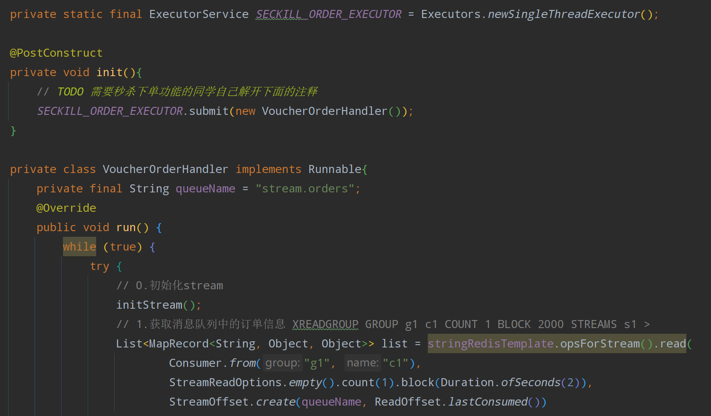

1. 逻辑过期解决缓存击穿，缓存重建（查询场馆信息时）

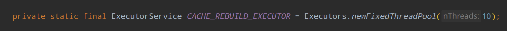

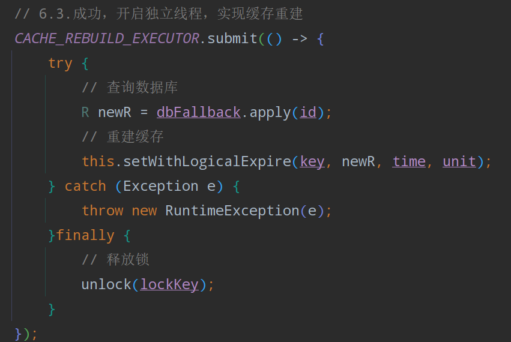

### 创建线程以及线程池主要参数有哪些？

```java
new ThreadPoolExecutor(1, 1,  0L, TimeUnit.MILLISECONDS,
                        new LinkedBlockingQueue<Runnable>(),
                        threadFactory));
```

线程池有 7 个参数，需要重点关注 `corePoolSize`、`maximumPoolSize`、`workQueue`、`handler` 这四个。


三分恶面渣逆袭：线程池参数

①、corePoolSize

定义了线程池中的核心线程数量。即使这些线程处于空闲状态，它们也不会被回收。这是线程池保持在等待状态下的线程数。

②、maximumPoolSize

线程池允许的最大线程数量。当工作队列满了之后，线程池会创建新线程来处理任务，直到线程数达到这个最大值。

③、keepAliveTime

非核心线程的空闲存活时间。如果线程池中的线程数量超过了 corePoolSize，那么这些多余的线程在空闲时间超过 keepAliveTime 时会被终止。

④、unit

keepAliveTime 参数的时间单位

⑤、workQueue

用于存放待处理任务的阻塞队列。当所有核心线程都忙时，新任务会被放在这个队列里等待执行。

⑥、threadFactory

一个创建新线程的工厂。它用于创建线程池中的线程。可以通过自定义 ThreadFactory 来给线程池中的线程设置有意义的名字，或设置优先级等。

⑦、handler

拒绝策略 RejectedExecutionHandler，定义了当线程池和工作队列都满了之后对新提交的任务的处理策略。常见的拒绝策略包括抛出异常、直接丢弃、丢弃队列中最老的任务、由提交任务的线程来直接执行任务等。

### 线程池的工作流程

1. 当调用 execute() 方法添加一个任务时，线程池会做如下判断：

- 如果正在运行的线程数量小于 corePoolSize，那么马上创建线程运行这个任务；
- 如果正在运行的线程数量大于或等于 corePoolSize，那么将这个任务放入队列；
- 如果这时候队列满了，而且正在运行的线程数量小于 maximumPoolSize，那么还是要创建非核心线程立刻运行这个任务；
- 如果队列满了，而且正在运行的线程数量大于或等于 maximumPoolSize，那么线程池会根据拒绝策略来对应处理。

1. 当一个线程完成任务时，它会从队列中取下一个任务来执行。
2. 当一个线程无事可做，超过一定的时间（keepAliveTime）时，线程池会判断，如果当前运行的线程数大于 corePoolSize，那么这个线程就被停掉。所以线程池的所有任务完成后，它最终会收缩到 corePoolSize 的大小

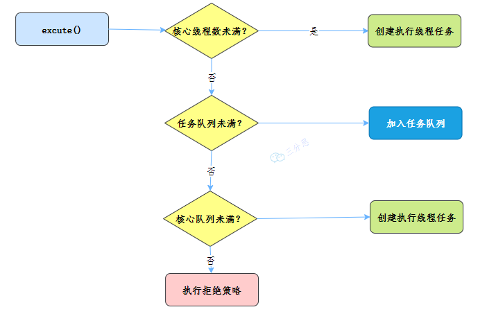

线程池执行流程

### 线程池提交 execute 和 submit 有什么区别？

execute 用于提交不需要返回值的任务

```java
threadsPool.execute(new Runnable() {
    @Override public void run() {
        // TODO Auto-generated method stub }
    });
```

submit()方法用于提交需要返回值的任务。线程池会返回一个 future 类型的对象，通过这个 future 对象可以判断任务是否执行成功，并且可以通过 future 的 get()方法来获取返回值

```java
Future<Object> future = executor.submit(harReturnValuetask);
try { Object s = future.get(); } catch (InterruptedException e) {
    // 处理中断异常
} catch (ExecutionException e) {
    // 处理无法执行任务异常
} finally {
    // 关闭线程池 executor.shutdown();
}
```

### 有哪几种常见的线程池？

面试常问，主要有四种，都是通过工具类 Excutors 创建出来的


##
