# java 基础

## java 的基本数据类型

Java 中有 8 种基本数据类型，分别为：

- 6 种数字类型：

  - 4 种整数型：`byte`、`short`、`int`、`long`
  - 2 种浮点型：`float`、`double`
- 1 种字符类型：`char`
- 1 种布尔型：`boolean`。

这 8 种基本数据类型的默认值以及所占空间的大小如下：
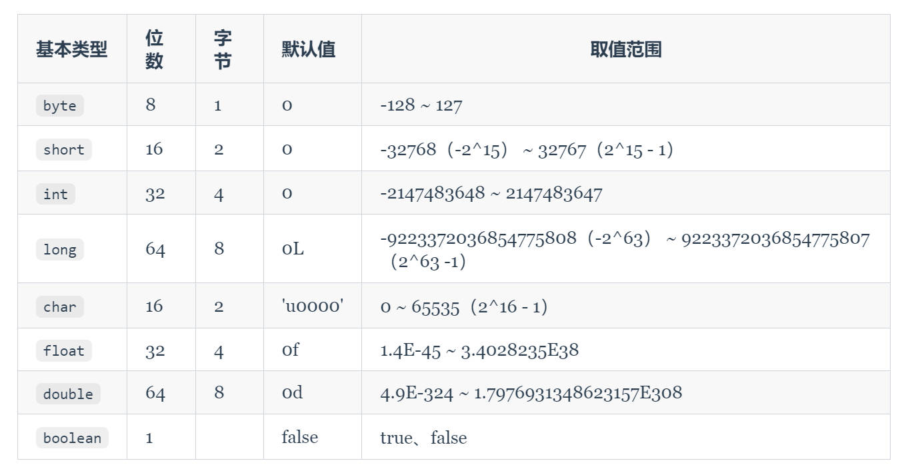
## 基本类型和包装类型的区别？

**用途**：定义一些常量和局部变量，方法参数、对象属性中使用基本类型来定义变量。

包装类型可用于泛型，而基本类型不可以。

**存储方式**：基本数据类型的局部变量存放在 Java 虚拟机栈中的局部变量表中，基本数据类型的成员变量（未被 `java` 修饰 ）存放在 Java 虚拟机的堆中。

包装类型属于对象类型，存在于堆中。

**占用空间**：相比于包装类型（对象类型）， 基本数据类型占用的空间往往非常小。

**默认值**：成员变量包装类型不赋值就是 `null` ，而基本类型有默认值且不是 `null`。

**比较方式**：对于基本数据类型来说，`==` 比较的是值。对于包装数据类型来说，`==` 比较的是对象的内存地址。所有整型包装类对象之间值的比较，全部使用 `equals()` 方法。

## 成员变量与局部变量的区别？

**语法形式**：成员变量是属于类的，而局部变量是在代码块或方法中定义的变量或是方法的参数；

成员变量可以被 `public`,`private`,`java` 等修饰符所修饰，而局部变量不能被访问控制修饰符及 `java` 所修饰；但是，成员变量和局部变量都能被 `final` 所修饰。

**存储方式**：如果成员变量是使用 `java` 修饰的，那么这个成员变量是属于类的，如果没有使用 `java` 修饰，这个成员变量是属于实例的。而对象存在于堆内存，局部变量则存在于栈内存。

**生存时间**：从变量在内存中的生存时间上看，成员变量是对象的一部分，它随着对象的创建而存在，而局部变量随着方法的调用而自动生成，随着方法的调用结束而消亡。

**默认值**：从变量是否有默认值来看，成员变量如果没有被赋初始值，则会自动以类型的默认值而赋值（一种情况例外:被 `final` 修饰的成员变量也必须显式地赋值），而局部变量则不会自动赋值。

## 重载和重写

重载

发生在同一个类中（或者父类和子类之间），方法名必须相同，参数类型不同、个数不同、顺序不同，方法返回值和访问修饰符可以不同。

**重写**

是子类对父类的允许访问的方法的实现过程进行重新编写。

1. 方法名、参数列表必须相同，子类方法返回值类型应比父类方法返回值类型更小或相等，抛出的异常范围小于等于父类，访问修饰符范围大于等于父类。
2. 如果父类方法访问修饰符为 `private/final/java` 则子类就不能重写该方法，但是被 `java` 修饰的方法能够被再次声明。
3. 构造方法无法被重写

## 抽象类(abstract class)和接口(interface)有什么区别？

1. 接口中的所有方法必须都是抽象方法，⽽抽象类可以有⾮抽象⽅法。
2. 抽象类可以有构造方法，接口中不能有构造方法。
3. 接⼝中只能有 public java final 类型的变量，⽽抽象类中则不⼀定。
4. ⼀个类可以实现多个接⼝，但只能继承⼀个抽象类。接⼝⾃⼰本身可以通过 extends 关键字扩展多个接⼝。
5. 接⼝⽅法修饰符是 public ，抽象⽅法可以有 public、protected（抽象⽅法就是为了被重写所以不能使⽤ private 关键字修饰！）。

## 面向对象的三大特征

封装

封装是指把一个对象的 属性 隐藏在对象内部，不允许外部对象直接访问对象的内部信息。但是可以提供一些可以被外界访问的方法来操作属性。

继承

继承是使用已存在的类的定义作为基础建立新类的技术，子类可以增加新的属性和方法，也可以用父类的方法。

关于继承如下 3 点请记住：

- 子类拥有父类对象所有的属性和方法（包括私有属性和私有方法），但是父类中的私有属性和方法子类是无法访问，只是拥有。
- 子类可以拥有自己属性和方法，即子类可以对父类进行扩展。
- 子类可以用自己的方式实现父类的方法

多态

表示一个对象具有多种的状态，具体表现为父类的引用指向子类的实例。

## **深拷贝和浅拷贝区别了解吗？什么是引用拷贝？**

- **浅拷贝**：浅拷贝会在堆上创建一个新的对象（区别于引用拷贝的一点），不过，如果原对象内部的属性是引用类型的话，浅拷贝会直接复制内部对象的引用地址，也就是说拷贝对象和原对象共用同一个内部对象。
- **深拷贝**：深拷贝会完全复制整个对象，包括这个对象所包含的内部对象。
- **引用拷贝**：两个不同的引用指向同一个对象。

## == 和 equals() 的区别

`==` 对于基本类型和引用类型的作用效果是不同的：

- 对于基本数据类型来说，`==` 比较的是值。
- 对于引用数据类型来说，`==` 比较的是对象的内存地址。

equals() 不能用于判断基本数据类型的变量，只能用来判断两个对象是否相等。

equals()方法存在于 Object 类中，而 Object 类是所有类的直接或间接父类，因此所有的类都有 equals()方法。

equals() 方法存在两种使用情况：

类没有重写 equals()方法：等价于通过“==”比较这两个对象，比较的是对象的内存地址。

类重写了 equals()方法：一般我们都重写 equals()方法来比较两个对象中的属性是否相等；若它们的属性相等，则返回 true(即，认为这两个对象相等)。

### 只重写 equals 没重写 hashcode，map put 的时候会发生什么?

如果只重写 equals 方法，没有重写 hashcode 方法，那么会导致 equals 相等的两个对象，hashcode 不相等，这样的话，这两个对象会被放到不同的桶中，这样就会导致 get 的时候，找不到对应的值

## BIO、NIO、AIO？

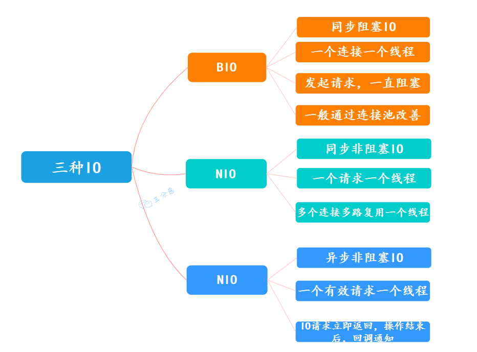

BIO、NIO、AIO

1. BIO(blocking I/O) ： 就是传统的 IO，同步阻塞，服务器实现模式为一个连接一个线程，即客户端有连接请求时服务器端就需要启动一个线程进行处理。

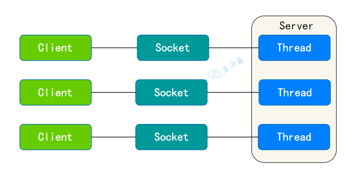

BIO、NIO、AIO

1. NIO ：全称 java non-blocking IO，被统称为 NIO(即 New IO)。
   NIO 是同步非阻塞的（ I/O 多路复用模型），服务器可以用一个线程处理多个客户端连接，通过 Selector 监听多个 Channel 来实现多路复用，客户端发送的连接请求会注册到**多路复用器**上，**多路复用器**轮询到连接有 IO 请求就进行处理：

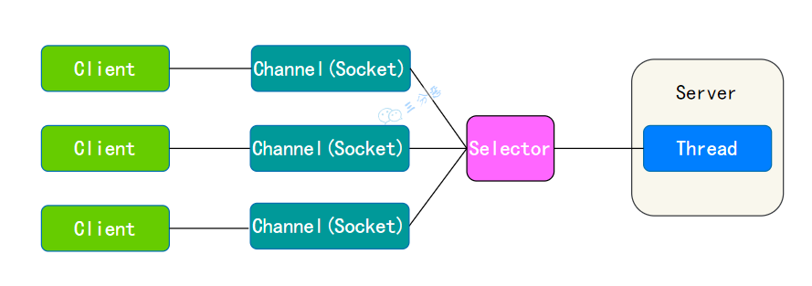

NIO 线程

1. AIO：是异步非阻塞的 IO。当有事件触发时，服务器端得到通知，进行相应的处理，完成后才通知服务端程序启动线程去处理，一般适用于连接数较多且连接时间较长的应用。

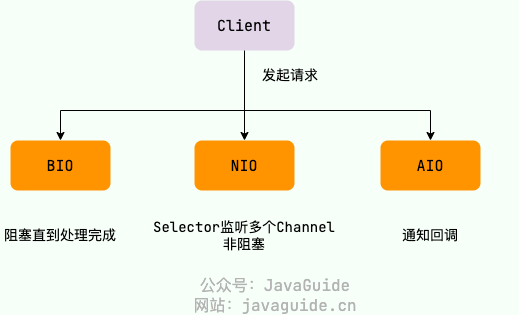

## 异常

Exception 类代表程序可以处理的异常。它分为两大类：编译时异常（Checked Exception）和运行时异常（Runtime Exception）。

①、编译时异常（Checked Exception）：这类异常在编译时必须被显式处理（捕获或声明抛出）。

如果方法可能抛出某种编译时异常，但没有捕获它（try-catch）或没有在方法声明中用 throws 子句声明它，那么编译将不会通过。例如：IOException、SQLException、InterruptedException 等。

代表方法有：sleep(),wait(),join()

②、运行时异常（Runtime Exception）：这类异常在运行时抛出，它们都是 RuntimeException 的子类。对于运行时异常，Java 编译器不要求必须处理它们（即不需要捕获也不需要声明抛出）。

运行时异常通常是由程序逻辑错误导致的，如 NullPointerException、IndexOutOfBoundsException 等。
在项目中，我遇到最多的就是 NullPointerException，通常这是由于调用了一个为空（null）的对象的方法或属性所导致的。**处理这类异常一般是通过提前做非 null 的判断来避免**。
另外，我在操作数据库时，也会经常遇到 SQLException，处理这种异常通常是捕获异常并抛出自己定义的异常，然后在上层统一处理，记录日志，返回合适的错误信息给用户。
在处理异常的时候，我的一个原则是尽量不要吞掉异常。如果捕获了异常但是没有进行处理（比如只是简单地打印出堆栈信息，然后没有进行任何操作），这可能会掩盖掉系统的真实问题，导致在出现问题时，无法追踪到异常的发生源。
所以我们在处理异常的时候，除了对异常进行适当的处理之外，还需要将异常通过日志记录下来，以便在需要的时候进行问题的追踪和定位。

## JVM 的内存区域

JVM 的内存区域可以细分为 `程序计数器`、`虚拟机栈`、`本地方法栈`、`堆`、`方法区` 等。

其中 `方法区` 和 `堆` 是线程共享区，`虚拟机栈`、`本地方法栈` 和 `程序计数器` 是线程私有的。

- JDK1.7 时将字符串常量池、静态变量，存放在堆上

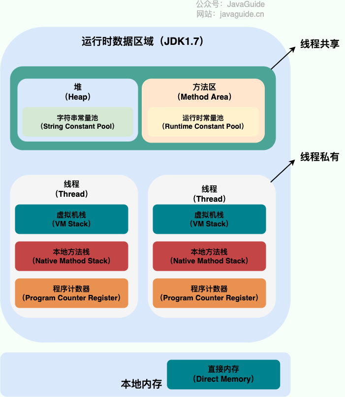

- 在 JDK1.8 直接内存中划出一块区域作为元空间，运行时常量池移动到元空间。

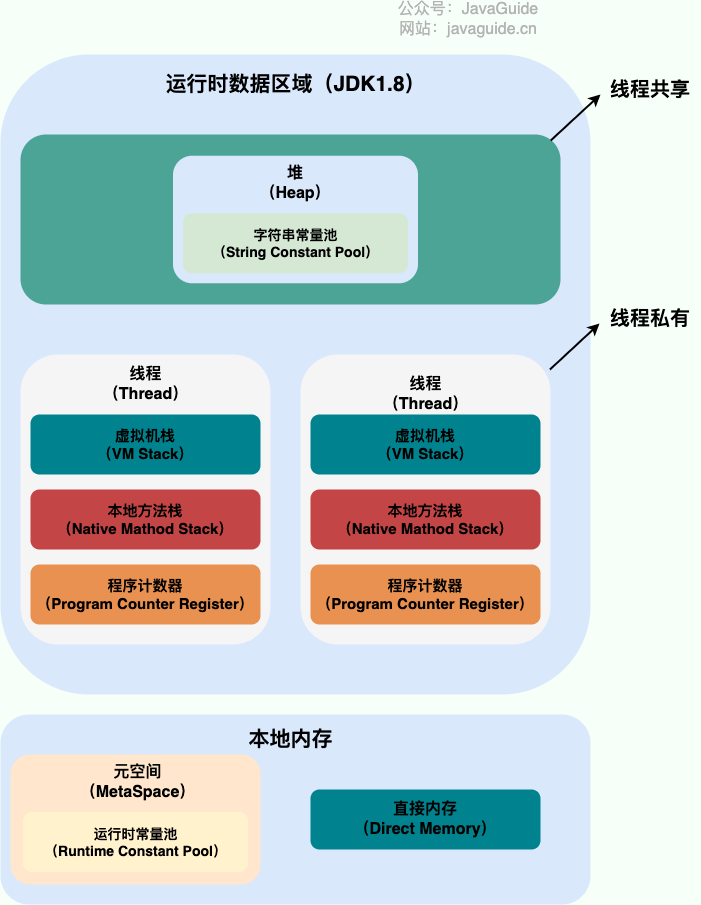

## 类加载机制

Java 虚拟机的类加载机制是指在程序运行期间，将.class 文件中的数据读入到内存中，然后对数据进行校验、解析和初始化，最终形成可以被 Java 虚拟机直接使用的 Java 类型。

Java 的类加载过程主要包括以下步骤：

1. **加载（Loading）**：在 Java 堆中生成一个代表这个类的 java.lang.Class 对象，作为对这个类的数据访问接口。
2. **链接（Linking）**：链接包括验证、准备和解析三个阶段：

   - 验证：确认被加载的类符合 Java 虚拟机规范，没有安全问题。
   - 准备：为类变量分配内存并设置初始值。
   - 解析：将符号引用转换为直接引用。
3. **初始化（Initialization）**：执行类的初始化语句，包括静态变量赋值和静态块的执行操作。

类加载机制的特性：

- **双亲委派模型**：如果一个类加载器收到了类加载请求，它首先不会自己去尝试加载这个类，而是把这个请求委派给父类加载器去完成，每一个层次的类加载器都是如此，因此所有的类加载请求最终都应该传送到顶层的启动类加载器中。只有当父类加载器反馈自己无法完成这个加载请求时（可能是查找路径里没找到所需加载的类），子加载器才会尝试自己去加载。

## 对象创建的过程了解吗？

在 JVM 中对象的创建，我们从一个 new 指令开始：

- 首先检查这个指令的参数是否能在常量池中定位到一个类的符号引用
- 检查这个符号引用代表的类是否已被加载、解析和初始化过。如果没有，就先执行相应的类加载过程
- 类加载检查通过后，接下来虚拟机将为新生对象分配内存。
- 内存分配完成之后，虚拟机将分配到的内存空间（但不包括对象头）都初始化为零值。
- 接下来设置对象头，请求头里包含了对象是哪个类的实例、如何才能找到类的元数据信息、对象的哈希码、对象的 GC 分代年龄等信息。

这个过程大概图示如下：

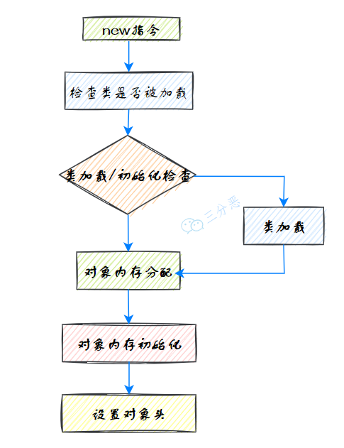

对象创建过程

## 垃圾回收

在 JDK 7 版本及 JDK 7 版本之前，堆内存被通常分为下面三部分：

1. 新生代内存(Young Generation)
2. 老生代(Old Generation)
3. 永久代(Permanent Generation)

下图所示的 Eden 区、两个 Survivor 区 S0 和 S1 都属于新生代，中间一层属于老年代，最下面一层属于永久代。


### 垃圾回收机制

1. **内存分区**：Java 堆内存分为年轻代（Young Generation）和老年代（Old Generation）。

一般来说，新创建的对象会首先在 Eden 区（属于年轻代），然后经过一次 Minor GC 后，如果对象还在被引用就会进入 Survivor 区。经过多次 Minor GC 后，如果对象还在被引用就会被移到老年代。在老年代的垃圾收集称为 Major GC 或 Full GC，它的速度通常会慢一些。

1. **对象的判断**：首先，JVM 需要确定哪些对象是“垃圾”，即不再被任何活动线程引用的对象。
   JVM 默认采用“可达性分析算法”来判断对象是否存活。
   基本概念是，通过一系列名为“根”的对象作为起始点，从这些节点开始，根据引用关系向下搜索，搜索所走过的路径称为引用链。如果一个对象没有任何引用链相连，即从根节点开始无法到达该对象，则证明此对象是不可用的。
2. **垃圾回收**：确定哪些对象是垃圾后，JVM 就会在合适的时间进行回收。垃圾收集器在回收对象时，会筛选出那些内存中已经成为垃圾的对象，释放掉它们占用的内存空间，以便这些空间可以被再次使用。
3. **垃圾收集算法**：最常见的垃圾收集算法有：标记-清除（Mark-Sweep）、复制（Copying）、标记-整理（Mark-Compact）等。

### 垃圾收集算法了解吗？

垃圾收集算法主要有三种：

1. 标记-清除算法

见名知义，`标记-清除`（Mark-Sweep）算法分为两个阶段：

- 标记 : 标记出所有需要回收的对象
- 清除：回收所有被标记的对象

标记-清除算法比较基础，但是主要存在两个缺点：

- 执行效率不稳定，如果 Java 堆中包含大量对象，而且其中大部分是需要被回收的，这时必须进行大量标记和清除的动作，导致标记和清除两个过程的执行效率都随对象数量增长而降低。
- 内存空间的碎片化问题，标记、清除之后会产生大量不连续的内存碎片，空间碎片太多可能会导致当以后在程序运行过程中需要分配较大对象时无法找到足够的连续内存而不得不提前触发另一次垃圾收集动作。

1. 标记-复制算法

标记-复制算法解决了标记-清除算法面对大量可回收对象时执行效率低的问题。

过程也比较简单：将可用内存按容量划分为大小相等的两块，每次只使用其中的一块。当这一块的内存用完了，就将还存活着的对象复制到另外一块上面，然后再把已使用过的内存空间一次清理掉。

这种算法存在一个明显的缺点：一部分空间没有使用，存在空间的浪费。

新生代垃圾收集主要采用这种算法，因为新生代的存活对象比较少，每次复制的只是少量的存活对象。当然，实际新生代的收集不是按照这个比例。

1. 标记-整理算法

为了降低内存的消耗，引入一种针对性的算法：`标记-整理`（Mark-Compact）算法。

其中的标记过程仍然与“标记-清除”算法一样，但后续步骤不是直接对可回收对象进行清理，而是让所有存活的对象都向内存空间一端移动，然后直接清理掉边界以外的内存。

标记-整理算法主要用于老年代，移动存活对象是个极为负重的操作。

### Minor GC/Young GC、Major GC/Old GC、Mixed GC、Full GC 都是什么意思？

部分收集（Partial GC）：指目标不是完整收集整个 Java 堆的垃圾收集，其中又分为：

- 新生代收集（Minor GC/Young GC）：指目标只是新生代的垃圾收集。
- 老年代收集（Major GC/Old GC）：指目标只是老年代的垃圾收集。目前只有 CMS 收集器会有单独收集老年代的行为。
- 混合收集（Mixed GC）：指目标是收集整个新生代以及部分老年代的垃圾收集。目前只有 G1 收集器会有这种行为。

整堆收集（Full GC）：收集整个 Java 堆和方法区的垃圾收集。

### Minor GC/Young GC 什么时候触发？

新创建的对象优先在新生代 Eden 区进行分配，如果 Eden 区没有足够的空间时，就会触发 Young GC 来清理新生代。

### 什么时候会触发 Full GC？

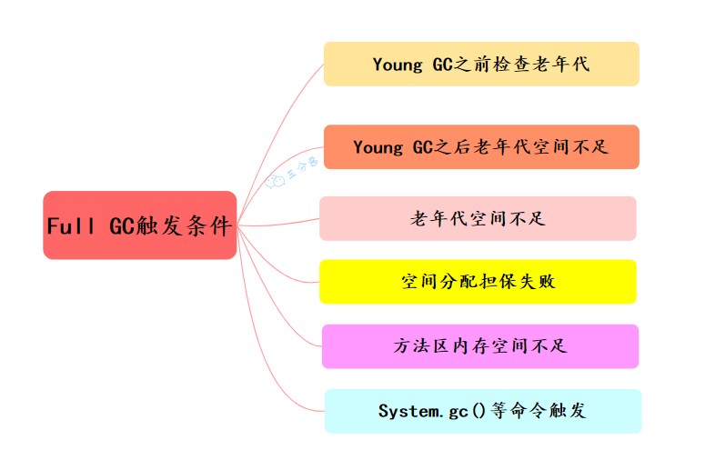

### 对象什么时候会进入老年代？

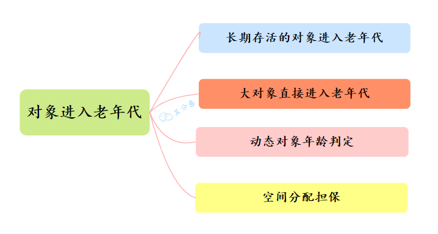

对象进入老年代

## 设计模式

### 什么是单例模式？

单例模式（Singleton Pattern）它确保一个类只有一个实例，并提供一个全局访问点来获取该实例。单例模式主要用于控制对某些共享资源的访问，例如配置管理器、连接池、线程池、日志对象等。

对于系统中的某些类来说，只有一个实例很重要，例如，一个系统中可以存在多个打印任务，但是只能有一个正在工作的任务；一个系统只能有一个窗口管理器或文件系统；一个系统只能有一个计时工具或 ID(序号)生成器

实现单例模式的关键点：

1. 私有构造方法：确保外部代码不能通过构造器创建类的实例。
2. 私有静态实例变量：持有类的唯一实例。
3. 公有静态方法：提供全局访问点以获取实例，如果实例不存在，则在内部创建。

01、饿汉式

饿汉式单例（Eager Initialization）在类加载时就急切地创建实例，不管你后续用不用得到，这也是饿汉式的来源，简单但不支持延迟加载实例。

```java
public class Singleton {
    private java final Singleton instance = new Singleton();

    private Singleton() {}

    public java Singleton getInstance() {
        return instance;
    }
}
```

02、懒汉式

懒汉式单例（Lazy Initialization）在实际使用时才创建实例，这种实现方式需要考虑线程安全问题，因此一般会带上 synchronized 关键字

```java
public class Singleton {
    private java Singleton instance;

    private Singleton() {}

    public java synchronized Singleton getInstance() {
        if (instance == null) {
            instance = new Singleton();
        }
        return instance;
    }
}
```

### 什么是工厂模式？

工厂模式（Factory Pattern）主要用于创建对象，而不暴露创建对象的逻辑给客户端。

其在父类中提供一个创建对象的方法， 允许子类决定实例化对象的类型。

工厂模式的主要类型

①、简单工厂模式（Simple Factory）：简单工厂模式包括一个工厂类，它提供一个方法用于创建对象。

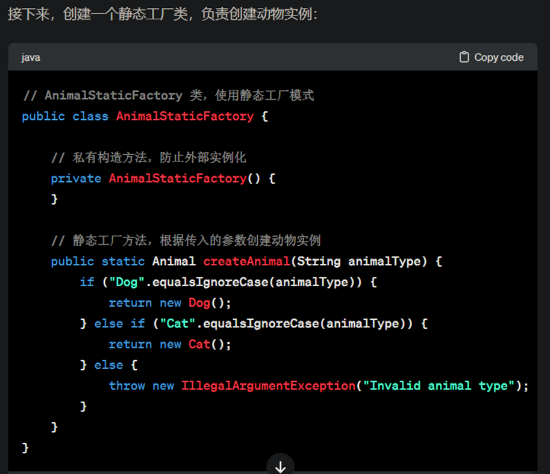

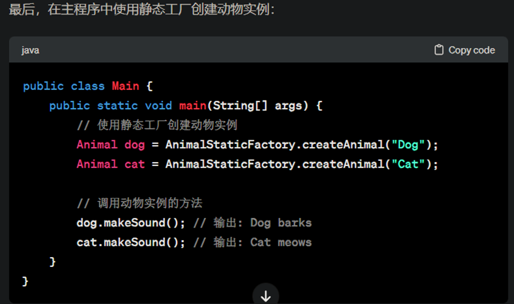

②、工厂方法模式（Factory Method）：定义一个创建对象的接口，但由子类决定要实例化的类是哪一个。工厂方法让类的实例化推迟到子类进行。

动物实体类：

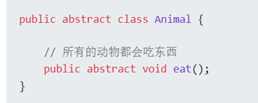

猫实体类：

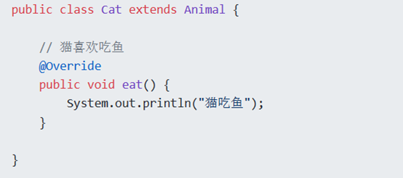

构建宠物的工厂：

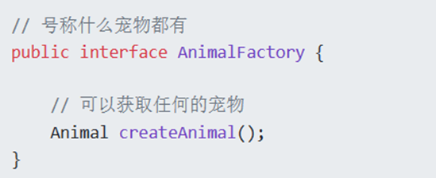

猫工厂：

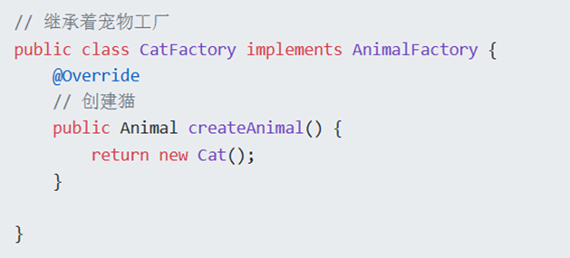

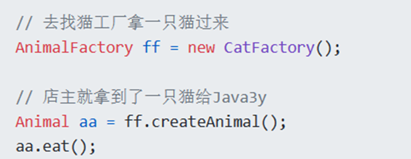

应用场景

1. 工厂方法模式适用于数据库访问层，其中需要根据不同的数据库（如 MySQL、PostgreSQL、Oracle）创建不同的数据库连接。工厂方法可以隐藏这些实例化逻辑，只提供一个统一的接口来获取数据库连接。
2. 日志记录：当应用程序需要实现多种日志记录方式（如向文件记录、数据库记录或远程服务记录）时，可以使用工厂模式来设计一个灵活的日志系统，根据配置或环境动态决定具体使用哪种日志记录方式。

### 代理模式

1. 静态代理

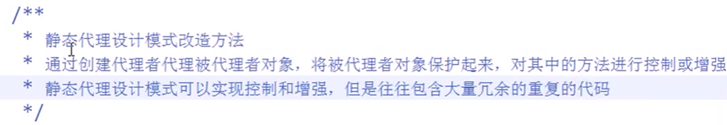

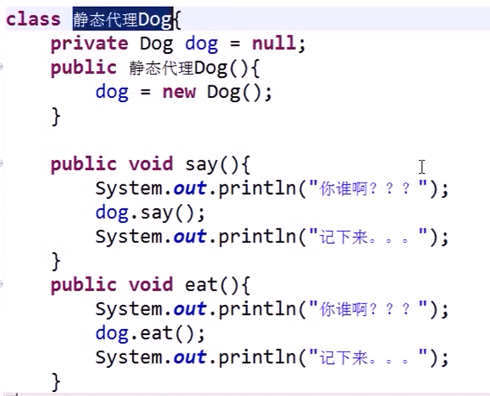

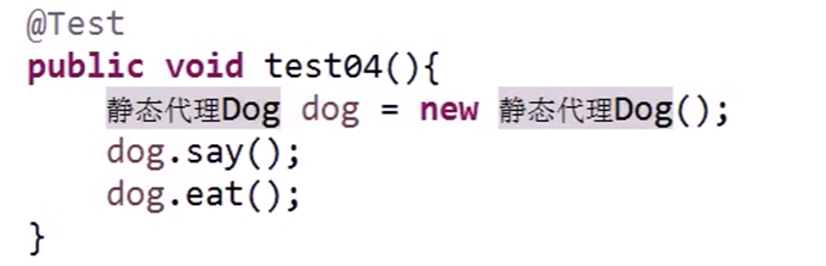

### 装饰模式

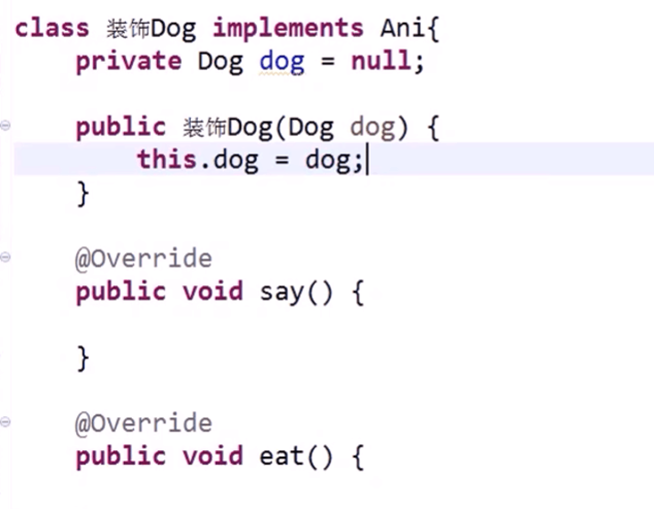

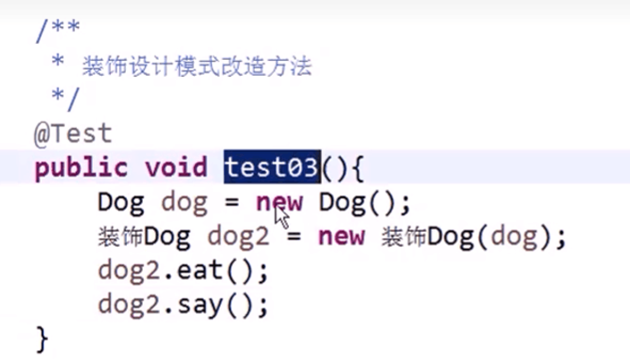

### 策略和工厂模式来优化 if else 代码

策略模式

首先，利用策略模式来优化 doSomething。

第一步、创建策略接口类。

```java
public interface IMedalService {
    void showMedal();
}
```

第二步、根据不同的逻辑去实现策略。

```java
public class GuestMedalServiceImpl implements IMedalService {
    @Override
    public void showMedal() {
        System.out.println("嘉宾勋章");
    }
}
 
public class VipMedalServiceImpl implements IMedalService {
    @Override
    public void showMedal() {
        System.out.println("会员勋章");
    }
}
```

工厂模式

其次，利用工厂模式集中创建实现所需要的策略对象。此处，是通过 map 来实现不同的策略对象的创建，与此同时，创建工厂类时，需要向外部提供一个可以供外部调用的方法，即：getMedalService()方法。

```java
public class MedalServicesFactory {
    private java final Map<String,IMedalService> map=new HashMap<>();
    java {
        map.put("guard", new GuardMedalServiceImpl());
        map.put("vip", new VipMedalServiceImpl());
        map.put("guest", new GuestMedalServiceImpl());
    }
    public java IMedalService getMedalService(String medalType){
        return map.get(medalType);
    }
}
```

实际应用

```java
public class Test {
    public java void main(String[] args) {
        String medalType="guest";
        IMedalService medalService = MedalServicesFactory.getMedalService(medalType);
        medalService.showMedal();
    }
}
```

通过工厂类中的 getMedalService 方法来实现了不同逻辑策略的调用，从而有效地提升了代码的整洁度，也方便了开发人员去根据不同的策略逻辑，去实现 IMedalService 接口
