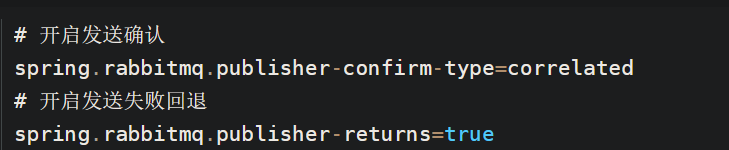
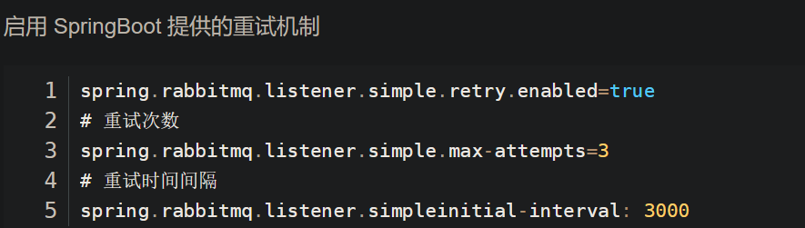

# 消息队列

## 为什么要使用消息队列呢？

消息队列主要有三大用途，我们拿一个电商系统的下单举例：

- 解耦：用户下单后可以把订单完成的消息丢进队列里，这样就完成了用户下单和记录到数据库的解耦。
- 异步：下单之后，我们要扣减库存、增加积分、发送消息等等，这样一来这个链路就长了，链路一长，响应时间就变长了。引入消息队列，除了 `更新订单状态`，其它的都可以异步去做，这样一来就来，就能降低响应时间。
- 削峰：消息队列可以用来削峰，例如秒杀系统，平时流量很低，但是要做秒杀活动，秒杀的时候流量疯狂怼进来，我们的服务器，Redis，MySQL 各自的承受能力都不一样，直接全部流量照单全收肯定有问题啊，严重点可能直接打挂了。我们可以把请求扔到队列里面，这样就能抗住短时间的大流量了。

解耦、异步、削峰，是消息队列最主要的三大作用

## 什么是消息队列

消息队列是一个存放消息的容器，当我们需要使用消息的时候，直接从容器中取出消息供自己使用即可。由于队列 Queue 是一种先进先出的数据结构，所以消费消息时也是按照顺序来消费的。

参与消息传递的双方称为 生产者 和 消费者 ，生产者负责发送消息，消费者负责处理消息。

RabbitMQ 的整体模型架构如下：


RabbitMQ 的整体模型架构

**多个消费者可以订阅同一个队列**，这时队列中的消息会被平均分摊（Round-Robin，即轮询）给多个消费者进行处理，而不是每个消费者都收到所有的消息并处理，这样**避免消息被重复消费**。

## **说说生产者 Producer 和消费者 Consumer?**

**生产者** :

- 消息生产者，就是投递消息的一方。
- 消息一般包含两个部分：消息体（`payload`)和标签(`Label`)。

**消费者**：

- 消费消息，也就是接收消息的一方。
- 消费者连接到 RabbitMQ 服务器，并订阅到队列上。消费消息时只消费消息体，丢弃标签。

## **说说 Broker 服务节点、Queue 队列、Exchange 交换器？**

- **Broker**：可以看做 RabbitMQ 的服务节点。一般情况下一个 Broker 可以看做一个 RabbitMQ 服务器。
- **Queue**：RabbitMQ 的内部对象，用于存储消息。多个消费者可以订阅同一队列，这时队列中的消息会被平摊（轮询）给多个消费者进行处理。
- **Exchange**：生产者将消息发送到交换器，由交换器将消息路由到一个或者多个队列中。当路由不到时，或返回给生产者或直接丢弃。

## **RabbitMQ 消息怎么传输？**

由于 TCP 链接的创建和销毁开销较大，且并发数受系统资源限制，会造成性能瓶颈

RabbitMQ 使用信道的方式来传输数据。信道（Channel）是生产者、消费者与 RabbitMQ 通信的渠道，信道是建立在 TCP 链接上的虚拟链接，且每条 TCP 链接上的信道数量没有限制。就是说 RabbitMQ 在**一条 TCP 链接上建立成百上千个信道来达到多个线程处理**，这个 TCP 被多个线程共享，每个信道在 RabbitMQ 都有唯一的 ID，保证了信道私有性，每个信道对应一个线程使用。

## **如何保证消息的可靠性？**

1. 生产者到 RabbitMQ：事务机制和 Confirm 机制。
   1. confirm 消息确认机制：生产端投递的消息一旦投递到 RabbitMQ 后，RabbitMQ 就会发送一个确认消息给生产端，让生产端知道我已经收到消息了，否则这条消息就可能已经丢失了，需要生产端重新发送消息。

   ```yaml
   ```

spring:
rabbitmq:
_##开启 confirm 确认机制_
publisher-confirms: true

```
	

2. RabbitMQ 自身：持久化、集群（普通模式、镜像模式）

消息持久化：相关的数据都持久化到硬盘中。在Spring Boot中消息默认就是持久化的。


1. RabbitMQ 到消费者：
	1. ACK机制改为手动

（RabbitMQ的自动ack机制默认在消息发出后就立即将这条消息删除，而不管消费端是否接收到，是否处理完。）

我们需要改为手动消费，当消息消费失败时，消费端回复n ack，消息重新入队。

SpringBoot 给我们提供了一种重试机制，当消费者执行的业务方法报错时会重试执行消费者业务方法。




### **镜像集群模式**

RabbitMQ 的高可用模式。跟普通集群模式不一样的是，在镜像集群模式下，创建的 queue，无论元数据还是 queue 里的消息都会存在于多个实例上，就是说，每个 RabbitMQ 节点都有这个 queue 的一个完整镜像，包含 queue 的全部数据的意思。然后每次写消息到 queue 的时候，都会自动把消息同步到多个实例的 queue 上。

## 消息重复消费怎么处理？

消息重复的原因有两个：

1. 生产时消息重复

生产者发送消息给MQ，在MQ确认的时候出现了网络波动，生产者没有收到确认，这时候生产者就会重新发送这条消息，导致MQ会接收到重复消息。

1. 消费时消息重复。

消费者消费成功后，给MQ确认的时候出现了网络波动，MQ没有接收到确认，为了保证消息不丢失，MQ就会继续给消费者投递之前的消息。这时候消费者就接收到了两条一样的消息。

由于重复消息是由于网络原因造成的，无法避免。

解决方法：发送消息时让每个消息携带一个全局的唯一ID，在消费消息时先判断消息是否已经被消费过，保证**消息消费逻辑的幂等性**。具体消费过程为：

1. 消费者获取到消息后先根据id去查询redis/db是否存在该消息

2. 如果不存在，则正常消费，消费完毕后写入redis/db

3. 如果存在，则证明消息被消费过，直接丢弃

## **如何保证 RabbitMQ 消息的顺序性？**

- 拆分多个 queue(消息队列)，每个 queue(消息队列) 一个 consumer(消费者)

- 或者就一个 queue (消息队列)但是对应一个 consumer(消费者)，然后这个 consumer(消费者)内部用内存队列做排队，然后分发给底层不同的 worker 来处理

## 什么是死信队列？

消费失败的消息存放的队列。

消息消费失败的原因：

- 消息被拒绝并且消息没有重新入队（requeue=false）

- 消息超时未消费

- 达到最大队列长度


## 导致的死信的几种原因？ 

1. 消息被拒（Basic.Reject /Basic.Nack) 且 requeue = false。

2. 消息TTL过期。

3. 队列满了，无法再添加。


```
