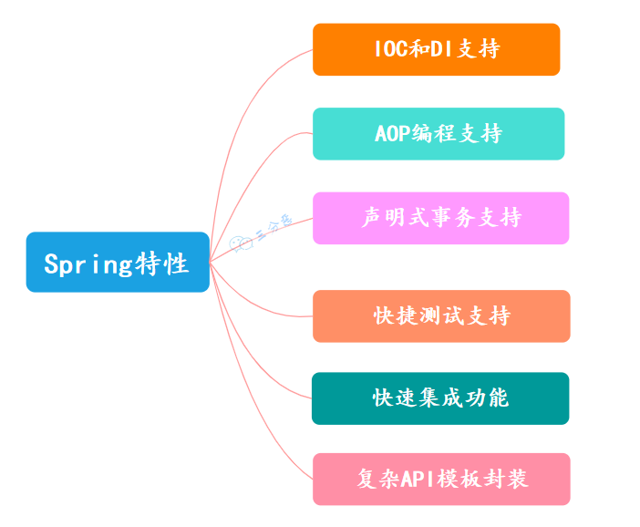
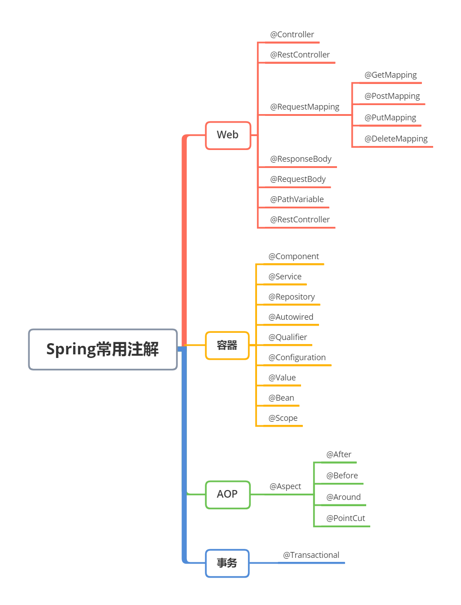
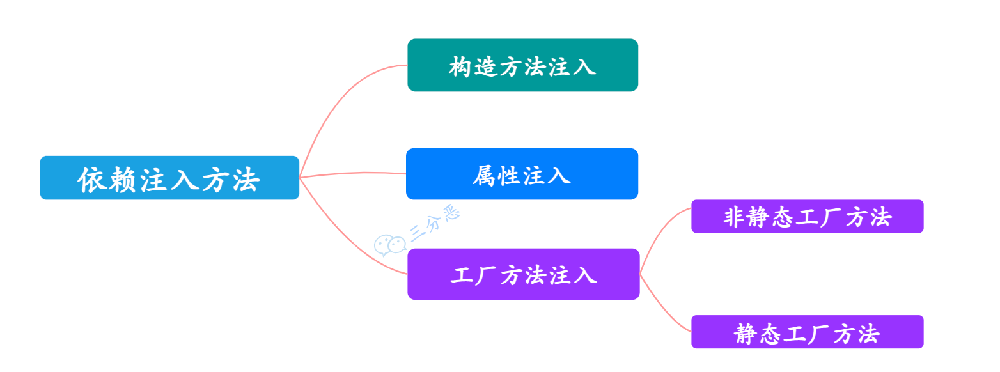
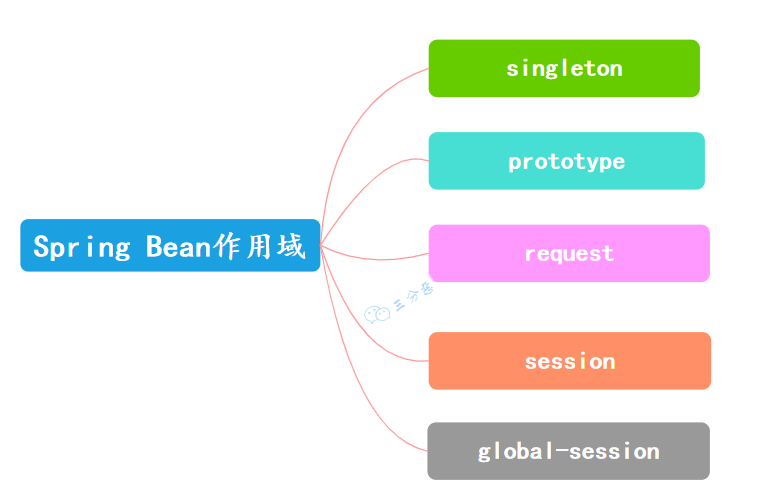

# Spring

## 基础

### Spring 特性



Spring 特性

1. IoC 和 DI 的支持

Spring 的核心就是一个大的工厂容器，可以维护所有对象的创建和依赖关系，Spring 工厂用于生成 Bean，并且管理 Bean 的生命周期，实现高内聚低耦合的设计理念。

1. AOP 编程的支持

Spring 提供了面向切面编程，可以方便的实现对程序进行权限拦截、运行监控等切面功能。

1. 声明式事务的支持

支持通过配置就来完成对事务的管理，以前重复的一些事务提交、回滚的 JDBC 代码，都可以不用自己写了。

1. 快捷测试的支持

Spring 对 Junit 提供支持，可以通过注解快捷地测试 Spring 程序。

1. 快速集成功能

方便集成各种框架

1. 复杂 API 模板封装

Spring 对 JavaEE 开发中非常难用的一些 API（JDBC、JavaMail、远程调用等）都提供了模板化的封装

### Spring 常用注解



- @Autowired：Spring 提供的工具（**优先按类型匹配**）
- @Resource: JDK 内置的（**优先按名称匹配**）
- @Configuration：声明当前类是一个配置类（相当于一个 Spring 配置的 xml 文件）
- @Value：可用在字段，构造器参数跟方法参数，指定一个默认值，支持 `#{} 跟 ${}` 两个方式。

（一般将 SpringbBoot 中的 application.properties 配置的属性值赋值给变量）

- @Bean：注解在方法上，声明当前方法的返回值为一个 Bean。
  （返回的 Bean 对应的类中可以定义 init()方法和 destroy()方法，然后在 `@Bean(initMethod=”init”,destroyMethod=”destroy”)` 定义，在构造之后执行 init，在销毁之前执行 destroy。）
- @Scope:定义我们采用什么模式去创建 Bean（方法上，得有 @Bean） 其设置类型包括：Singleton 、Prototype、Request 、 Session、GlobalSession

### Spring 中应用了哪些设计模式呢？

Spring 框架中广泛使用了不同类型的设计模式，下面我们来看看到底有哪些设计模式?

1. 工厂模式 : Spring 容器本质是一个大工厂，使用工厂模式通过 BeanFactory、ApplicationContext 创建 bean 对象。
2. 代理模式 : Spring AOP 功能功能就是通过代理模式来实现的，分为动态代理和静态代理。
3. 单例模式 : Spring 中的 Bean 默认都是单例的，这样有利于容器对 Bean 的管理。
4. 模板模式 : Spring 中 JdbcTemplate、RestTemplate 等以 Template 结尾的对数据库、网络等等进行操作的模板类，就使用到了模板模式。
5. 观察者模式: Spring 事件驱动模型就是观察者模式很经典的一个应用。
6. 适配器模式 :Spring AOP 的增强或通知 (Advice) 使用到了适配器模式、Spring MVC 中也是用到了适配器模式适配 Controller。
7. 策略模式：Spring 中有一个 Resource 接口，它的不同实现类，会根据不同的策略去访问资源。

### `@Transactional` 失效

Spring 框架中的 `@Transactional` 对事务进行管理的时候，有一些特殊情况会导致事务注解失效。以下列出一些常见的场景：

1. **自调用问题**：如果在同一个类中，一个没有加 @Transactional 注解的方法内部调用了加了 @Transactional 的另一个方法，那么事务是不会起作用的。这是因为 Spring 的 AOP 事务管理默认是通过动态代理实现的，而自调用是无法触发动态代理的。


1. **数据库引擎不支持事务**：如果你的数据库引擎（比如 MySQL 的 MyISAM 引擎）不支持事务，那么 @Transactional 也无法起作用。
2. **异常处理不当**：默认情况下，Spring 只有在抛出的是运行时异常（也就是非检查异常，比如 NullPointerException，IndexOutOfBoundsException 等 RuntimeException 及其子类）或者 Error 时，才会回滚事务，而在遇到编译时异常（即需要被显式地捕获处理的异常 IOException、SQLException）时，是不会回滚事务的。

要解决以上问题，可以进行以下尝试：对于自调用问题，可以考虑使用 AopContext 来手动获取代理对象；对于数据库引擎不支持事务，需要切换到支持事务的引擎，比如 InnoDB；

异常处理不当的问题，可以在 `@Transactional` 注解中添加 rollbackFor 属性，使得在特定的 Exception 抛出时，也触发事务回滚。

### protected 和 private 加事务失效

如果在 protected、private 方法上使用 `@Transactional`，这些事务注解将不会生效，原因：Spring 默认使用基于 JDK 的动态代理（当接口存在时）或基于 CGLIB 的代理（当只有类时）来实现事务。这两种代理机制都只能代理公开的方法。

## IoC

### 说一说什么是 IoC？什么是 DI？

所谓的 IoC（控制反转，Inversion of Control），就是由容器来控制对象的生命周期和对象之间的关系。

所有的类创建都通过 Spring 容器来，不再是开发者去 new，去 = null 销毁，这些创建和销毁的工作都交给 Spring 容器来。

DI（依赖注入，Dependency Injection）：

A 类需要 B 类，以前是 A 类自己 new 一个 B 类，现在是有人把 B 类注入到 A 类里。

**为什么要使用 IoC 呢？**

在平时的 Java 开发中，如果我们要实现某一个功能，可能至少需要两个以上的对象来协助完成，在没有 Spring 之前，需要自己 new 一个，比如说 A 要使用 B，A 就对 B 产生了依赖，也就是 A 和 B 之间存在了一种耦合关系。

有了 Spring 之后，创建 B 的工作交给了 Spring 来完成，Spring 创建好了 B 对象后就放到容器中，A 告诉 Spring 我需要 B，Spring 就从容器中取出 B 交给 A 来使用。

这就是 IoC 的好处，它降低了对象之间的耦合度，使得程序更加灵活，更加易于维护。

### Spring IoC 的实现机制大致可以分为以下步骤：

1. **配置文件加载**：首先，Spring IoC 容器通过读取配置信息（可以是 XML 文件、Java 配置类或者注解等），得到需要管理的 Bean 对象以及它们之间的依赖关系。
2. **Bean 的实例化**：根据配置信息，IoC 容器会创建这些对象。这个过程可能通过反射来完成，也可能通过 FactoryBean 来完成。
3. **依赖注入**：Spring IoC 容器会查看 Bean 对象之间的依赖关系，如果 A 对象依赖于 B 对象，那么 Spring IoC 容器会把已创建的 B 对象注入到 A 对象中。
4. **Bean 对象的使用**：最后，当需要使用某个 Bean 对象时，你可以直接从 Spring IoC 容器中获取。如果配置的是单例模式，每次获取的都是同一个对象，如果是原型模式，每次获取的会是一个新的对象。

### 你知道 Spring 容器启动阶段会干什么吗？

Spring 的 IoC 容器工作的过程，其实可以划分为两个阶段：容器启动阶段和 Bean 实例化阶段。

其中容器启动阶段主要做的工作是加载和解析配置文件，保存到对应的 Bean 定义中。


### Spring Bean 生命周期

Spring 中 Bean 的生命周期大致分为四个阶段：实例化（Instantiation）、属性赋值（Populate）、初始化（Initialization）、销毁（Destruction）。


Bean 生命周期四个阶段

对应的完整步骤如下图所示：


### 有哪些依赖注入的方法？

Spring 支持构造方法注入、属性注入、工厂方法注入,其中工厂方法注入，又可以分为静态工厂方法注入和非静态工厂方法注入。



Spring 依赖注入方法

### Spring 有哪些自动装配的方式？

> 什么是自动装配？

Spring IoC 容器知道所有 Bean 的配置信息，此外，通过 Java 反射机制还可以获知实现类的结构信息，如构造方法的结构、属性等信息。掌握所有 Bean 的这些信息后，Spring IoC 容器就可以按照某种规则对容器中的 Bean 进行自动装配，而无须通过显式的方式进行依赖配置。

Spring 提供的这种方式，可以按照某些规则进行 Bean 的自动装配，`<bean>` 元素提供了一个指定自动装配类型的属性：`autowire="<自动装配类型>"`

> Spring 提供了哪几种自动装配类型？

Spring 提供了 4 种自动装配类型：


Spring 四种自动装配类型

### Spring 中的 Bean 的作用域有哪些?

Spring 的 Bean 主要支持五种作用域：



Spring Bean 支持作用域

- singleton : 在 Spring 容器仅存在一个 Bean 实例，Bean 以单实例的方式存在，是 Bean 默认的作用域。
- prototype : 每次从容器中调用 Bean 时，都会返回一个新的实例。

以下三个作用域于只在 Web 应用中适用：

- request : 每一次 HTTP 请求都会产生一个新的 Bean，该 Bean 仅在当前 HTTP Request 内有效。
- session : 同一个 HTTP Session 共享一个 Bean，不同的 HTTP Session 使用不同的 Bean。

### Spring 中的单例 Bean 会存在线程安全问题吗？

首先结论在这：Spring 中的单例 Bean 不是线程安全的。

因为单例 Bean，是全局只有一个 Bean，所有线程共享。如果线程中的操作不会对 Bean 中的成员变量执行查询以外的操作，那么这个单例 Bean 是线程安全的。

假如会对 Bean 中的成员变量进行写操作，那么可能就存在线程安全的问题。

> 单例 Bean 线程安全问题怎么解决呢？

常见的有这么些解决办法：

将 Bean 中的成员变量保存在 ThreadLocal 中

ThredLocal 能保证多线程下变量的隔离，可以在类中定义一个 ThreadLocal 成员变量，将需要的可变成员变量保存在 ThreadLocal 里，这是推荐的一种方式。

## AOP

### 什么是 AOP

AOP，也就是 Aspect-oriented Programming，译为面向切面编程。

就是把一些业务逻辑中的相同代码抽取到一个独立的模块中，让业务逻辑更加清爽。


横向抽取

比如说可以将日志记录、事务管理等分离出来，形成一个切面，然后在业务代码中引入这个切面，业务代码不再关心这些通用逻辑，只需要关心自己的业务实现，这样就实现了业务逻辑和通用逻辑的分离，提高代码的可重用性。


AOP 应用示例

AOP 的核心其实就是动态代理，可以使用 JDK 的动态代理，也可以使用 CGLIB 代理，主要应用于一些系统级服务，如日志收集、事务管理、安全检查、缓存、对象池管理等。

- **JDK 动态代理**：JDK 原生的实现方式，需要被代理的目标类必须实现接口。因为这个技术要求**代理对象和目标对象实现同样的接口**（兄弟两个拜把子模式）。
- **cglib 动态代理**：通过**继承被代理的目标类**实现代理，所以不需要目标类实现接口。(**CGLIB 通过动态生成一个需要被代理类的子类（即被代理类作为父类），该子类重写被代理类的所有不是 final 修饰的方法，并在子类中采用方法拦截的技术拦截父类所有的方法调用，进而织入横切逻辑。**)

> 可以继续追问：AOP 有哪些核心概念？

- 切面（Aspect）：类是对物体特征的抽象，切面就是对横切关注点的抽象
- 连接点（Join Point）：被拦截到的点，因为 Spring 只支持方法类型的连接点，所以在 Spring 中，连接点指的是被拦截到的方法，实际上连接点还可以是字段或者构造方法
- 切点（Pointcut）：对连接点进行拦截的定位
- 通知（Advice）：指拦截到连接点之后要执行的代码，也可以称作增强
- 目标对象 （Target）：代理的目标对象
- 织入（Weabing）：织入是将增强添加到目标类的具体连接点上的过程。

> 继续追问：AOP 有哪些环绕方式？

AOP 一般有 5 种环绕方式：

- 前置通知 (@Before)
- 返回通知 (@AfterReturning)
- 异常通知 (@AfterThrowing)
- 后置通知 (@After)
- 环绕通知 (@Around)


### 用到 AOP

1. 在我的项目中，我使用 AOP 来实现统一的日志管理。具体实现方式是通过定义切面以及在切面中定义前置、后置、环绕等通知来记录需要的日志信息。

首先，我创建一个切面类，注解为 @Aspect，并在类上添加 @Component 让 Spring 容器管理该类。

```java
@Aspect
@Component
public class LogAspect {
    ...
}
```

定义切点 @Pointcut("execution(* com.example.controller..*(..))")

然后，我定义一个前置通知，使用 @Before 注解。在此通知中，我获取了请求的相关信息，如请求 URL、请求参数等，并写入日志。

```java
@Before("execution(* com.example.controller..*(..))")
public void doBefore(JoinPoint joinPoint) throws Throwable {
    // 在这里写入日志
    ...
}
```

接着，我定义一个后置通知，使用 @AfterReturning 注解。在此通知中，我记录方法的返回值，并将其写入日志。

```java
@AfterReturning(returning = "ret", pointcut = "execution(* com.example.controller..*(..))")
public void doAfterReturning(Object ret) throws Throwable {
    // 在这里写入日志
    ...
}
```

通过上述方式，我可以非常方便地在所有 Controller 层的方法执行前后切入自己的代码，从而实现日志的统一管理。这样既保证了代码的可维护性，又减少了重复代码，使得代码更加简洁。此外，借助 Spring 框架的力量，可以方便地定制日志信息，例如按照不同的级别（info、debug、warn、error）、不同的类或者方法等记录日志

具体： 把切点和通知合在一起就是切面了，一个切面指定了在何时何地执行何种方法

```java
@Aspect
@Component
public class LogAspect {

    private final Logger logger = LoggerFactory.getLogger(this.getClass());

    // 定义切点
    @Pointcut("execution(* com.example.controller..*(..))")
    public void log() {}

    //方法执行前的操作
    @Before("log()")
    public void doBefore(JoinPoint joinPoint) {
        ServletRequestAttributes attributes = (ServletRequestAttributes) RequestContextHolder.getRequestAttributes();
        HttpServletRequest request = attributes.getRequest();

        // 记录请求内容
        logger.info("URL : " + request.getRequestURL().toString());
        logger.info("HTTP METHOD : " + request.getMethod());
        logger.info("CLASS_METHOD : " + joinPoint.getSignature().getDeclaringTypeName() + "." + joinPoint.getSignature().getName());
        logger.info("ARGS : " + Arrays.toString(joinPoint.getArgs()));
    }

    //方法执行后的操作
    @AfterReturning(returning = "ret", pointcut = "log()")
    public void doAfterReturning(Object ret) throws Throwable {
        // 处理完请求，返回内容
        logger.info("RESPONSE : " + ret);
    }
}
```

1. 像 `@Transactional` 注解，就是一个典型的 AOP 应用，它就是通过 AOP 来实现事务管理的。我们只需要在方法上添加 `@Transactional` 注解，Spring 就会在方法执行前后添加事务管理的逻辑。
   (其本质是通过 AOP 功能，对方法前后进行拦截，将事务处理的功能编织到拦截的方法中，也就是在目标方法开始之前启动一个事务，在目标方法执行完之后根据执行情况提交或者回滚事务。)

CGLIB 动态代理实现：

它通过继承方式实现代理，不需要接口，被广泛应用于 Spring AOP 中，用于提供方法拦截操作。

1. 第一步：定义目标类（Solver），目标类 Solver 定义了一个 solve 方法，模拟了解决问题的行为。目标类不需要实现任何接口，这与 JDK 动态代理的要求不同。
2. 第二步：动态代理工厂（ProxyFactory），ProxyFactory 类实现了 MethodInterceptor 接口，这是 CGLIB 提供的一个方法拦截接口，用于定义方法的拦截逻辑。

   - ProxyFactory 接收一个 Object 类型的 target，即目标对象的实例。
   - 使用 CGLIB 的 Enhancer 类来生成目标类的子类（代理对象）。通过 setSuperclass 设置代理对象的父类为目标对象的类，setCallback 设置方法拦截器为当前对象（this），最后调用 create 方法生成并返回代理对象。
   - 重写 MethodInterceptor 接口的 intercept 方法以提供方法拦截逻辑。在目标方法执行前后添加自定义逻辑，然后通过 method.invoke 调用目标对象的方法。
3. 第三步：客户端使用代理，首先创建目标对象（Solver 的实例），然后使用 ProxyFactory 创建该目标对象的代理。通过代理对象调用 solve 方法时，会先执行 intercept 方法中定义的逻辑，然后执行目标方法，最后再执行 intercept 方法中的后续逻辑。

### Spring 的事务隔离级别？

Spring 的接口 TransactionDefinition 中定义了表示隔离级别的常量，当然其实主要还是对应数据库的事务隔离级别：

1. ISOLATION_DEFAULT：使用后端数据库默认的隔离界别，MySQL 默认可重复读，Oracle 默认读已提交。
2. ISOLATION_READ_UNCOMMITTED：读未提交
3. ISOLATION_READ_COMMITTED：读已提交
4. ISOLATION_REPEATABLE_READ：可重复读
5. ISOLATION_SERIALIZABLE：串行化

## Spring MVC 的工作流程？

Spring MVC 是基于模型-视图-控制器的 Web 框架，它的工作流程也主要是围绕着 Model、View、Controller 这三个组件展开的。


三分恶面渣逆袭：Spring MVC 的工作流程

①、发起请求：客户端通过 HTTP 协议向服务器发起请求。

②、前端控制器：这个请求会先到前端控制器，它是整个流程的入口点，负责接收请求并将其分发给相应的处理器。

③、处理器映射：前端控制器调用 HandlerMapping 来确定哪个 Controller 应该处理这个请求。通常会根据请求的 URL 来确定。

④、处理器适配器：一旦找到目标 Controller，前端控制器会使用 HandlerAdapter 来调用 Controller 的处理方法。

⑤、执行处理器：Controller 处理请求，处理完后返回一个 ModelAndView 对象，其中包含模型数据和逻辑视图名。

⑥、视图解析器：前端控制器 接收到 ModelAndView 后，会使用 ViewResolver 来解析视图名称，找到具体的视图页面。

⑦、渲染视图：视图使用模型数据渲染页面，生成最终的页面内容。

⑧、响应结果：前端控制器 将视图结果返回给客户端。

## SpringBoot 自动配置原理

在 Spring Boot 中，开启自动装配的注解是 `@EnableAutoConfiguration`。

Spring Boot 项目为了进一步简化，直接通过 `@SpringBootApplication` 注解一步搞定，这个注解包含了 `@EnableAutoConfiguration` 注解。

①、`@EnableAutoConfiguration` 只是一个简单的注解的核心是 `AutoConfigurationImportSelector` 类。

②、`AutoConfigurationImportSelector` 实现了 `ImportSelector` 接口，这个接口的作用就是收集需要导入的配置类，配合 `@Import(）` 就将相应的类导入到 Spring 容器中。

画张图来总结下：


