# 图书管理系统Demo
## 项目目录结构
```Bash
├─java
│  └─com
│      └─library
│          │  libraryApplication.java  // SpringApplication.run文件
│          │  
│          ├─config // 各种配置
│          │      
│          ├─controller // 前端接控制器
│          │      
│          ├─dto //Data Transfer Object，重构类，仅保留需要的属性
│          │      
│          ├─entity // 实体类
│          │      
│          ├─mapper // mybatis需求
│          │      
│          ├─service // 服务端接口
│          │  │  
│          │  └─impl // 服务端接口的实现类
│          │          
│          └─utils // 工具类
│                  
└─resources
    └─application.yaml // Springboot的配置
```
> Windows生成项目目录结构
>1. 用powershell打开需要生成项目结构的目录
>2. 输入`tree /f >project.txt`然后回车即可生成项目目录结构（project.txt为指定生成的项目结构文件）

## 数据库设计
```sql
-- 创建数据库
CREATE DATABASE IF NOT EXISTS book_management;
USE book_management;

-- 创建books表
CREATE TABLE IF NOT EXISTS books (
    id INT AUTO_INCREMENT PRIMARY KEY,
    title VARCHAR(255) NOT NULL, -- 书名
    author VARCHAR(255) NOT NULL, -- 作者
    price DECIMAL(10, 2) NOT NULL, -- 价格
    category VARCHAR(255) -- 类别
);

-- 插入数据
INSERT INTO books (title, author, price, category) VALUES 
('杀死一只知更鸟', '哈珀·李', 10.99, '小说'),
('1984', '乔治·奥威尔', 9.99, '小说'),
('魔戒', 'J.R.R. 托尔金', 20.99, '奇幻'),
('麦田里的守望者', 'J.D. 塞林格', 15.99, '小说'),
('了不起的盖茨比', 'F. 斯科特·菲茨杰拉德', 14.99, '小说'),
('傲慢与偏见', '简·奥斯汀', 12.99, '浪漫'),
('年轻女孩的日记', '安妮·弗兰克', 11.99, '传记'),
('哈利·波特与魔法石', 'J.K. 罗琳', 10.99, '奇幻'),
('霍比特人', 'J.R.R. 托尔金', 10.99, '奇幻'),
('动物农场', '乔治·奥威尔', 8.99, '小说');
```
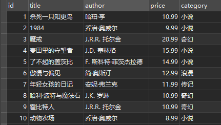
## 项目创建
1. 创建Springboot项目
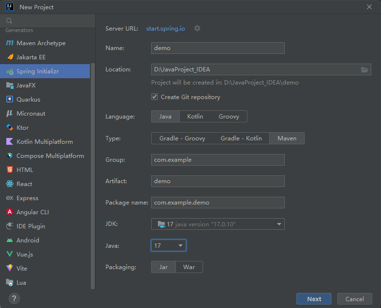
2. 添加Maven依赖
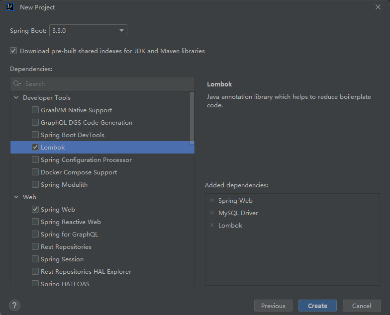

```xml
<!--pom.xml文件内容 -->
<?xml version="1.0" encoding="UTF-8"?>
<project xmlns="http://maven.apache.org/POM/4.0.0" xmlns:xsi="http://www.w3.org/2001/XMLSchema-instance"
         xsi:schemaLocation="http://maven.apache.org/POM/4.0.0 https://maven.apache.org/xsd/maven-4.0.0.xsd">
    <modelVersion>4.0.0</modelVersion>
    <parent>
        <groupId>org.springframework.boot</groupId>
        <artifactId>spring-boot-starter-parent</artifactId>
        <version>3.3.0</version>
        <relativePath/> <!-- lookup parent from repository -->
    </parent>
    <groupId>com.example</groupId>
    <artifactId>libraryDemo</artifactId>
    <version>0.0.1-SNAPSHOT</version>
    <name>libraryDemo</name>
    <description>libraryDemo</description>
    <properties>
        <java.version>17</java.version>
    </properties>
    <dependencies>
        <dependency>
            <groupId>org.springframework.boot</groupId>
            <artifactId>spring-boot-starter-web</artifactId>
        </dependency>

        <dependency>
            <groupId>com.mysql</groupId>
            <artifactId>mysql-connector-j</artifactId>
            <scope>runtime</scope>
        </dependency>
        <dependency>
            <groupId>org.projectlombok</groupId>
            <artifactId>lombok</artifactId>
            <optional>true</optional>
        </dependency>
        <dependency>
            <groupId>org.springframework.boot</groupId>
            <artifactId>spring-boot-starter-test</artifactId>
            <scope>test</scope>
        </dependency>
        <dependency>
            <groupId>com.baomidou</groupId>
            <artifactId>mybatis-plus-boot-starter</artifactId>
            <version>3.5.5</version>
            <!--这个版本的mybatis-plus中的mybatis-spring版本太老，需要排除依赖-->
            <exclusions>
                <exclusion>
                    <artifactId>mybatis-spring</artifactId>
                    <groupId>org.mybatis</groupId>
                </exclusion>
            </exclusions>
        </dependency>
        <!--导入高版本的mybatis-spring依赖-->
        <dependency>
            <groupId>org.mybatis</groupId>
            <artifactId>mybatis-spring</artifactId>
            <version>3.0.3</version>
        </dependency>
    </dependencies>

    <build>
        <plugins>
            <plugin>
                <groupId>org.springframework.boot</groupId>
                <artifactId>spring-boot-maven-plugin</artifactId>
                <configuration>
                    <excludes>
                        <exclude>
                            <groupId>org.projectlombok</groupId>
                            <artifactId>lombok</artifactId>
                        </exclude>
                    </excludes>
                </configuration>
            </plugin>
        </plugins>
    </build>
</project>

```
3. 删除多余的文件，完善目录结构
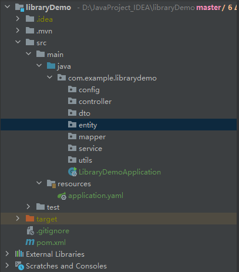
4. 编写Springboot的配置文件application.yaml
```yaml
server:
  port: 8081
spring:
  application:
    name: library
  datasource:
    driver-class-name: com.mysql.cj.jdbc.Driver
    url: jdbc:mysql://localhost:3306/book_management?useSSL=false&serverTimezone=UTC
    username: "root"
    password: "6446530"
  jackson:
    default-property-inclusion: non_null # JSON处理时忽略非空字段
mybatis-plus:
  type-aliases-package: com.example.librarydemo.entity # 别名扫描包
logging:
  level:
    com.example.librarydemo: debug

```
5. entity中创建实体类
```java
@Data
@EqualsAndHashCode(callSuper = false)
@Accessors(chain = true)
@TableName("books") // mybatis-plus的注解，表名
public class Book implements Serializable {
    private static final long serialVersionUID = 1L; // 定义一个常量，用于实现序列化
    // 主键
    @TableId(value = "id", type = IdType.AUTO)
    private Long id;
    // 书名
    private String title;
    // 作者
    private String author;
    // 价格
    private Long price;
    // 类型
    private String category;
}
```
6. config中创建 MybatisConfig 和 WebExceptionAdvice类
```java
@Configuration
public class MybatisConfig {
    @Bean
    public MybatisPlusInterceptor mybatisPlusInterceptor() {
        MybatisPlusInterceptor interceptor = new MybatisPlusInterceptor();
        interceptor.addInnerInterceptor(new PaginationInnerInterceptor(DbType.MYSQL));
        return interceptor;
    }
}
```
```java
@Slf4j
@RestControllerAdvice
public class WebExceptionAdvice {

    @ExceptionHandler(RuntimeException.class)
    public Result handleRuntimeException(RuntimeException e) {
        log.error(e.toString(), e);
        return Result.fail("服务器异常");
    }
}
```
7. dto中创建服务器响应结果类
```java
@Data
@NoArgsConstructor
@AllArgsConstructor
public class Result {
    private Boolean success;
    private String errorMsg;
    private Object data;
    private Long total;

    public static Result ok(){
        return new Result(true, null, null, null);
    }
    public static Result ok(Object data){
        return new Result(true, null, data, null);
    }
    public static Result ok(List<?> data, Long total){
        return new Result(true, null, data, total);
    }
    public static Result fail(String errorMsg){
        return new Result(false, errorMsg, null, null);
    }
}
```
8. mapper中创建操作实体类的BookMapper接口，继承mybatisplus提供的BaseMapper接口, 然后启动类`LibraryDemoApplication.class`上加注解`@MapperScan("com.example.librarydemo.mapper")`扫描 Mapper 类
```java
public interface BookMapper extends BaseMapper<Book> {
    
}
```

9. service中定义功能接口
```java
public interface IBookService extends IService<Book> {
    Result queryBookById(Long id); // 根据id查询
    Result queryBookByTitle(String title); // 根据名字查询
    Result queryBookByAuthor(String author); // 根据作者查询
    Result queryBookByCategory(String category); // 根据类型查询

    Result updateBook(Book book); // 更新图书

    Result addBook(Book book); // 添加图书

    Result deleteById(Book book); // 删除图书
}
```
10. impl中创建实现功能接口的实现类，继承mybatisplus的ServiceImpl类
```java
// @Slf4j
@Service
public class BookServiceImpl extends ServiceImpl<BookMapper, Book> implements IBookService {

    @Override
    public Result queryBookById(Long id) {
        Book book = getById(id);
        if (book == null){
            return Result.fail("图书不存在");
        }
        // log.debug("图书id为：{}", id);
        return Result.ok(book);
    }

    @Override
    public Result queryBookByTitle(String title) {
        List<Book> books = query().eq("title", title).list();
        if (books == null){
            return Result.fail("图书不存在");
        }
        return Result.ok(books);
    }

    @Override
    public Result queryBookByAuthor(String author) {
        List<Book> books = query().eq("author", author).list();
        if (books == null){
            return Result.fail("图书不存在");
        }
        return Result.ok(books);
    }

    @Override
    public Result queryBookByCategory(String category) {
        List<Book> books = query().eq("category", category).list();
        if (books == null){
            return Result.fail("图书不存在");
        }
        return Result.ok(books);
    }

    @Override
    @Transactional   // 开启事务
    public Result updateBook(Book book) {
        Long id = book.getId();
        if (id == null) {
            return Result.fail("图书id不能为空！");
        }
        // 更新数据库
        updateById(book);
        return Result.ok();
    }

    @Override
    @Transactional   // 开启事务
    public Result addBook(Book book) {
        if (book.getAuthor() == null || book.getTitle() == null || book.getPrice() == null || book.getCategory() == null) {
            return Result.fail("图书信息输入有误");
        }
        // 添加到数据库
        save(book);
        // 返回图书id
        return Result.ok(book.getId());
    }

    @Override
    @Transactional   // 开启事务
    public Result deleteById(Book book) {
        Long id = book.getId();
        if (id == null) {
            return Result.fail("图书不存在");
        }
        // 删除数据库
        removeById(book);
        return Result.ok();
    }
}
```
11. Postman进行接口测试
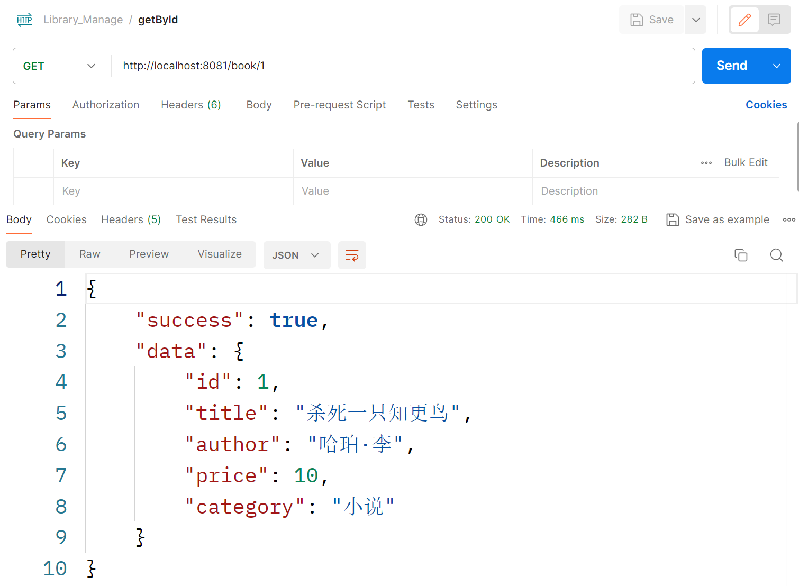
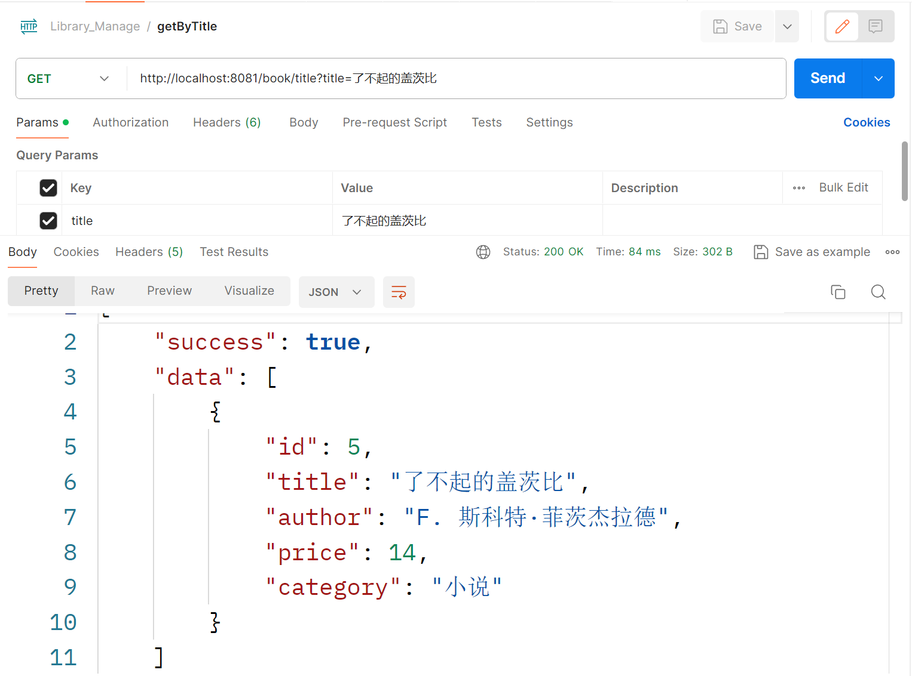
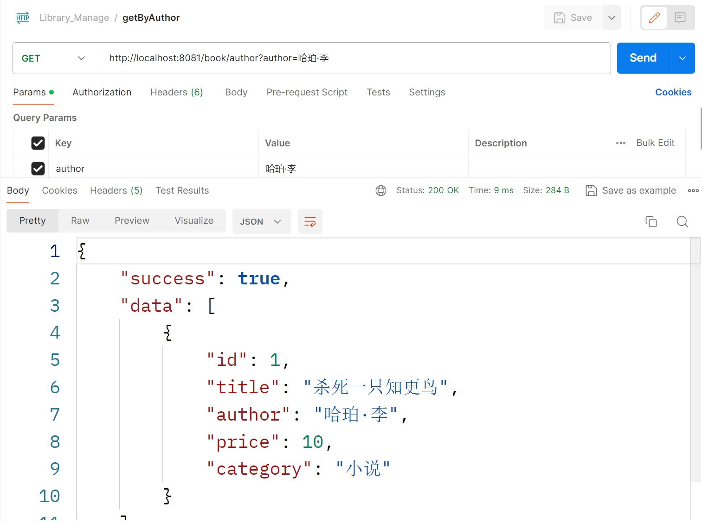
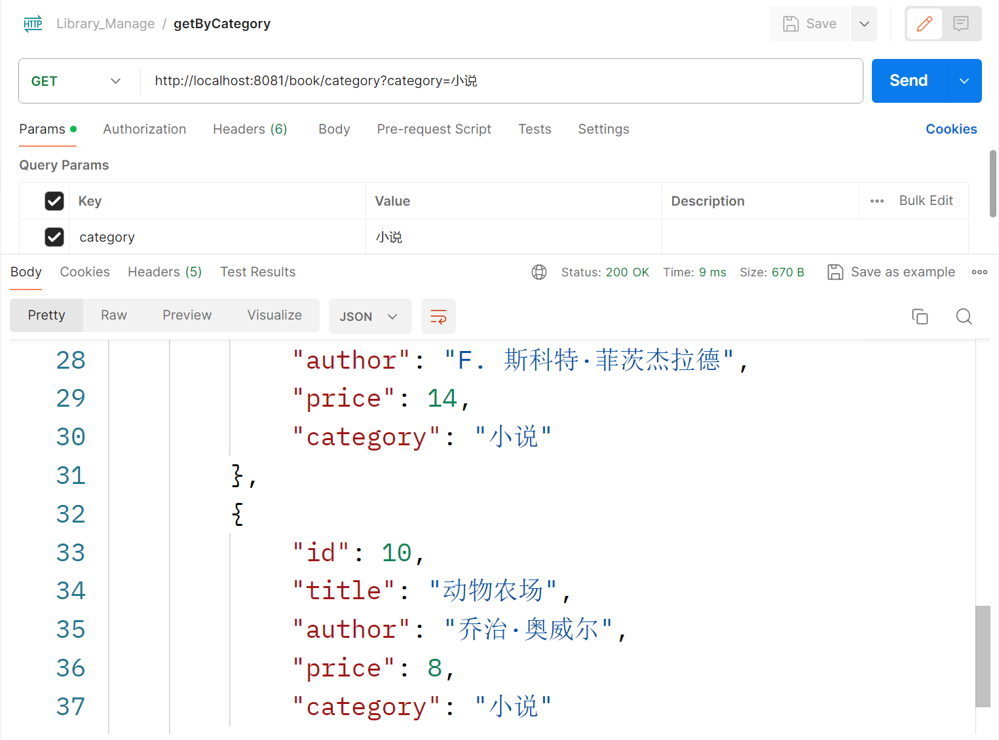
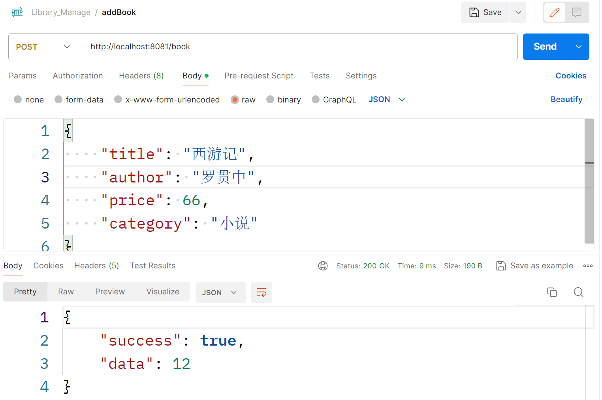
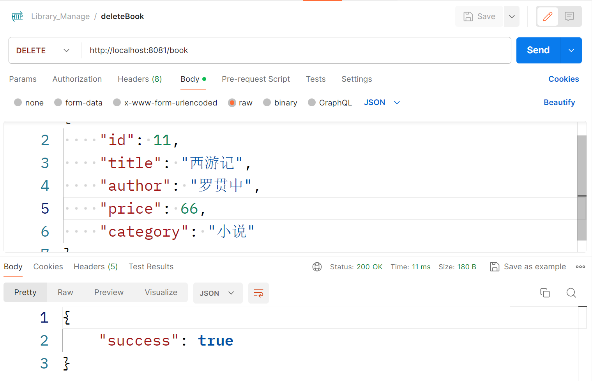
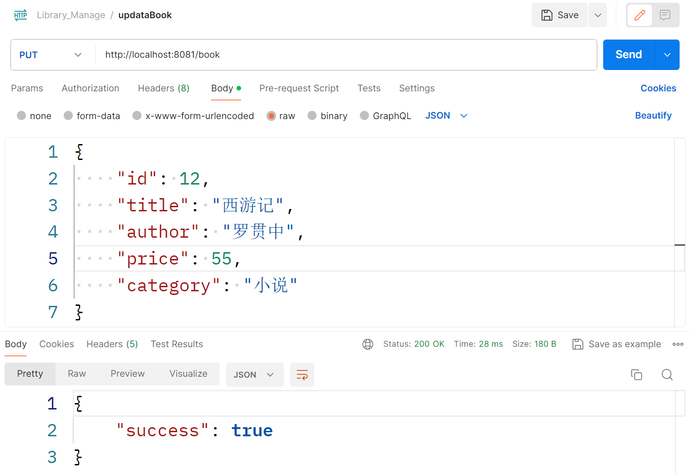
### Lombok 常用注解
>Lombok是一个编译时注释预处理器，有助于在编译时注入一些代码。Lombok提供了一组在开发时处理的注释，以将代码注入到Java应用程序中，注入的代码在开发环境中立即可用。
- @Data \
  注解在类上；提供类**所有属性**的 getting 和 setting 方法，此外还提供了equals、canEqual、hashCode、toString 方法
- @Setter / @Getter \
  注解在**属性或类**上；为属性提供 Setter/Getter 方法
- @Value \
  此注解集@equals()、@hashCode()、@toString()、@Getter()于一身。
- @NoArgsConstructor / @AllArgsConstructor\
  自动生成无参数构造函数/全参构造函数。
- @NonNull \
  修饰方法、构造函数的参数或者类字段，Lombok自动生成一个非空检测语句。
- @Log4j / @Slf4j\
  注解在类上；为类提供一个 属性名为log的日志对像
- @Accessors 
  当属性字段在生成 getter 和 setter 方法时，做一些相关的设置。当它可作用于类上时，修饰类中所有字段，当作用于具体字段时，只对该字段有效。
  - fluent 属性\
    不写默认为false，当该值为 true 时，对应字段的 getter 方法前面没有 get，setter 方法前没有 set。
    `s.setName("jack") -> s.name("jack")` , 
    `String name = s.getName() -> String name = s.name()`
  - chain 属性\
    不写默认为false，当该值为 true 时，对应字段的 setter 方法调用后，会返回当前对象。
    `Student stu = s.setName("jack")`
  - prefix 属性\
    该属性是一个字符串数组，当该数组有值时，表示忽略字段中对应的前缀，生成对应的 getter 和 setter 方法。
    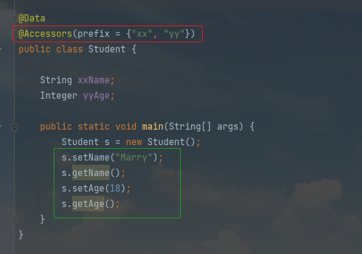

### MyBatis-Plus实体类注解
- @TableName（"表名"）
- @TableId（表名主键）\
    value：主键字段名\
    type：主键类型：\
    写法：IdType.NONE\
    - AUTO——数据库自增
    - INPUT——自行输入
    - ID_WORKER——分布式全局唯一ID长整型类型
    - UUID——32位UUID字符串
    - NONE——无状态
    - ID_WORKER_STR——分布式全局唯一ID字符串类型
    1. `@TableId(value = “id”, type = IdType.AUTO)`：自增
    2. `@TableId(value = “id”, type = IdType.ID_WORKER_STR)`：分布式全局唯一ID字符串类型
    3. `@TableId(value = “id”, type = IdType.INPUT)`：自行输入
    4. `@TableId(value = “id”, type = IdType.ID_WORKER)`：分布式全局唯一ID 长整型类型
    5. `@TableId(value = “id”, type = IdType.UUID)`：32位UUID字符串
    6. `@TableId(value = “id”, type = IdType.NONE)`：无状态
- @TableField\
    value：字段名\
    exit：是否为数据库表字段\
    Strategy：字段验证
    1. `@TableField(value = “age”)`: 用来解决数据库中的字段和实体类的字段不匹配问题
    2. `@TableField(exist = false)` : 用来解决实体类中有的属性但是数据表中没有的字段,默认为true
    3. `@TableField(condition = SqlCondition.LIKE)`：表示该属性可以模糊搜索。
    4. `@TableField(fill = FieldFill.INSERT)`：注解填充字段 ，生成器策略部分也可以配置
### Mybatis-Plus CRUD 操作
#### Mapper 接口方法（CRUD）
使用代码生成器生成的 mapper 接口中，其继承了 `BaseMapper` 接口。而 `BaseMapper` 接口中封装了一系列 CRUD 常用操作，可以直接使用，而不用自定义 xml 与 sql 语句进行 CRUD 操作（当然根据实际开发需要，自定义 sql 还是有必要的）。
```java
public interface BookMapper extends BaseMapper<Book> {

}
```
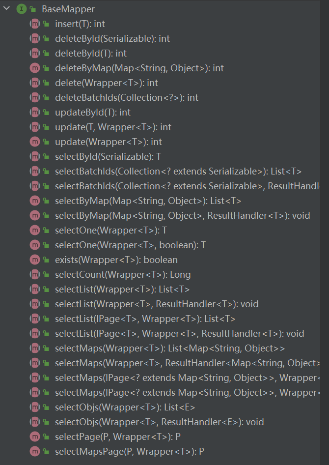
```java
【添加数据：（增）】
    int insert(T entity);              // 插入一条记录
注：
    T         表示任意实体类型
    entity    表示实体对象
 
【删除数据：（删）】
    int deleteById(Serializable id);    // 根据主键 ID 删除
    int deleteByMap(@Param(Constants.COLUMN_MAP) Map<String, Object> columnMap);  // 根据 map 定义字段的条件删除
    int delete(@Param(Constants.WRAPPER) Wrapper<T> wrapper); // 根据实体类定义的 条件删除对象
    int deleteBatchIds(@Param(Constants.COLLECTION) Collection<? extends Serializable> idList); // 进行批量删除
注：
    id        表示 主键 ID
    columnMap 表示表字段的 map 对象
    wrapper   表示实体对象封装操作类，可以为 null。
    idList    表示 主键 ID 集合（列表、数组），不能为 null 或 empty
 
【修改数据：（改）】
    int updateById(@Param(Constants.ENTITY) T entity); // 根据 ID 修改实体对象。
    int update(@Param(Constants.ENTITY) T entity, @Param(Constants.WRAPPER) Wrapper<T> updateWrapper); // 根据 updateWrapper 条件修改实体对象
注：
    update 中的 entity 为 set 条件，可以为 null。
    updateWrapper 表示实体对象封装操作类（可以为 null,里面的 entity 用于生成 where 语句）
 
【查询数据：（查）】
    T selectById(Serializable id); // 根据 主键 ID 查询数据
    List<T> selectBatchIds(@Param(Constants.COLLECTION) Collection<? extends Serializable> idList); // 进行批量查询
    List<T> selectByMap(@Param(Constants.COLUMN_MAP) Map<String, Object> columnMap); // 根据表字段条件查询
    T selectOne(@Param(Constants.WRAPPER) Wrapper<T> queryWrapper); // 根据实体类封装对象 查询一条记录
    Integer selectCount(@Param(Constants.WRAPPER) Wrapper<T> queryWrapper); // 查询记录的总条数
    List<T> selectList(@Param(Constants.WRAPPER) Wrapper<T> queryWrapper); // 查询所有记录（返回 entity 集合）
    List<Map<String, Object>> selectMaps(@Param(Constants.WRAPPER) Wrapper<T> queryWrapper); // 查询所有记录（返回 map 集合）
    List<Object> selectObjs(@Param(Constants.WRAPPER) Wrapper<T> queryWrapper); // 查询所有记录（但只保存第一个字段的值）
    <E extends IPage<T>> E selectPage(E page, @Param(Constants.WRAPPER) Wrapper<T> queryWrapper); // 查询所有记录（返回 entity 集合），分页
    <E extends IPage<Map<String, Object>>> E selectMapsPage(E page, @Param(Constants.WRAPPER) Wrapper<T> queryWrapper); // 查询所有记录（返回 map 集合），分页
注：
    queryWrapper 表示实体对象封装操作类（可以为 null）
    page 表示分页查询条件
```
#### Service 接口方法（CRUD）
使用 代码生成器 生成的 service 接口中，其继承了 `IService` 接口。`IService` 内部进一步封装了 `BaseMapper` 接口的方法（当然也提供了更详细的方法）。使用时，可以通过生成的 mapper 接口进行 CRUD 操作，也可以通过生成的 service 接口的实现类进行 CRUD 操作。
```java
public interface IBookService extends IService<Book> {
}
```
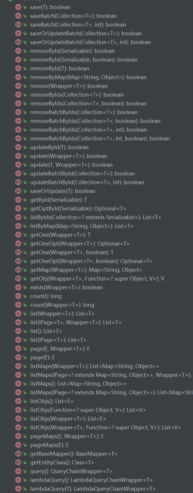
```java
【添加数据：（增）】
    default boolean save(T entity); // 调用 BaseMapper 的 insert 方法，用于添加一条数据。
    boolean saveBatch(Collection<T> entityList, int batchSize); // 批量插入数据
注：
    entityList 表示实体对象集合 
    batchSize 表示一次批量插入的数据量，默认为 1000
 
【添加或修改数据：（增或改）】
    boolean saveOrUpdate(T entity); // id 若存在，则修改， id 不存在则新增数据
   default boolean saveOrUpdate(T entity, Wrapper<T> updateWrapper); // 先根据条件尝试更新，然后再执行 saveOrUpdate 操作
   boolean saveOrUpdateBatch(Collection<T> entityList, int batchSize); // 批量插入并修改数据 
 
【删除数据：（删）】
    default boolean removeById(Serializable id); // 调用 BaseMapper 的 deleteById 方法，根据 id 删除数据。
    default boolean removeByMap(Map<String, Object> columnMap); // 调用 BaseMapper 的 deleteByMap 方法，根据 map 定义字段的条件删除
    default boolean remove(Wrapper<T> queryWrapper); // 调用 BaseMapper 的 delete 方法，根据实体类定义的 条件删除对象。
    default boolean removeByIds(Collection<? extends Serializable> idList); // 用 BaseMapper 的 deleteBatchIds 方法, 进行批量删除。
    
【修改数据：（改）】
    default boolean updateById(T entity); // 调用 BaseMapper 的 updateById 方法，根据 ID 选择修改。
    default boolean update(T entity, Wrapper<T> updateWrapper); // 调用 BaseMapper 的 update 方法，根据 updateWrapper 条件修改实体对象。
    boolean updateBatchById(Collection<T> entityList, int batchSize); // 批量更新数据
 
【查找数据：（查）】
    default T getById(Serializable id); // 调用 BaseMapper 的 selectById 方法，根据 主键 ID 返回数据。
    default List<T> listByIds(Collection<? extends Serializable> idList); // 调用 BaseMapper 的 selectBatchIds 方法，批量查询数据。
    default List<T> listByMap(Map<String, Object> columnMap); // 调用 BaseMapper 的 selectByMap 方法，根据表字段条件查询
    default T getOne(Wrapper<T> queryWrapper); // 返回一条记录（实体类保存）。
    Map<String, Object> getMap(Wrapper<T> queryWrapper); // 返回一条记录（map 保存）。
    default int count(Wrapper<T> queryWrapper); // 根据条件返回 记录数。
    default List<T> list(); // 返回所有数据。
    default List<T> list(Wrapper<T> queryWrapper); // 调用 BaseMapper 的 selectList 方法，查询所有记录（返回 entity 集合）。
    default List<Map<String, Object>> listMaps(Wrapper<T> queryWrapper); // 调用 BaseMapper 的 selectMaps 方法，查询所有记录（返回 map 集合）。
    default List<Object> listObjs(); // 返回全部记录，但只返回第一个字段的值。
    default <E extends IPage<T>> E page(E page, Wrapper<T> queryWrapper); // 调用 BaseMapper 的 selectPage 方法，分页查询
    default <E extends IPage<Map<String, Object>>> E pageMaps(E page, Wrapper<T> queryWrapper); // 调用 BaseMapper 的 selectMapsPage 方法，分页查询
注：
    get 用于返回一条记录。
    list 用于返回多条记录。
    count 用于返回记录总数。
    page 用于分页查询。
    
【链式调用：】
    default QueryChainWrapper<T> query(); // 普通链式查询
    default LambdaQueryChainWrapper<T> lambdaQuery(); // 支持 Lambda 表达式的修改
    default UpdateChainWrapper<T> update(); // 普通链式修改
    default LambdaUpdateChainWrapper<T> lambdaUpdate(); // 支持 Lambda 表达式的修改
注：
    query 表示查询
    update 表示修改
    Lambda 表示内部支持 Lambda 写法。
形如：
    query().eq("column", value).one();
    lambdaQuery().eq(Entity::getId, value).list();
    update().eq("column", value).remove();
    lambdaUpdate().eq(Entity::getId, value).update(entity);
```
#### 条件构造器（Wrapper，定义 where 条件）
上面介绍的接口方法的参数中，会出现各种 `wrapper`，比如 `queryWrapper`、`updateWrapper` 等。`wrapper` 的作用就是用于定义各种各样的查询条件（`where`）。
```java
【通用条件：】
【比较大小： ( =, <>, >, >=, <, <= )】
    eq(R column, Object val); // 等价于 =，例: eq("name", "老王") ---> name = '老王'
    ne(R column, Object val); // 等价于 <>，例: ne("name", "老王") ---> name <> '老王'
    gt(R column, Object val); // 等价于 >，例: gt("name", "老王") ---> name > '老王'
    ge(R column, Object val); // 等价于 >=，例: ge("name", "老王") ---> name >= '老王'
    lt(R column, Object val); // 等价于 <，例: lt("name", "老王") ---> name < '老王'
    le(R column, Object val); // 等价于 <=，例: le("name", "老王") ---> name <= '老王'
    
【范围：（between、not between、in、not in）】
   between(R column, Object val1, Object val2); // 等价于 between a and b, 例： between("age", 18, 30) ---> age between 18 and 30
   notBetween(R column, Object val1, Object val2); // 等价于 not between a and b, 例： notBetween("age", 18, 30) ---> age not between 18 and 30
   in(R column, Object... values); // 等价于 字段 IN (v0, v1, ...),例: in("age",{1,2,3}) ---> age in (1,2,3)
   notIn(R column, Object... values); // 等价于 字段 NOT IN (v0, v1, ...), 例: notIn("age",{1,2,3}) ---> age not in (1,2,3)
   inSql(R column, Object... values); // 等价于 字段 IN (sql 语句), 例: inSql("id", "select id from table where id < 3") ---> id in (select id from table where id < 3)
   notInSql(R column, Object... values); // 等价于 字段 NOT IN (sql 语句)
   
【模糊匹配：（like）】
    like(R column, Object val); // 等价于 LIKE '%值%'，例: like("name", "王") ---> name like '%王%'
    notLike(R column, Object val); // 等价于 NOT LIKE '%值%'，例: notLike("name", "王") ---> name not like '%王%'
    likeLeft(R column, Object val); // 等价于 LIKE '%值'，例: likeLeft("name", "王") ---> name like '%王'
    likeRight(R column, Object val); // 等价于 LIKE '值%'，例: likeRight("name", "王") ---> name like '王%'
    
【空值比较：（isNull、isNotNull）】
    isNull(R column); // 等价于 IS NULL，例: isNull("name") ---> name is null
    isNotNull(R column); // 等价于 IS NOT NULL，例: isNotNull("name") ---> name is not null
 
【分组、排序：（group、having、order）】
    groupBy(R... columns); // 等价于 GROUP BY 字段, ...， 例: groupBy("id", "name") ---> group by id,name
    orderByAsc(R... columns); // 等价于 ORDER BY 字段, ... ASC， 例: orderByAsc("id", "name") ---> order by id ASC,name ASC
    orderByDesc(R... columns); // 等价于 ORDER BY 字段, ... DESC， 例: orderByDesc("id", "name") ---> order by id DESC,name DESC
    having(String sqlHaving, Object... params); // 等价于 HAVING ( sql语句 )， 例: having("sum(age) > {0}", 11) ---> having sum(age) > 11
 
【拼接、嵌套 sql：（or、and、nested、apply）】
   or(); // 等价于 a or b， 例：eq("id",1).or().eq("name","老王") ---> id = 1 or name = '老王'
   or(Consumer<Param> consumer); // 等价于 or(a or/and b)，or 嵌套。例: or(i -> i.eq("name", "李白").ne("status", "活着")) ---> or (name = '李白' and status <> '活着')
   and(Consumer<Param> consumer); // 等价于 and(a or/and b)，and 嵌套。例: and(i -> i.eq("name", "李白").ne("status", "活着")) ---> and (name = '李白' and status <> '活着')
   nested(Consumer<Param> consumer); // 等价于 (a or/and b)，普通嵌套。例: nested(i -> i.eq("name", "李白").ne("status", "活着")) ---> (name = '李白' and status <> '活着')
   apply(String applySql, Object... params); // 拼接sql（若不使用 params 参数，可能存在 sql 注入），例: apply("date_format(dateColumn,'%Y-%m-%d') = {0}", "2008-08-08") ---> date_format(dateColumn,'%Y-%m-%d') = '2008-08-08'")
   last(String lastSql); // 无视优化规则直接拼接到 sql 的最后，可能存若在 sql 注入。
   exists(String existsSql); // 拼接 exists 语句。例: exists("select id from table where age = 1") ---> exists (select id from table where age = 1)
   
【QueryWrapper 条件：】
    select(String... sqlSelect); // 用于定义需要返回的字段。例： select("id", "name", "age") ---> select id, name, age
    select(Predicate<TableFieldInfo> predicate); // Lambda 表达式，过滤需要的字段。
    lambda(); // 返回一个 LambdaQueryWrapper
    
【UpdateWrapper 条件：】
    set(String column, Object val); // 用于设置 set 字段值。例: set("name", null) ---> set name = null
    etSql(String sql); // 用于设置 set 字段值。例: setSql("name = '老李头'") ---> set name = '老李头'
    lambda(); // 返回一个 LambdaUpdateWrapper
```
简单测试
```java
@Test
public void testQueryWrapper() {
    // Step1：创建一个 QueryWrapper 对象
    QueryWrapper<User> queryWrapper = new QueryWrapper<>();
 
    // Step2： 构造查询条件
    queryWrapper
            .select("id", "name", "age")
            .eq("age", 20)
            .like("name", "sun");
    // SELECT id, name, age FROM table WHERE age = 20 AND name like %sun%;
    // Step3：执行查询
    userService
            .list(queryWrapper)
            .forEach(System.out::println);
}
```