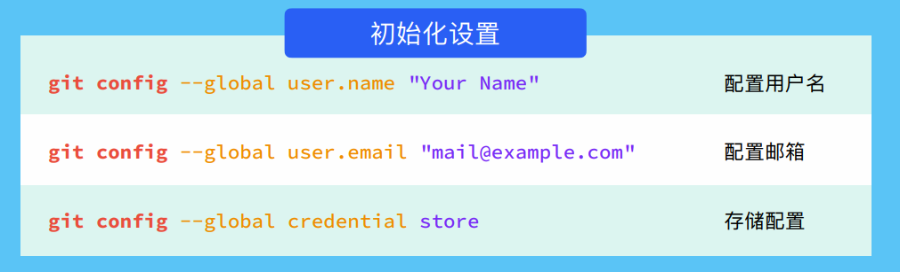
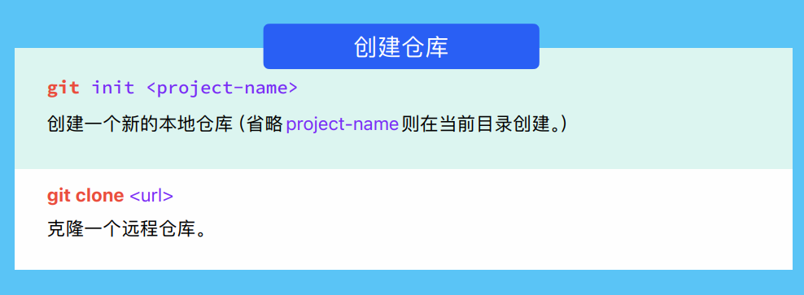
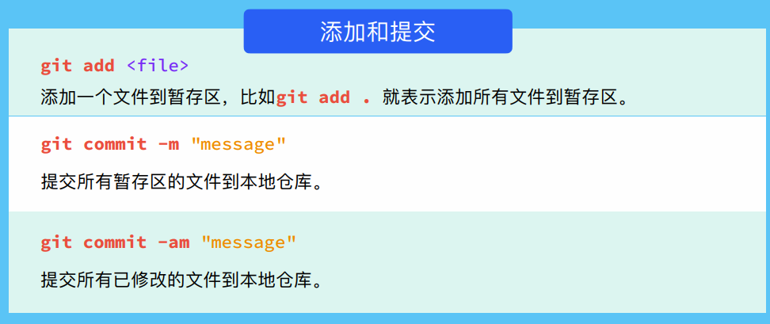
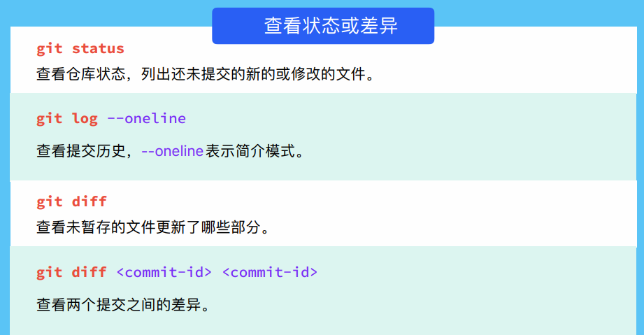
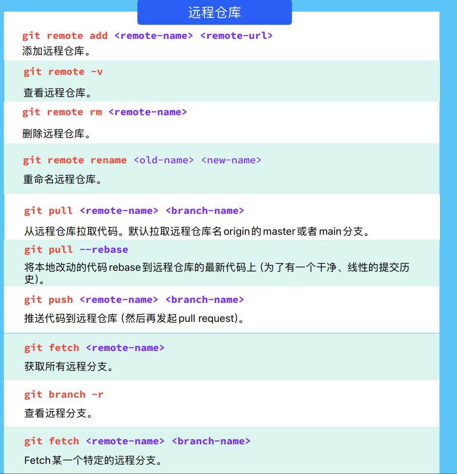
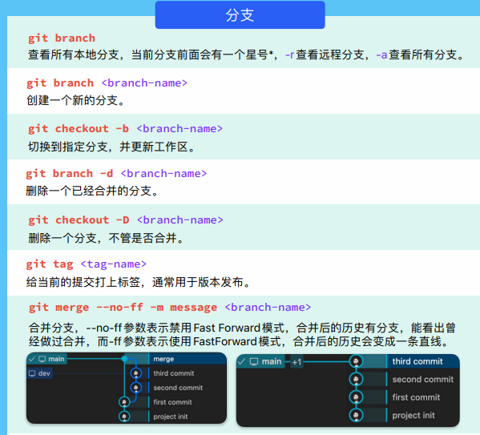
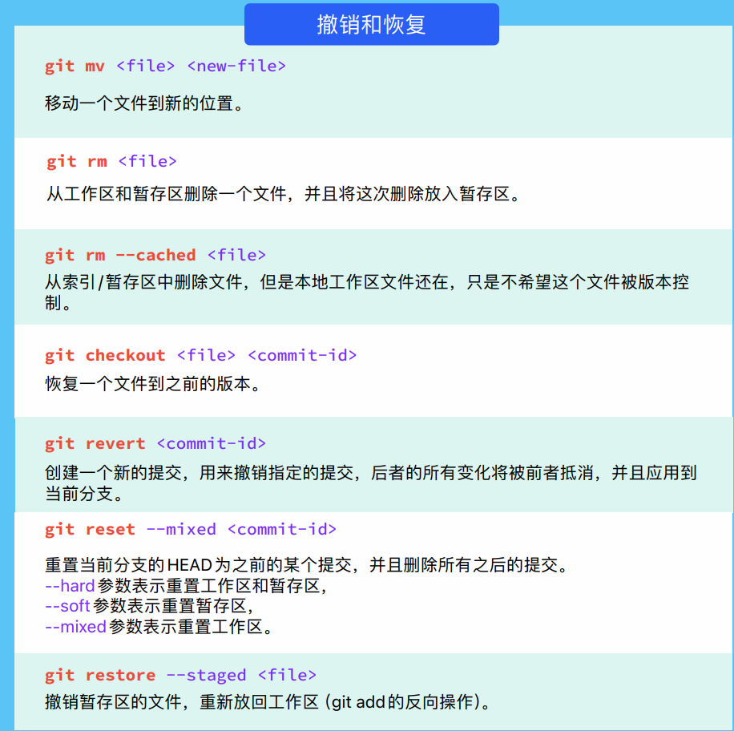

# Git 笔记

## 常用命令

### 初始化

### 添加和提交

### 查看状态和差异

### 远程仓库

### 合并分支

### 撤销和恢复

## 注意

**main/master 分支不要动**

要把 dev 分支合并到 master 分支的时候：

1. 切换到 master 分支，pull 一下最新的代码，保证本地的 master 分支代码是最新的
2. 切换到 dev 分支，把 master 分支合并到 dev 分支，并处理冲突
3. 切换到 master 分支，pull 一下最新的代码，合并 dev 分支到 master 分支，push 一下
