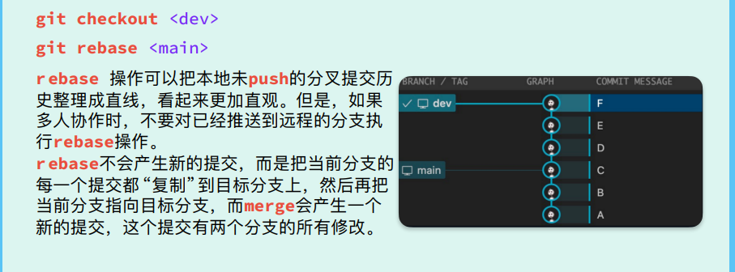
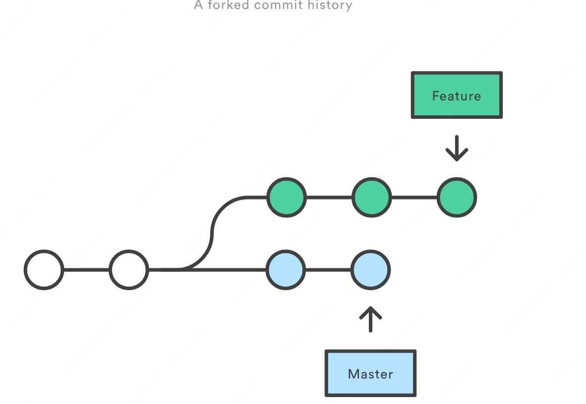
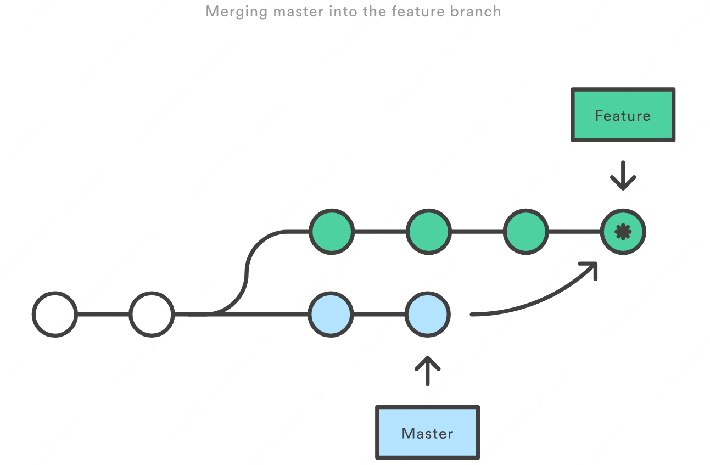
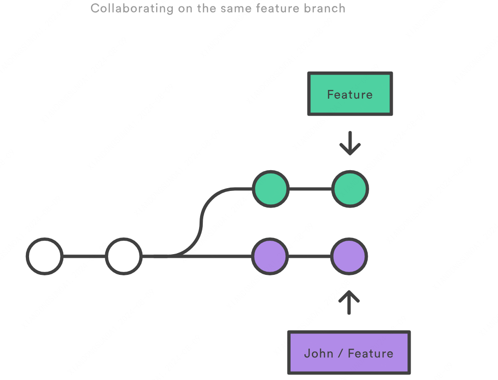
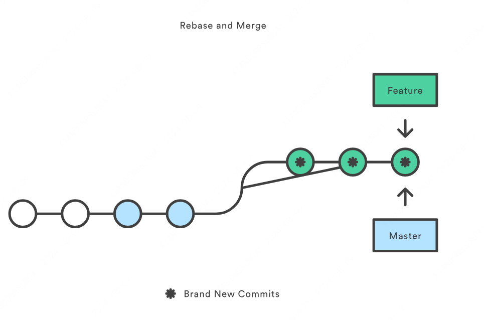

# Git 笔记

## 常用命令

### 初始化

### 添加和提交

### 查看状态和差异

### 远程仓库

### 合并分支

### 撤销和恢复

## 注意

### 1.main/master 分支不要动
要把 dev 分支合并到 master 分支的时候：

1. 切换到 master 分支，pull 一下最新的代码，保证本地的 master 分支代码是最新的
2. 切换到 dev 分支，把 master 分支合并到 dev 分支，并处理冲突
3. 切换到 master 分支，pull 一下最新的代码，合并 dev 分支到 master 分支，push 一下

### 2.新建分支需符合命名规范
分支命名规范：`feature / release_版本号`，其中`feature`表示开发版本，`release`则是上线版本，版本号格式为`年月日`，例如新建`feature_20240711`分支，表示该系统20240711开发版本分支。

### 3.合并分支注意Merge和Rebase

假设在 `master` 分支上的新提交与你正在开发的 `feature` 相关。需要将新提交合并到你的 `feature` 分支中，你可以有两个选择：`merge` 或者 `rebase`。

- `merge`操作会保留`feature`分支的提交记录，另外创建一个合并提交，在`git log`上显示为两条线合并到一个节点，会保留两个分支的独立历史以及它们合并的信息。\
另一方面，这也意味着 `feature` 分支每次需要合并上游更改时，它都将产生一个额外的合并提交。如果`master` 提交非常活跃，这可能会严重污染你的 `feature` 分支历史记录。

- `rebase`会将整个 `feature` 分支移动到 `master` 分支的顶端，从而有效地整合了所有 `master` 分支上的提交。但是，与 `merge` 提交方式不同，`rebase` 通过为原始分支中的每个提交创建全新的 `commits` 来 重写 项目历史记录。

`rebase` 的主要好处是可以获得更清晰的项目历史。首先，它消除了 `git merge` 所需的不必要的合并提交；其次，正如你在上图中所看到的，`rebase` 会产生完美线性的项目历史记录，你可以在 `feature`分支上没有任何分叉的情况下一直追寻到项目的初始提交。这样可以通过命令 `git log，git bisect 和 gitk` 更容易导航查看项目。
但是，`rebase` 会丢失合并提交的上下文，你也就无法看到上游更改是何时合并到 feature 中的。
> `git rebase` 的黄金法则是永远不要在公共分支上使用它。

当与另一个开发人员协作使用相同的功能并且你需要将他们的更改合并到你的 repository 时, 使用`rebase`。
比如你和另一个名为 John 的开发人员添加了对 `feature` 分支的提交，在你 `fetch` (注意 `fetch` 并不会自动 `merge` )来自 John 的远程 `feature`分支后，你的 repository 可能如下所示：

你可以整合上来自上游的分叉：要么用 `john/feature merge 本地 feature` ，要么 `rebase 本地feature 到john/feature` 的顶部。

请注意，此 `rebase` 不违反 `Rebase 黄金规则`，因为只有你的本地 `feature` 提交被移动， 之前的所有内容都不会受到影响。这就像是说 "将我的更改添加到 John 已经完成的工作中"。在大多数情况下，这比通过合并提交与远程分支同步更直观。

默认情况下，使用 `git pull` 命令执行合并，但你可以通过向其传递 `--rebase` 选项来强制它将远程分支 以 `rebase` 方式集成。

>git pull --rebase

总结：
1. 从远程仓库拉取到本地分支选择`Rebase`方式保证提交记录log的简洁性（一条直线）
2. 个人提交代码时，先拉取代码到本地再提交，若有冲突，选择`Merge`方式解决并第一时间联系冲突代码提交者协商
3. 若出现了提交失误，则选中`git log`使用`revert`撤销提交，修改后重新commit、push
4. 若出现合并出错，需立马联系权限管理员删除分支重新拉取（锁分支之前，确保没有其他提交）
