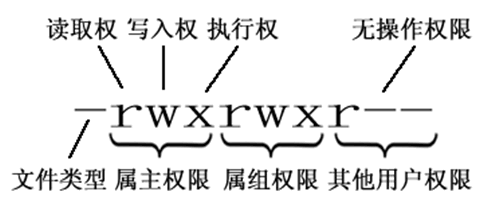

# Linux 笔记

**常见目录说明：**

- **/bin：** 存放二进制可执行文件(ls、cat、mkdir 等)，常用命令一般都在这里；
- **/etc：** 存放系统管理和配置文件；
- **/home：** 存放所有用户文件的根目录，是用户主目录的基点，比如用户 user 的主目录就是/home/user，可以用~user 表示；
- **/usr：** 用于存放系统应用程序；
- **/opt：** 额外安装的可选应用程序包所放置的位置。一般情况下，我们可以把 tomcat 等都安装到这里；
- **/proc：** 虚拟文件系统目录，是系统内存的映射。可直接访问这个目录来获取系统信息；
- **/root：** 超级用户（系统管理员）的主目录（特权阶级 ^o^）；
- **/sbin:** 存放二进制可执行文件，只有 root 才能访问。这里存放的是系统管理员使用的系统级别的管理命令和程序。如 ifconfig 等；
- **/dev：** 用于存放设备文件；
- **/mnt：** 系统管理员安装临时文件系统的安装点，系统提供这个目录是让用户临时挂载其他的文件系统；
- **/boot：** 存放用于系统引导时使用的各种文件；
- **/lib 和/lib64：** 存放着和系统运行相关的库文件 ；
- **/tmp：** 用于存放各种临时文件，是公用的临时文件存储点；
- **/var：** 用于存放运行时需要改变数据的文件，也是某些大文件的溢出区，比方说各种服务的日志文件（系统启动日志等。）等；
- **/lost+found：** 这个目录平时是空的，系统非正常关机而留下“无家可归”的文件（windows 下叫什么.chk）就在这里。

## 目录切换

- `cd usr`：切换到该目录下 usr 目录
- `cd ..（或cd../）`：切换到上一层目录
- `cd /`：切换到系统根目录
- `cd ~`：切换到用户主目录
- `cd -`： 切换到上一个操作所在目录

## **目录操作**

- `ls`：显示目录中的文件和子目录的列表。\
  `ls /home`，显示 `/home` 目录下的文件和子目录列表。

- `ll`： `ls -l` 的别名，查看该目录下的所有目录和文件的详细信息
- `mkdir [选项] 目录名`：创建新目录（增）\
  `mkdir -m 755 my_directory`，创建一个名为 `my_directory` 的新目录，并将其权限设置为 755，即所有用户对该目录有读、写和执行的权限。
- `find [路径] [表达式]`：在指定目录及其子目录中搜索文件或目录（查）。\
  ① 列出当前目录及子目录下所有文件和文件夹: `find .`；\
  ② 在 `/home` 目录下查找以 `.txt` 结尾的文件名:`find /home -name "*.txt"`\
  ③ 当前目录及子目录下查找所有以 `.txt` 和 `.pdf` 结尾的文件:`find . -name "*.txt" -o -name "*.pdf"`。
- `pwd`：显示当前工作目录的路径。
- `rmdir [选项] 目录名`：删除空目录（删）。\
  `rmdir -p my_directory`，删除名为 `my_directory` 的空目录，并且会递归删除`my_directory` 的空父目录，直到遇到非空目录或根目录。
- `rm [选项] 文件或目录名`：删除文件/目录（删）。\
  `rm -r my_directory`，删除名为 `my_directory` 的目录，`-r`(recursive,递归) 表示会递归删除指定目录及其所有子目录和文件。
- `cp [选项] 源文件/目录 目标文件/目录`：复制文件或目录（移）。\
  `cp -r source destination`，将 `source` 目录及其下的所有子目录和文件复制到 `destination` 目录下，并保留源文件的属性和目录结构。
- `mv [选项] 源文件/目录 目标文件/目录`：移动文件或目录（移），也可以用于重命名文件或目录。\
  `mv file.txt /home/file.txt`，将 `file.txt` 文件移动到 `/home` 目录下，并重命名为 `file.txt`。

---

## **文件操作**

- `touch [选项] 文件名..`：创建新文件或更新已存在文件（增）。\
  `touch file1.txt file2.txt file3.txt` ，创建 3 个文件。

- `ln [选项] <源文件> <硬链接/软链接文件>`：创建硬链接/软链接。\
  `ln -s file.txt file_link`，创建名为 `file_link` 的软链接，指向 `file.txt` 文件。`-s` 选项代表的就是创建软链接，s 即 symbolic（软链接又名符号链接） 。
- `cat/more/less/tail 文件名`：文件的查看（查）。
  - `tail -f 文件` :对某个文件进行动态监控，例如 Tomcat 的日志文件，会随着程序的运行，日志会变化。\
  `tail -f catalina-2016-11-11.log`: 监控文件的变化 。
  - `head/tail`：显示文件的前几行或后几行\
    `head -n 10 file_name` ：显示文件的前10行\
    `tail -n 20 file_name` ：显示文件的后20行
  - `more/less`：逐页显示文本文件内容\
    `more file_name`\
    `less file_name`
- `grep`：在文件中搜索指定文本\
  `grep 要搜索的字符串 要搜索的文件 --color`：搜索命令，`--color` 代表高亮显示
- `vim 文件名`：修改文件的内容（改）。\
  在实际开发中，使用 vim 编辑器主要作用就是修改配置文件，下面是一般步骤：`vim 文件------>进入文件----->命令模式------>按i进入编辑模式----->编辑文件 ------->按Esc进入底行模式----->输入：wq/q!`\
  （输入 `wq` 代表写入内容并退出，即保存；输入 `q!`代表强制退出不保存）。

## **文件压缩**

**1）打包并压缩文件：**

Linux 中的打包文件一般是以 `.tar` 结尾的，压缩的命令一般是以 `.gz` 结尾的。而一般情况下打包和压缩是一起进行的，打包并压缩后的文件的后缀名一般 `.tar.gz`。

命令：`tar -zcvf 打包压缩后的文件名 要打包压缩的文件` ，其中：

- z：调用 gzip 压缩命令进行压缩
- c：打包文件
- v：显示运行过程
- f：指定文件名

比如：假如 test 目录下有三个文件分别是：`aaa.txt`、 `bbb.txt`、`ccc.txt`，如果我们要打包 `test` 目录并指定压缩后的压缩包名称为 `test.tar.gz` 可以使用命令：`tar -zcvf test.tar.gz aaa.txt bbb.txt ccc.txt` 或 `tar -zcvf test.tar.gz /test/` 。

**2）解压压缩包：**

命令：`tar [-xvf] 压缩文件`

其中 x 代表解压

示例：
- 将 `/test` 下的 `test.tar.gz` 解压到当前目录下可以使用命令：`tar -xvf test.tar.gz`
- 将 /test 下的 test.tar.gz 解压到根目录/usr 下:`tar -xvf test.tar.gz -C /usr`（`-C` 代表指定解压的位置）

## **文件传输**

- `scp [选项] 源文件 远程文件` （scp 即 secure copy，安全复制）：用于通过 SSH 协议进行安全的文件传输，可以实现从本地到远程主机的上传和从远程主机到本地的下载。\
  例如：`scp -r my_directory user@remote:/home/user` ，将本地目录 `my_directory` 上传到远程服务器 `/home/user` 目录下。\
  `scp -r user@remote:/home/user/my_directory` ，将远程服务器的 `/home/user` 目录下的 `my_directory` 目录下载到本地。
- `rsync [选项] 源文件 远程文件` : 可以在本地和远程系统之间高效地进行文件复制，并且能够智能地处理增量复制，节省带宽和时间。\
  例如：`rsync -r my_directory user@remote:/home/user`，将本地目录 `my_directory` 上传到远程服务器 `/home/user` 目录下。

## **文件权限**

操作系统中每个文件都拥有特定的权限、所属用户和所属组。权限是操作系统用来限制资源访问的机制，在 Linux 中权限一般分为读(readable)、写(writable)和执行(executable)，分为三组。分别对应文件的属主(owner)，属组(group)和其他用户(other)，通过这样的机制来限制哪些用户、哪些组可以对特定的文件进行什么样的操作。

通过 **ls -l** 命令我们可以 查看某个目录下的文件或目录的权限

第一列的内容的信息解释如下：

**Linux 中权限分为以下几种：**

- r：代表权限是可读，r 也可以用数字 4 表示
- w：代表权限是可写，w 也可以用数字 2 表示
- x：代表权限是可执行，x 也可以用数字 1 表示

**文件和目录权限的区别：**

对于文件：

对于目录：

需要注意的是：**超级用户可以无视普通用户的权限，即使文件目录权限是 000，依旧可以访问。**

- **修改文件/目录的权限的命令：****chmod**

示例：修改/test 下的 aaa.txt 的权限为文件所有者有全部权限，文件所有者所在的组有读写权限，其他用户只有读的权限。

**chmod u=rwx,g=rw,o=r aaa.txt** 或者 **chmod 764 aaa.txt**

## **系统状态**

- `top [选项]`：用于实时查看系统的 CPU 使用率、内存使用率、进程信息等。
- `free [选项]`：用于查看系统的内存使用情况，包括已用内存、可用内存、缓冲区和缓存等。
- `ps [选项]`：用于查看系统中的进程信息，包括进程的 ID、状态、资源使用情况等。\
  `ps -ef`/`ps -aux`：两者的区别是展示格式不同。\
  如果想要查看特定的进程可以使用这样的格式：`ps aux|grep redis` （查看包括 redis 字符串的进程），也可使用 `pgrep redis -a`。
- `htop [选项]`：类似于 `top`，但提供了更加交互式和友好的界面，可让用户交互式操作，支持颜色主题，可横向或纵向滚动浏览进程列表，并支持鼠标操作。
- `uptime [选项]`：用于查看系统总共运行了多长时间、系统的平均负载等信息。
- `vmstat [间隔时间] [重复次数]`：vmstat （Virtual Memory Statistics） 的含义为显示虚拟内存状态，但是它可以报告关于进程、内存、I/O 等系统整体运行状态。
- `df [选项] [文件系统]`：用于查看系统的磁盘空间使用情况，包括磁盘空间的总量、已使用量和可用量等，可以指定文件系统上。\
  例如：`df -a`，查看全部文件系统。
- `du [选项] [文件]`：用于查看指定目录或文件的磁盘空间使用情况，可以指定不同的选项来控制输出格式和单位。
- `sar [选项] [时间间隔] [重复次数]`：用于收集、报告和分析系统的性能统计信息，包括系统的 CPU 使用、内存使用、磁盘 I/O、网络活动等详细信息。它的特点是可以连续对系统取样，获得大量的取样数据。取样数据和分析的结果都可以存入文件，使用它时消耗的系统资源很小。
- `systemctl [命令] [服务名称]`：用于管理系统的服务和单元，可以查看系统服务的状态、启动、停止、重启等。

## **网络通信**

- `ping [选项] 目标主机`：测试与目标主机的网络连接。
- `ifconfig` 或 `ip`：用于查看系统的网络接口信息，包括网络接口的 IP 地址、MAC 地址、状态等。
- `netstat [选项]`：用于查看系统的网络连接状态和网络统计信息，可以查看当前的网络连接情况、监听端口、网络协议等。
- `ss [选项]`：比 `netstat` 更好用，提供了更快速、更详细的网络连接信息。

## **其他**

- `sudo + 其他命令`：以系统管理者的身份执行指令，也就是说，经由 sudo 所执行的指令就好像是 root 亲自执行。
- `kill -9 进程的pid`：杀死进程（-9 表示强制终止）先用 ps 查找进程，然后用 kill 杀掉。
- `shutdown`：`shutdown -h now`：指定现在立即关机；\
  `shutdown +5 "System will shutdown after 5 minutes"`：指定 5 分钟后关机，同时送出警告信息给登入用户。
- `reboot`：`reboot`：重开机。\
  `reboot -w`：做个重开机的模拟（只有纪录并不会真的重开机）。
- `echo`：将文本输出到标准输出\
  `echo "Hello, World!"`

## **常用快捷键**
### 移动光标
`Ctrl - 左右键`: 在单词之间跳转

`Alt - d` ：由光标位置开始，往右删除单词。往行尾删

`Ctrl – a` ：移到行首

`Ctrl – e` ：移到行尾

`Ctrl – b` ：往回(左)移动一个字符

`Ctrl – f` ：往后(右)移动一个字符

`Alt – b` ：往回(左)移动一个单词

`Alt – f` ：往后(右)移动一个单词

### 编辑命令

`Ctrl – h` ：删除光标左方位置的字符

`Ctrl – d` ：删除光标右方位置的字符（注意：当前命令行没有任何字符时，会销系统或结束终端）

`Ctrl – w` ：由光标位置开始，往左删除单词。往行首删

`Alt – d` ：由光标位置开始，往右删除单词。往行尾删

`Ctrl – k` ：由光标所在位置开始，删除右方所有的字符，直到该行结束。

`Ctrl – u` ：由光标所在位置开始，删除左方所有的字符，直到该行开始。

`Ctrl – y` ：粘贴之前删除的内容到光标后。

`Ctrl – t` ：交换光标处和之前两个字符的位置。

`Alt + .` ：使用上一条命令的最后一个参数。

`Ctrl – _` ：回复之前的状态。撤销操作。

Ctrl -a + Ctrl -k 或 Ctrl -e + Ctrl -u 或 Ctrl -k + Ctrl -u 组合可删除整行。

### 查找历史命令

`Ctrl – p` ：显示当前命令的上一条历史命令

`Ctrl – n` ：显示当前命令的下一条历史命令

`Ctrl – r` ：搜索历史命令，随着输入会显示历史命令中的一条匹配命令，Enter键执行匹配命令；ESC键在命令行显示而不执行匹配命令。

`Ctrl – g` ：从历史搜索模式（Ctrl – r）退出。

### 控制命令

`Ctrl – l` ：清除屏幕，然后，在最上面重新显示目前光标所在的这一行的内容。

`Ctrl – o` ：执行当前命令，并选择上一条命令。

`Ctrl – s` ：阻止屏幕输出

`Ctrl – q` ：允许屏幕输出

`Ctrl – c` ：终止命令

`Ctrl – z` ：挂起命令

