# MySQL 笔记

## 基础

数据类型


- 对于长度相对固定的字符串，可以使用 char，对于长度不确定的，使用 varchar 更合适一些。
- MySQL 里记录货币用 Decimal 和 Numric 类型
- MySQL 中的 in 语句是把外表和内表作 hash 连接，而 exists 语句是对外表作 loop 循环


查询语句执行顺序


>对于分组之后利用条件过滤的可以使用having关键字，其作用类似于where

## 常用场景 

* 查询平均成绩大于60分学生的学号和平均成绩:
`select stu_id as '学号',avg(grade) as '平均成绩' from score group by stu_id having avg(grade) > 60;`

* 查询至少选修两门课程的学生学号以及课程数目:
`select stu_id as '学号',count(course_id) as '课程数目' from score group by stu_id having count(course_id) >= 2;`

* 查询同名同姓学生名单并统计同名人数:
`select name,count(*) as '人数' from student group by name having count(*) >= 2;`

* 查询每门课程的平均成绩，结果按照平均成绩升序排序，平均成绩相同时，按照课程好降序排序:
`select course_id,avg(grade) from score group by course_id order by avg(grade) asc,course_id desc;`

* 查询两门以上成绩不满85分的同学的学号及其平均成绩:
`select stu_id, avg(grade) from score where grade < 85 group by stu_id having count(course_id) >= 2;`

* 查询各科成绩前两名的记录
```sql
SELECT 
    stu_id, 
    course_id, 
    grade
FROM (
    SELECT 
        stu_id, 
        course_id, 
        grade,
        RANK() OVER(PARTITION BY course_id ORDER BY grade DESC) as rnk
    FROM 
        score
) t 
WHERE 
    t.rnk <= 2;
```
* 查询出每门课程的大于80得人数和不大于80的人数
>为了对每门课程中大于80与不大于80的进行统计，则得到以course_id进行分组即可，对于人数的统计可以使用函数来代替即利用`case...when...then...else...end`实现分数的判断。
```sql
select course_id,
    sum(case when grade > 80 then 1 else 0 end) as '大于80',
    sum(case when grade <= 80 then 1 else 0 end) as '不大于80' 
from score 
group by course_id;
```

* 使用分段[90,100],[80-90),[70,80),[60,70)区间统计各科成绩，统计各分段人数和，课程号，课程名称
```sql
select 
    c1.id, c1.name,
    sum(case when s.grade >= 60 and s.grade < 70 then 1 else 0 end) as '[60,70)',
    sum(case when s.grade >= 70 and s.grade < 80 then 1 else 0 end) as '[70,80)',
    sum(case when s.grade >= 80 and s.grade < 90 then 1 else 0 end) as '[80,90)',
    sum(case when s.grade >= 90 and s.grade < 100 then 1 else 0 end) as '[90,100)' 
    from score as s 
        join course as c1 
        on s.course_id = c1.id 
    group by s.course_id;
```
* 查询至少有一门课与学号为“0001”的学生所学课程相同的学生的学号和姓名
```sql
select 
    s1.id, s1.name 
from 
    student as s1 
where s1.id in 
    (select distinct(stu_id) 
    from score where course_id in 
        (select course_id from score where stu_id = '0001')) 
    and s1.id != '0001';
```
* 查找表A中存在但表B中不存在的id
`select A.id from A where (select count(1) from B where A.id = B.id) = 0;`

## 窗口函数
*  查询每门成绩最好的前两名学生
```sql
SELECT *
FROM 
(
  SELECT *, DENSE_RANK() OVER (PARTITION BY course ORDER BY score DESC) as rank
  FROM table_name
) tmp
WHERE rank <= 2;
```
  


## 数据库操作命令

①、创建数据库:

```sql
CREATE DATABASE database_name;
```

②、删除数据库:

```sql
DROP DATABASE database_name;
```

③、选择数据库:

```sql
USE database_name;
```

### 表操作命令

①、创建表:

```sql
CREATE TABLE table_name (
    column1 datatype,
    column2 datatype,...);
```

②、删除表:

```sql
DROP TABLE table_name;
```

③、显示所有表:

```sql
SHOW TABLES;
```

④、查看表结构:

```sql
DESCRIBE table_name;
```

⑤、修改表（添加列）:

```sql
ALTER TABLE table_name ADD column_name datatype;
```

### 数据操作命令

①、插入数据:

```sql
INSERT INTO table_name (column1, column2, ...) VALUES (value1, value2, ...);
```

②、查询数据:

```sql
SELECT column_names FROM table_name WHERE condition;
```

③、更新数据:

```sql
UPDATE table_name SET column1 = value1, column2 = value2 WHERE condition;
```

④、删除数据:

```sql
DELETE FROM table_name WHERE condition;
```

### 索引和约束

①、创建索引:

```sql
CREATE INDEX index_name ON table_name (column_name);
```

②、添加主键约束:

```sql
ALTER TABLE table_name ADD PRIMARY KEY (column_name);
```

③、添加外键约束:

```sql
ALTER TABLE table_name ADD CONSTRAINT fk_name FOREIGN KEY (column_name) REFERENCES parent_table (parent_column_name);
```

### 用户和权限管理

①、创建用户:

```sql
CREATE USER 'username'@'host' IDENTIFIED BY 'password';
```

②、授予权限:

```sql
GRANT ALL PRIVILEGES ON database_name.table_name TO 'username'@'host';
```

③、撤销权限:

```sql
REVOKE ALL PRIVILEGES ON database_name.table_name FROM 'username'@'host';
```

④、删除用户:

```sql
DROP USER 'username'@'host';
```

### 事务控制

①、开始事务:

```sql
START TRANSACTION; 或者 BEGIN
```

②、提交事务:

```sql
COMMIT;
```

③、回滚事务:

```sql
ROLLBACK;
```

## **什么是三大范式**

三大范式的作用是为了减少数据冗余，提高数据完整性。

①、第一范式（1NF）：确保表的每一列都是不可分割的基本数据单元，比如说用户地址，应该拆分成省、市、区、详细信息等 4 个字段。

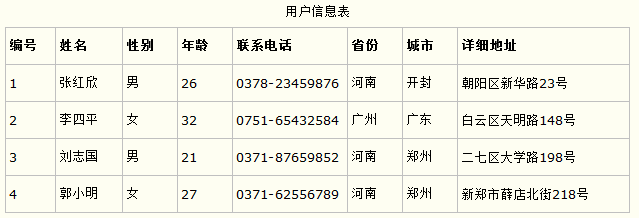

Ruthless：第一范式

②、第二范式（2NF）：在 1NF 的基础上，要求数据库表中的每一列都和主键直接相关，而不能只与主键的某一部分相关（主要针对联合主键）。

比如说在一个订单表中，可能会存在订单编号和商品编号，设计出来的表可能是这样的。


Ruthless：不符合第二范式

这个订单表中就存在冗余数据，比如说商品名称、单位、商品价格等，应该将其拆分为订单表、订单商品关联表、商品表。

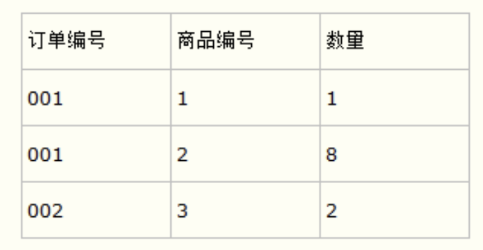

Ruthless：订单商品关联表

③、第三范式（3NF）：在 2NF 的基础上，消除非主键列对主键的传递依赖，即非主键列只依赖于主键列，不依赖于其他非主键列。

比如说在设计订单信息表的时候，可以把客户名称、所属公司、联系方式等信息拆分到客户信息表中，然后在订单信息表中用客户编号进行关联。

## 内连接、外连接、交叉连接、笛卡尔积呢？

- 内连接（inner join）：`inner join` 内连接，在两张表进行连接查询时，只保留两张表中完全匹配的结果集。

只有当两个表中都有匹配的记录时，这些记录才会出现在查询结果中。如果某一方没有匹配的记录，则该记录不会出现在结果集中，相当于两个数据集的交集。

- 外连接（outer join）：不只取得两张表中满足存在连接匹配关系的记录，还包括某张表（或两张表）中不满足匹配关系的记录，相当于两个数据集的并集。
- 交叉连接（cross join）：显示两张表所有记录一一对应，没有匹配关系进行筛选，它是笛卡尔积在 SQL 中的实现，如果 A 表有 m 行，B 表有 n 行，那么 A 和 B 交叉连接的结果就有 m*n 行。
- 笛卡尔积：是数学中的一个概念，例如集合 A={a,b}，集合 B={0,1,2}，那么 A✖️B=`{<a,0>,<a,1>,<a,2>,<b,0>,<b,1>,<b,2>,}`。

②、`left join` 返回左表（FROM 子句中指定的表）的所有记录，以及右表中匹配记录的记录。如果右表中没有匹配的记录，则结果中右表的部分会以 NULL 填充。

③、`right join` 刚好与左联相反，返回右表（FROM 子句中指定的表）的所有记录，以及左表中匹配记录的记录。如果左表中没有匹配的记录，则结果中左表的部分会以 NULL 填充。

## drop、delete 与 truncate 的区别？

三者都表示删除，但是三者有一些差别：

因此，在不再需要一张表的时候，用 drop；在想删除部分数据行时候，用 delete；在保留表而删除所有数据的时候用 truncate。

## 一条 SQL 查询语句在 MySQL 中如何执行的？

- 先检查该语句 `是否有权限`，如果没有权限，直接返回错误信息，如果有权限会先查询缓存
- 如果没有缓存，分析器进行 `语法分析`，提取 sql 语句中 select 等关键元素，然后判断 sql 语句是否有语法错误，比如关键词是否正确等等。
- 语法解析之后，MySQL 的服务器会对查询的语句进行优化，确定执行的方案。
- 完成查询优化后，按照生成的执行计划 `调用数据库引擎接口`，返回执行结果。

## count(1)、count(*) 与 count(列名) 的区别？

- count(*)包括了所有的列，相当于行数，在统计结果的时候，不会忽略列值为 NULL
- count(1)包括了忽略所有列，用 1 代表代码行，在统计结果的时候，不会忽略列值为 NULL
- count(列名)只包括列名那一列，在统计结果的时候，字段值为 NULL 时，不统计。

执行速度：

- 列名为主键，count(列名)会比 count(1)快
- 列名不为主键，count(1)会比 count(列名)快
- 如果表多个列并且没有主键，则 count（1） 的执行效率优于 count（*）
- 如果有主键，则 select count（主键）的执行效率是最优的
- 如果表只有一个字段，则 select count（*）最优。

## MySQL 日志文件有哪些？分别介绍下作用？

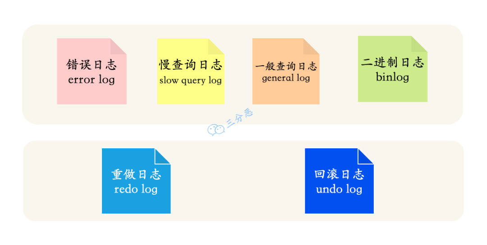

MySQL 主要日志

MySQL 日志文件有很多，包括 ：

- 错误日志（error log）：错误日志文件对 MySQL 的启动、运行、关闭过程进行了记录，能帮助定位 MySQL 问题。
- 慢查询日志（slow query log）：慢查询日志是用来记录执行时间超过 long_query_time 这个变量定义的时长的查询语句。通过慢查询日志，可以查找出哪些查询语句的执行效率很低，以便进行优化。
- 一般查询日志（general log）：一般查询日志记录了所有对 MySQL 数据库请求的信息，无论请求是否正确执行。
- 二进制日志（bin log）：关于二进制日志，它记录了数据库所有执行的 DDL 和 DML 语句（除了数据查询语句 select、show 等），以事件形式记录并保存在二进制文件中。

还有两个 InnoDB 存储引擎特有的日志文件：

- 重做日志（redo log）：记录了对于 InnoDB 存储引擎的事务日志，当事务进行写操作时，InnoDB 首先会写入 redo log，记录数据的更改，并不会立即修改数据文件。当 redo log 填满或在某些其他情况下，InnoDB 会异步将这些更改刷新到数据文件中。在系统崩溃后，redo log 可用于恢复数据。（保证事务的持久性）
- 回滚日志（undo log）： 记录了事务发生之前的数据，如果事务执行失败或调用了 rollback，导致事务需要回滚，就可以利用 undo log 中的信息将数据回滚到修改之前的样子（保证事务的原子性）

## binlog 和 redo log 有什么区别？

- bin log 会记录所有与数据库有关的日志记录，而 redo log 只记 InnoDB 存储引擎的日志。
- 记录的内容不同，bin log 记录的是关于一个事务的具体操作内容，即该日志是逻辑日志。而 redo log 记录的是关于每个页（Page）的更改的物理情况。
- 写入的时间不同，bin log 仅在事务提交前进行写入。而在事务进行的过程中，redo log 不断被写入 。
- 写入的方式也不相同，bin log 是追加写入，不会覆盖已经写的文件，redo log 是循环写入和擦除。

## 存储引擎

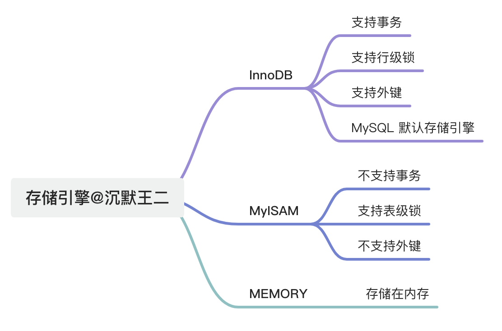

## 索引

### 索引的分类

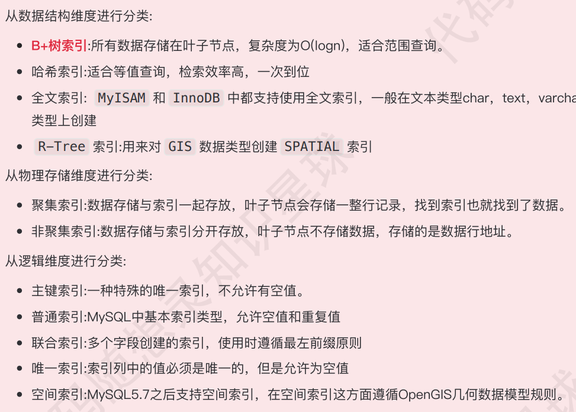

**从功能上分类：**

①、主键索引: 表中每行数据唯一标识的索引，强调列值的唯一性和非空性。

id 列被指定为主键索引，同时，MySQL 会自动为这个列创建一个聚簇索引（主键索引一定是聚簇索引）。

可以通过 `show index from table_name` 查看索引信息

②、唯一索引: 保证数据列中每行数据的唯一性，但允许有空值。

可以通过下面的语句创建唯一索引：`CREATE UNIQUE INDEX idx_username ON users(username);`

③、普通索引: 基本的索引类型，用于加速查询。

可以通过下面的语句创建普通索引：`CREATE INDEX idx_email ON users(email);`

④、全文索引：特定于文本数据的索引，用于提高文本搜索的效率。

假设有一个名为 articles 的表，下面这条语句在 content 列上创建了一个全文索引。

`CREATE FULLTEXT INDEX idx_article_content ON articles(content);`

**从存储位置上分类：**

①、聚簇索引：聚簇索引的叶子节点中，包含了一个完整的记录行。

②、非聚簇索引：它的叶子节点只包含一个主键值，通过非聚簇索引查找记录要先找到主键，然后通过主键再到聚簇索引中找到对应的记录行，这个过程被称为回表。

### 为什么使用索引会加快查询？

数据库存储在磁盘上，磁盘 I/O 是数据库操作中最耗时的部分之一。没有索引时，数据库会进行全表扫描

有了索引，就可以直接跳到索引指示的数据位置，而不必扫描整张表，从而大大减少了磁盘 I/O 操作的次数。

索引文件相较于数据库文件，体积小得多，查到索引之后再映射到数据库记录，查询效率就会高很多。

MySQL 的 InnoDB 存储引擎默认使用 B+ 树来作为索引的数据结构，而 B+ 树的查询效率非常高，时间复杂度为 O(logN)。

### 什么时候需要创建索引

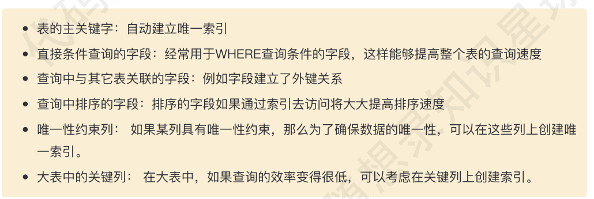

### 创建索引有哪些注意点？

①、选择合适的列作为索引

- 经常作为查询条件（WHERE 子句）、排序条件（ORDER BY 子句）、分组条件（GROUP BY 子句）的列
- 区分度低的字段，例如性别，不要建索引
- 频繁更新的字段，不要作为主键或者索引

②、避免过多的索引

- 每个索引都需要占用额外的磁盘空间。
- 更新表（INSERT、UPDATE、DELETE 操作）时，所有的索引都需要被更新。
- 维护索引文件需要成本；还会导致页分裂，IO 次数增多。

③、在创建复合索引时，应该根据查询条件将最常用作过滤条件的列放在前面。

### 什么时候不需要创建索引


### 索引哪些情况下会失效呢？

- 查询条件包含 or，or 的条件有一列没有索引
- 以 % 开头的 like 查询可能会导致索引失效。
- 联合索引，查询时的条件列不是联合索引中的第一个列，索引失效。
- 在索引列上使用了函数，列运算（如，+、-、*、/），索引失效。
- 索引字段上使用负向条件 !=、<>、not in、not exists、not like 等，可能会导致索引失效。
- 索引字段上使用 is null， is not null，可能导致索引失效。
- MySQL 优化器估计使用全表扫描要比使用索引快，则不使用索引。

建立联合索引（a, b, c）

```sql
-- 使用了a列
where a = 3
 
-- 使用了a b列
where a = 3 and b = 5
 
-- 使用了a b c列
where a = 3 and c = 4 and b = 5
 
-- 没有使用索引
where b = 3
 
-- 使用了a列 
where a = 3 and c = 4
 
-- 使用了a b列 
where a = 3 and b > 10 and c = 7
 
-- 使用了a b 列
where a = 3 and b like 'xx%' and c = 7
```

### MySQL 索引用的什么数据结构了解吗？

MySQL 的默认存储引擎是 InnoDB，它采用的是 B+ 树索引

B 树是一种自平衡的多路查找树，和红黑树、二叉平衡树不同，B+ 树的每个节点可以有 m 个子节点，而红黑树和二叉平衡树都只有 2 个。B+ 树每个节点存储更多关键字，更多路数

B+ 树的非叶子节点只存储键值，不存储数据，而叶子节点存储了所有的数据，并且构成了一个有序链表。

这样做的好处是，非叶子节点上由于没有存储数据，就可以存储更多的键值对

再加上叶子节点构成了一个有序链表，范围查询时就可以直接通过叶子节点间的指针顺序访问整个查询范围内的所有记录，而无需对树进行多次遍历。

### 为什么用 B+ 树而不用 B 树呢？


### 聚簇索引与非聚簇索引的区别？

聚簇索引不是一种新的索引，而是一种**数据存储方式**。

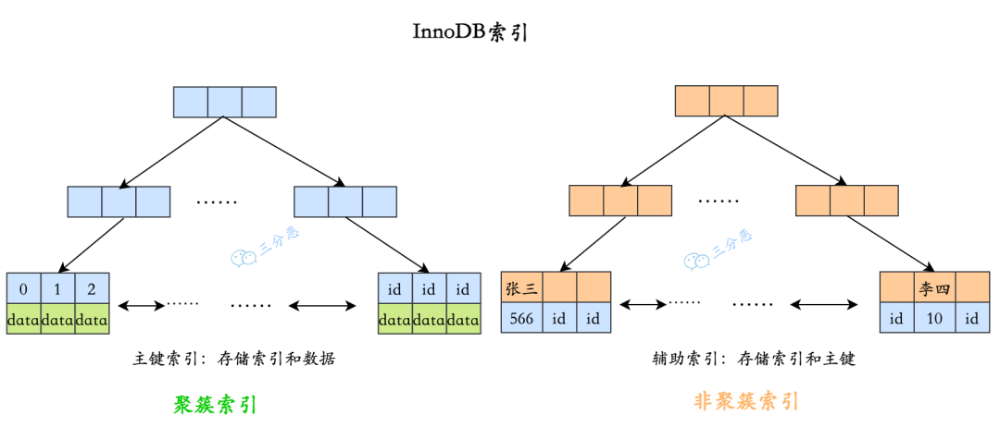

聚簇索引直接将数据存储在 B+ 树的叶子节点中

非聚簇索引的叶子节点上存储的并不是真正的行数据，而是主键 ID

所以当我们使用非聚簇索引进行查询时，首先会得到一个主键 ID，然后再使用主键 ID 去聚簇索引上找到真正的行数据，我们把这个过程称之为回表查询。

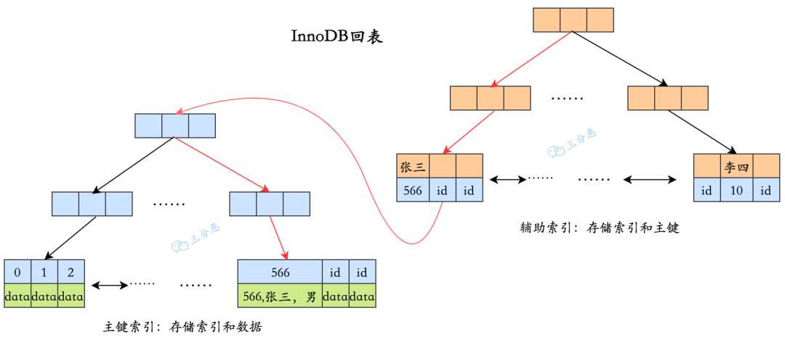

InnoDB 回表

### 覆盖索引

使用非主键索引查询数据时需要回表，但如果索引的叶节点中已经包含要查询的字段，那就不会再回表查询了，这就叫覆盖索引。

举个例子，现在要从 test 表中查询 city 为上海的 name 字段。

```sql
select name from test where city='上海'
```

如果仅在 city 字段上添加索引，那么这条查询语句会先通过索引找到 city 为上海的行，然后再回表查询 name 字段，这就是回表查询。

为了避免回表查询，可以在 city 和 name 字段上建立联合索引，这样查询结果就可以直接从索引中获取。

```sql
alter table test add index index1(city,name);
```

### 数据库是先建立索引还是先插入数据？

在 InnoDB 中，数据插入和索引创建（更新）是密不可分的。从数据库的视角看，插入操作包括向聚簇索引添加记录和更新所有相关的次级索引。这些步骤在一个事务中原子地执行，以确保数据的一致性和完整性。

在 InnoDB 中，如果表定义了主键，那么主键索引就是聚簇索引。如果没有明确指定主键，InnoDB 会自动选择一个唯一索引作为聚簇索引。如果表没有任何唯一索引，InnoDB 将自动生成一个隐藏的行 ID 作为聚簇索引。

这意味着当插入新数据时，InnoDB 首先将数据插入到聚簇索引中。这一步骤实质上是创建索引的一部分，因为数据存放在索引结构中。

InnoDB 还需要更新表的所有次级索引。这些索引中的每一个都包含指向聚簇索引记录的指针。

### 订单表建索引

订单表通常是数据库中的一个关键表，经常会有大量的查询、插入和更新操作。在合适的地方添加索引可以显著提高查询效率，但过度的索引可能会给插入和更新操作带来负担。所以需要根据实际需求和访问模式来决定哪些字段需要添加索引。

索引需求通常会基于以下几种场景：

1. 频繁查询的列：如果有某些字段经常被用在 WHERE 子句中，例如订单号(order_id)，用户 ID(user_id)，或者订单状态(status)等，这些列都是需要考虑添加索引的。
2. ORDER BY 操作：如果你的应用经常需要对某个字段进行排序展示，例如按照订单的创建时间(create_time)排序，那么在该字段上添加索引能加快排序的速度。

## 锁

### MySQL 中有哪几种锁，列举一下？

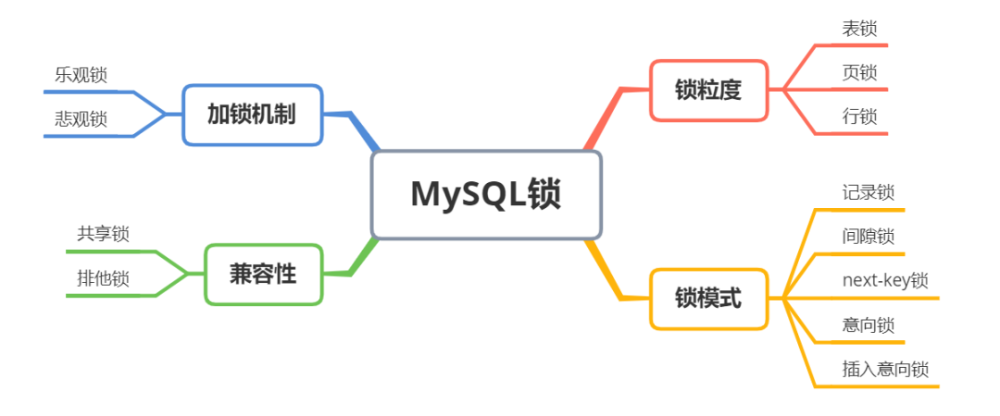

MySQL 中的锁

如果按锁粒度划分，有以下 3 种：

- 表锁：开销小，加锁快；锁定力度大，发生锁冲突概率高，并发度最低;不会出现死锁。（意向锁）
- 行锁：开销大，加锁慢；会出现死锁；锁定粒度小，发生锁冲突的概率低，并发度高。（记录锁，间隙锁，临键锁）
- 页锁：开销和加锁速度介于表锁和行锁之间；会出现死锁；锁定粒度介于表锁和行锁之间，并发度一般

如果按照兼容性，有两种，

- 共享锁（S Lock）,也叫读锁（read lock），相互不阻塞。
- 排他锁（X Lock），也叫写锁（write lock），排它锁是阻塞的，在一定时间内，只有一个请求能执行写入，并阻止其它锁读取正在写入的数据。

### InnoDB 里的行锁实现?

- Record Lock 记录锁

记录锁就是直接锁定某行记录。当我们使用唯一性的索引(包括唯一索引和聚簇索引)进行等值查询且精准匹配到一条记录时，此时就会直接将这条记录锁定。例如 `select * from t where id =6 for update;` 就会将 `id=6` 的记录锁定。


- Gap Lock 间隙锁

间隙锁(Gap Locks) 的间隙指的是两个记录之间逻辑上尚未填入数据的部分,是一个左开右开空间。


间隙锁

间隙锁就是锁定某些间隙区间的。当我们使用用等值查询或者范围查询，并且没有命中任何一个 `record`，此时就会将对应的间隙区间锁定。例如 `select * from t where id > 1 and id < 6 for update;` 就会将(1,6)区间锁定。

- Next-key Lock 临键锁

临键指的是间隙加上它右边的记录组成的左开右闭区间。比如上述的(1,6]、(6,8]等。


临键锁

临键锁就是记录锁(Record Locks)和间隙锁(Gap Locks)的结合，即除了锁住记录本身，还要再锁住索引之间的间隙。当我们使用范围查询，并且命中了部分 `record` 记录，此时锁住的就是临键区间。注意，临键锁锁住的区间会包含最后一个 record 的右边的临键区间。例如 `select * from t where id > 5 and id <= 7 for update;` 会锁住(4,7]、(7,+∞)。

mysql 默认行锁类型就是 `临键锁(Next-Key Locks)`。当使用唯一性索引，等值查询匹配到一条记录的时候，临键锁(Next-Key Locks)会退化成记录锁；没有匹配到任何记录的时候，退化成间隙锁。

如果**没有使用索引列作为查询条件**，或者查询语句没有走索引查询，导致扫描是全表扫描。那么，每一条记录的索引上都会加 next-key 锁，这样就相当于锁住的全表，这时如果其他事务对该表进行增、删、改操作的时候，都会被阻塞。

> `间隙锁(Gap Locks)` 和 `临键锁(Next-Key Locks)` 都是用来解决幻读问题的，在 `读已提交（READ COMMITTED）` 隔离级别下，`间隙锁(Gap Locks)` 和 `临键锁(Next-Key Locks)` 都会失效！

- **幻读**：事务 A 查询一个范围的结果集，另一个并发事务 B 往这个范围中插入 / 删除了数据，然后事务 A 再次查询相同的范围，两次读取得到的结果集不一样了

### 意向锁是什么知道吗？

意向锁是一个表级锁。它解决的是表锁和行锁共存的问题。

有了意向锁这个表级锁之后，我们直接判断一次就知道表中是否有数据行被锁定。

要执行的事务 A 在申请**行锁**（写锁）之前，数据库会自动先给事务 A 申请**表的意向排他锁**。

当事务 B 去申请表的互斥锁时就会失败，因为表上有意向排他锁之后事务 B 申请表的互斥锁时会被阻塞。

### MySQL 的乐观锁和悲观锁了解吗？

- 悲观锁（Pessimistic Concurrency Control）：

悲观锁认为被它保护的数据是极其不安全的，每时每刻都有可能被改动，一个事务拿到悲观锁后，其他任何事务都不能对该数据进行修改，只能等待锁被释放才可以执行。

数据库中的行锁，表锁，读锁，写锁均为悲观锁。

- 乐观锁（Optimistic Concurrency Control）

乐观锁认为数据的变动不会太频繁。

它通常是通过在表中增加一个版本(version)或时间戳(timestamp)来实现，其中，版本最为常用。

事务在从数据库中取数据时，会将该数据的版本也取出来(v1)，当事务对数据变动完毕想要将其更新到表中时，会将之前取出的版本 v1 与数据中最新的版本 v2 相对比，如果 v1=v2，那么说明在数据变动期间，没有其他事务对数据进行修改，此时，就允许事务对表中的数据进行修改，并且修改时 version 会加 1，以此来表明数据已被变动。

如果，v1 不等于 v2，那么说明数据变动期间，数据被其他事务改动了，此时不允许数据更新到表中，一般的处理办法是通知用户让其重新操作。

### MySQL 遇到过死锁问题吗，你是如何解决的？

排查死锁的一般步骤是这样的：

（1）查看死锁日志 show engine innodb status;

（2）找出死锁 sql

（3）分析 sql 加锁情况

（4）模拟死锁案发

（5）分析死锁日志

（6）分析死锁结果

## 事务


### MySQL 事务的四大特性说一下？（ACID）

**原子性**（Atomicity） **一致性**（Consistency） **隔离性** （Isolation）**持久性**（Durability）

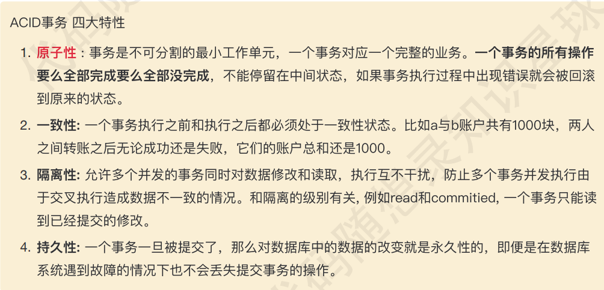

### 那 ACID 靠什么保证的呢？

MySQL 通过事务管理和持久性存储机制来确保 ACID（原子性、一致性、隔离性和持久性）。

01、原子性（Atomicity）

undo log 是 InnoDB 存储引擎来确保事务原子性的关键机制，undo log 记录了事务发生之前的数据，如果事务失败，InnoDB 会根据 undo log 回滚数据。

02、一致性（Consistency）

一致性是 ACID 的目的，也就是说，只要保证原子性、隔离性、持久性，自然也就保证了数据的一致性。

03、隔离性 (Isolation)

InnoDB 存储引擎使用 MVCC (多版本并发控制) 机制来处理并发事务，确保每个事务都有自己的数据版本。

事务查看数据时，数据所处的状态要么是另一事务修改它之前的状态，要么是另一事务修改它之后的状态，事务不会查看到中间状态的数据。

04、持久性 (Durability)

InnoDB 使用“redo log”来记录数据的更改，在系统崩溃后，redo log 可用于恢复数据。

当事务进行写操作时，InnoDB 首先会写入 redo log，并不会立即修改数据文件。

当 redo log 填满或在某些其他情况下，InnoDB 会异步将这些更改刷新到数据文件中。

系统崩溃时，由于数据可能还没有被真正写入数据文件，但已经在 redo log 中，因此系统可以在启动时使用这些日志来重新执行或“重做”这些更改，确保数据的持久性。

即使数据库在事务提交后立即崩溃，由于事务的更改已经记录在 redo log 中，这些更改在数据库恢复时仍然是安全的。

### 事务的隔离级别有哪些？MySQL 的默认隔离级别是什么？


MySQL 默认的事务隔离级别是可重复读 (Repeatable Read)。

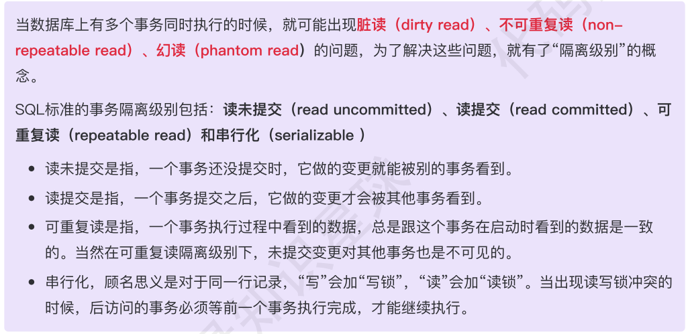

### 脏读，幻读，不可重复读

- **脏读：**事务 A、B 交替执行，事务 A 读取到事务 B 未提交的数据。
- **不可重复读**：在一个事务范围内，两个相同的查询，读取同一条记录，却返回了不同的数据
- **幻读**：事务 A 查询一个范围的结果集，另一个并发事务 B 往这个范围中插入 / 删除了数据，然后事务 A 再次查询相同的范围，两次读取得到的结果集不一样了

### 事务的各个隔离级别都是如何实现的？

读未提交，采取的是读不加锁原理。

读取已提交和可重复读级别利用了 `MVCC`，也就是每个事务只能读取它能看到的版本

串行化的实现采用的是读写都加锁的原理。

### MVCC 了解吗？怎么实现的？


## SQL 优化

### 定位慢 SQL

- 慢查询日志：开启 MySQL 慢查询日志，再通过一些工具比如 mysqldumpslow 去分析对应的慢查询日志，找出问题的根源。
- 服务监控：可以在业务的基建中加入对慢 SQL 的监控，常见的方案有字节码插桩、连接池扩展、ORM 框架过程，对服务运行中的慢 SQL 进行监控和告警。

### 优化慢 SQL？


延迟关联（Late Row Lookups）和书签（Seek Method）是两种优化分页查询的有效方法。

①、延迟关联

延迟关联适用于需要从多个表中获取数据且主表行数较多的情况。它首先从主表中检索出需要的行 ID，然后再根据这些 ID 去关联其他的表获取详细信息，减少了不必要的 JOIN 操作。

## 高性能

### 数据库读写分离了解吗？

读写分离的基本原理是将数据库读写操作分散到不同的节点上，下面是基本架构图：

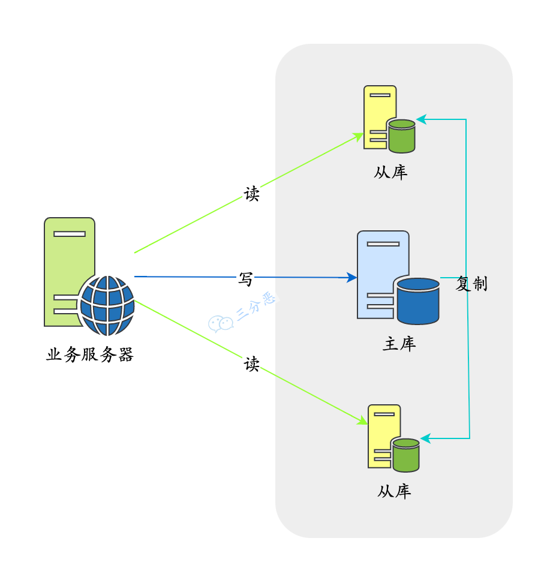

### 主从复制是怎么实现？

MySQL 的主从复制依赖于 binlog ，复制的过程就是将 binlog 中的数据从主库传输到从库上。

这个过程一般是异步的，也就是主库上执行事务操作的线程不会等待复制 binlog 的线程同步完成。


具体详细过程如下：

- MySQL 主库在收到客户端提交事务的请求之后，会先写入 binlog，再提交事务，更新存储引擎中的数据，事务提交完成后，返回给客户端“操作成功”的响应。
- 从库会创建一个专门的 I/O 线程，连接主库的 log dump 线程，来接收主库的 binlog 日志，再把 binlog 信息写入 relay log 的中继日志里，再返回给主库“复制成功”的响应。
- 从库会创建一个用于回放 binlog 的线程，去读 relay log 中继日志，然后回放 binlog 更新存储引擎中的数据，最终实现主从的数据一致性。

在完成主从复制之后，你就可以在写数据时只写主库，在读数据时只读从库，这样即使写请求会锁表或者锁记录，也不会影响读请求的执行。

### 从库是不是越多越好？

不是的。

因为从库数量增加，从库连接上来的 I/O 线程也比较多，主库也要创建同样多的 log dump 线程来处理复制的请求，对主库资源消耗比较高，同时还受限于主库的网络带宽。

所以在实际使用中，一个主库一般跟 2～3 个从库（1 套数据库，1 主 2 从 1 备主），这就是一主多从的 MySQL 集群结构。

### MySQL 主从复制还有哪些模型？

主要有三种：

- 同步复制：MySQL 主库提交事务的线程要等待所有从库的复制成功响应，才返回客户端结果。这种方式在实际项目中，基本上没法用，原因有两个：一是性能很差，因为要复制到所有节点才返回响应；二是可用性也很差，主库和所有从库任何一个数据库出问题，都会影响业务。
- 异步复制（默认模型）：MySQL 主库提交事务的线程并不会等待 binlog 同步到各从库，就返回客户端结果。这种模式一旦主库宕机，数据就会发生丢失。
- 半同步复制：MySQL 5.7 版本之后增加的一种复制方式，介于两者之间，事务线程不用等待所有的从库复制成功响应，只要一部分复制成功响应回来就行，比如一主二从的集群，只要数据成功复制到任意一个从库上，主库的事务线程就可以返回给客户端。这种半同步复制的方式，兼顾了异步复制和同步复制的优点，即使出现主库宕机，至少还有一个从库有最新的数据，不存在数据丢失的风险。

### 百万级别以上的数据如何删除？

1. 所以我们想要删除百万数据的时候可以先删除索引
2. 然后删除其中无用数据

### 百万千万级大表如何添加字段？

避免长时间锁表。

- 通过中间表转换过去

创建一个临时的新表，把旧表的结构完全复制过去，添加字段，再把旧表数据复制过去，删除旧表，新表命名为旧表的名称，这种方式可能会丢掉一些数据。

- 先在**从库**添加 再进行**主从切换**

如果一张表数据量大且是热表（读写特别频繁），则可以考虑先在**从库**添加，再进行**主从切换**，切换后再将其他几个节点上添加字段。

### MySQL 数据库 cpu 飙升的话，要怎么处理呢？

排查过程：

（1）使用 top ps 命令观察，确定是 mysql 导致还是其他原因。

（2）如果是 mysql 导致的，show processlist，查看 session 情况，确定是不是有消耗资源的 sql 在运行。

（3）找出消耗高的 sql，看看执行计划是否准确， 索引是否缺失，数据量是否太大。

处理：

（1）kill 掉这些线程 (同时观察 cpu 使用率是否下降)，

（2）进行相应的调整 (比如说加索引、改 sql、改内存参数)

（3）重新跑这些 SQL。

其他情况：

也有可能是每个 sql 消耗资源并不多，但是突然之间，有大量的 session 连进来导致 cpu 飙升，这种情况就需要跟应用一起来分析为何连接数会激增，再做出相应的调整，比如说限制连接数等
