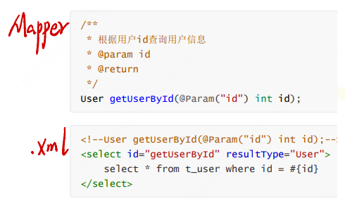

# 搭建MyBatis
1. 引入依赖
  ```xml
      <dependency>
        <groupId>org.mybatis</groupId>
        <artifactId>mybatis</artifactId>
        <version>3.5.7</version>
      </dependency>
  ``` 
2. 配置MyBatis的全局配置信息
3. 创建mapper接口
   > MyBatis中的mapper接口相当于以前的dao。但是区别在于，mapper仅仅是接口，我们不需要提供实现类
   ```java
    public interface UserMapper {
      /**
      * 添加用户信息
      */
      int insertUser();
      }
   ```
4. 创建MyBatis的映射文件
  - 映射文件的命名规则：
  表所对应的实体类的类名+Mapper.xml
  例如：表t_user，映射的实体类为User，所对应的映射文件为UserMapper.xml
  因此一个映射文件对应一个实体类，对应一张表的操作
  MyBatis映射文件用于编写SQL，访问以及操作表中的数据
  MyBatis映射文件存放的位置是src/main/resources/mappers目录下
  - MyBatis中可以面向接口操作数据，要保证两个一致：
  a> mapper接口的全类名和映射文件的命名空间（namespace）保持一致
  b> mapper接口中方法的方法名和映射文件中编写SQL的标签的id属性保持一致
  ```xml
  <?xml version="1.0" encoding="UTF-8" ?>
    <!DOCTYPE mapper
    PUBLIC "-//mybatis.org//DTD Mapper 3.0//EN"
    "http://mybatis.org/dtd/mybatis-3-mapper.dtd">
    <mapper namespace="com.atguigu.mybatis.mapper.UserMapper">
      <!--int insertUser();-->
      <insert id="insertUser">
        insert into t_user values(null,'张三','123',23,'女')
      </insert>
    </mapper>
  ```
  
# MyBatis中mapper.xml的语法
## 一、前言
MyBatis是"半自动"的ORM框架，即SQL语句需要开发者自定义，MyBatis的关注点在POJO与SQL之间的映射关系。那么SQL语句在哪里配置自定义呢？就在Mapper.xml中配置。当然了该配置文件可以自定义文件名。文件的样式如下：
```xml
<!DOCTYPE mapper PUBLIC "-//mybatis.org//DTD Mapper 3.0//EN" "http://mybatis.org/dtd/mybatis-3-mapper.dtd" >
<mapper namespace="com.scau.demo.mapper.UserMapper">
## ...具体内容...
</mapper>
```
其中，namespace用于绑定Mapper接口。不同mapper接口对应到不同的xml。

## 二、mapper.xml
- **mapper**：指定唯一的namespace，一般设置成mapper类的全路径名。
- **insert**：对应SQL中的insert插入语句。
  - **id**：为该语句的属性，通常与mapper java 文件的方法名相同。
  - **parameterType**：参入插入语句的参数类型。
  - **useGeneratedKeys**：主键使用数据库自增策略，需要数据库底层支持，并返回主键到keyProperty指定的属性名。
  - **keyProperty**：指示主键映射到实体类的属性名。
```xml
  <mapper namespace="org.mybatis.mapper.UserMapper">
      <!-- useGeneratedKeys:返回主键
           keyProperty:返回的主键对应实体类的属性字段
      -->
      <insert id="saveUser" parameterType="com.mybatis.domain.User" useGeneratedKeys="true" keyProperty="id">
          insert into user values(#{id},#{username},#{birthday},#{sex},#{address})
      </insert>
  </mapper>
```
> 注意：
  1. 查询的标签`select`必须设置属性`resultType`或`resultMap`，用于设置实体类和数据库表的映射关系
     - resultType：自动映射，用于属性名和表中字段名一致的情况
     - resultMap：自定义映射，用于一对多或多对一或字段名和属性名不一致的情况
  2. 当`查询的数据为多条时，只能使用集合`，不能使用实体类作为返回值，否则会抛出异常TooManyResultsException；但是`若查询的数据只有一条，可以使用实体类或集合作为返回值`

## 三、sql代码段
这个元素可以被用来定义可重用的 SQL 代码段，可以包含在其他语句中。它可以被静态地(在加载参数) 参数化. 不同的属性值通过包含的实例变化。在使用的地方通过`<include>`标签进行引入
```xml
<sql id="userColumns"> ${alias}.id,${alias}.username,${alias}.password </sql>
 
<select id="selectUsers" resultType="map">
  select
    <include refid="userColumns"><property name="alias" value="t1"/></include>,
    <include refid="userColumns"><property name="alias" value="t2"/></include>
  from some_table t1
    cross join some_table t2
</select>
```
## 四、parameterType
如果传递的是简单的参数，是简单的数据类型，参数类型可以省略，原生的类型或简单数据类型（比如整型和字符串）因为没有相关属性，它会完全用参数值来替代。

1. 省略参数
  ```xml
  <select id="selectUsers" resultType="User">
    select * from user  where id = #{id}
  </select>
  ```
2. 传递对象
  参数类型是个User对象，User 类型的参数对象传递到了语句中，id、username 和 password 属性将会被查找，然后将它们的值传入预处理语句的参数中。
  ```xml
  <insert id="insertUser" parameterType="User">
    insert into users (id, username, password) values (#{id}, #{username}, #{password})
  </insert>
  ```

3. 指定参数类型
- 参数也可以指定一个特殊的数据类型。
`#{property,javaType=int,jdbcType=NUMERIC}`
- 对于数值类型，还有一个小数保留位数的设置，来确定小数点后保留的位数。
`#{height,javaType=double,jdbcType=NUMERIC,numericScale=2}`

## 五、XML转义字符
少部分特殊字符写入到 XML 文件会被 XML 语法检测报错,XML为这些字符提供了转义

特殊字符| 转义字符|说明
-------|----------|------
\>     |\&gt;     |大于
\<     |\&lt;     |小于
\<=    |\&lt;=    |小于等于
\>=    |\&gt;=    |小于等于
\<>    |\&lt;>    |不等于
&      |\&amp;    |与
'      |\&apos;   |单引号
"      |\&quot;   |双引号

在 XML 中写 SQL，用到特殊字符的可用转义字符替换。
但使用转义字符比较麻烦，不容易记住，可使用`<![CDATA[ ]]>`标记里面的内容不被 XML 解析器解析，保留为文本。
`<![CDATA[ SELECT * FROM  user WHERE  age  <= 30 AND age >= 18 ]]>`

## 六、模糊查询
mapper.xml 中写模湖查询需要使用 `concat` 来连接 `like concat('%', #{param}, '%')`  或者 `like '%${param}%'`  --推荐使用前者，可以避免sql注入。

## 七、获取参数值
MyBatis获取参数值的两种方式：`${}`和`#{}`
 1. `${}` 和 `#{}`的区别
   `${}`的本质就是字符串拼接，#{}的本质就是占位符赋值
  - `#`可以实现预编译，会先把`#{变量}`编译成`?`，在执行时再取值，可以防止sql注入。
  - `$`是直接进行字符串替换。
  - `#`符号的应用场景：
需要在sql映射文件中动态拼接sql时的开发场景，比如传入多个变量进行条件查询、传入一个POJO进行数据插入等。
  - `$`符号的应用场景：
用于传入的参数是sql片段的场景下，会直接进行字符串替换，完成了sql的拼接。

`#`符号解析：
`#`可以实现预编译，主要表现在数据类型检查和安全检查两部分：
- 数据类型检查表现在：若检测到为数值类型，就不加引号，即?；若检测到位字符串类型，就加上引号，即'?'。

- 安全检查表现在：若变量的值带有引号，会对引号进行转义处理，这样可以防止sql注入。

```xml
<!--   
    比如  select * from user where name =#{name}  如果name是jack  翻译成 name ='jack'
         select * from user where name =${name}  如果name是jack  翻译成 name = jack
-->
```
2. 若mapper接口中的方法参数为实体类对象时, 此时可以使用`${}`和`#{}`，通过访问实体类对象中的属性名获取属性值，注意`${}`需要手动加单引号
3. 可以通过`@Param`注解标识mapper接口中的方法参数。此时，会将这些参数放在map集合中，以@Param注解的value属性值为键，以参数为值；以param1,param2...为键，以参数为值；只需要通过`${}`和`#{}`访问map集合的键就可以获取相对应的值，注意`${}`需要手动加单引号
`(@Param("username") String name)`

## 八、动态SQL
Mybatis框架的动态SQL技术是一种根据特定条件动态拼装SQL语句的功能，它存在的意义是为了解决拼接SQL语句字符串时的痛点问题。
1. if test
一般在列表页面,有多个查询条件,并且不确定条件是否使用的时候可以使用 if test语法。
if标签可通过test属性的表达式进行判断，若表达式的结果为true，则标签中的内容会执行；反之标签中的内容不会执行。

  ```xml
  Mapper
  //这里需要注意的是,一般持久层中,查询条件多于两个的时候最好创建一PO模型
  List<UserInfoVo> findByKeywords(Map<String,String> param)
  //如果这里使用了@Param("param")注解的时候,在xml映射中,需要使用param.xxx的方式获取参数
  ```
  
  ```xml
  xxmaper.xml
  <select id ="findByKeywords" parameterType="java.util.Map" resultType="com.example.test.vo.UserInfoVo">
    SELECT * from user where user_type =1 
      <if test="username != null">
          and username like concat('%',#{username},'%)
      </if>
      
      <if test="idnumber != null">
          and idnumber like concat('%',#{idnumber},'%')
      </if>
  </select>
  ```
2. where
  > **where和if一般结合使用：**
  a>若where标签中的if条件都不满足，则where标签没有任何功能，即不会添加where关键字
  b>若where标签中的if条件满足，则where标签会自动添加where关键字，并将条件最前方多余的and去掉
  注意：where标签不能去掉条件最后多余的and
  ```xml
  <select id="getEmpListByMoreTJ2" resultType="Emp">
    select * from t_emp
    <where>
      <if test="ename != '' and ename != null">
        ename = #{ename}
      </if>
      <if test="age != '' and age != null">
        and age = #{age}
      </if>
      <if test="sex != '' and sex != null">
      and sex = #{sex}
      </if>
    </where>
  </select>
  ```
  修改数据用`<set>`标签，`update user set ... where ...`
3. trim
> **trim用于去掉或添加标签中的内容**
常用属性：
prefix：在trim标签中的内容的前面添加某些内容
prefixOverrides：在trim标签中的内容的前面去掉某些内容
suffix：在trim标签中的内容的后面添加某些内容
suffixOverrides：在trim标签中的内容的后面去掉某些内容
```xml
<select id="getEmpListByMoreTJ" resultType="Emp">
  select * from t_emp
  <!-- 在前边加where，如果开头是and就去掉 -->
  <trim prefix="where" suffixOverrides="and">
    <if test="ename != '' and ename != null">
      ename = #{ename} and
    </if>
    <if test="age != '' and age != null">
      age = #{age} and
    </if>
    <if test="sex != '' and sex != null">
      sex = #{sex}
    </if>
  </trim>
</select>
```
4. foreach
遍历数组和集合
> 属性
  collection: 设置要循环的数组或集合
  item: 表示集合或数组中的每一个数据
  separator: 设置循环体之间的分隔符
  open: 设置foreach标签中的内容的开始符
  close: 设置foreach标签中的内容的结束符
```xml
<!--int insertMoreEmp(List<Emp> emps);-->
<insert id="insertMoreEmp">
  insert into t_emp values
  <foreach collection="emps" item="emp" separator=",">
    (null,#{emp.ename},#{emp.age},#{emp.sex},#{emp.email},null)
  </foreach>
</insert>
<!--int deleteMoreByArray(int[] eids);-->
<delete id="deleteMoreByArray">
  delete from t_emp where
  <foreach collection="eids" item="eid" separator="or">
    eid = #{eid}
  </foreach>
</delete>
<!--int deleteMoreByArray(int[] eids);-->
<delete id="deleteMoreByArray">
  delete from t_emp where eid in
  <foreach collection="eids" item="eid"   separator="," open="(" close=")">
    #{eid}
  </foreach>
</delete>
```
